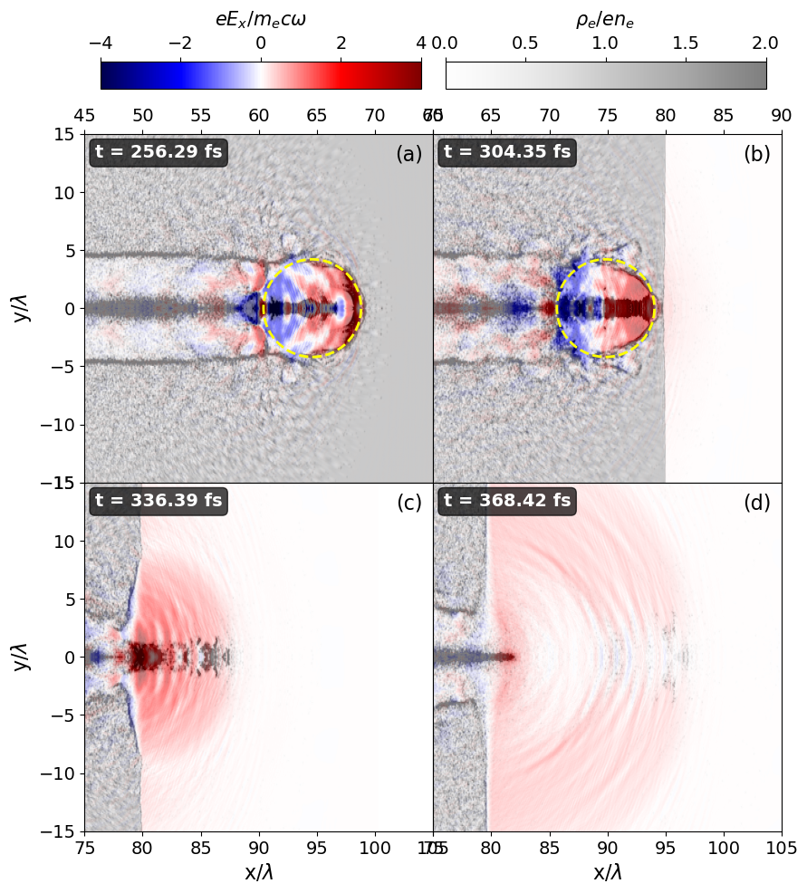

### <a id="jupyter-notebook-cells---interactive-navigation--parameter-inspection">Interactive Navigation & Parameter Inspection</a>
<details>
<summary><b>Tag: navigator1.0</b> – ⚠️  Interactive folder navigator and selector with following inspection of MainVars.py parameters and global saving</summary>

⚠️ **CORE MODULE NOTICE:** This cell manages global pipeline state. **Do not modify the internal code** during routine execution.
🔧 *Only enter this cell if you explicitly need to switch the normalization factor (e.g., change `Norm = fields['Mag']` to `fields['Elec']`). All folder selection and parameter inspection should be handled via the dropdown UI or downstream cells.*

**Description**:  
Provides an interactive dropdown menu to browse predefined simulation directories and dynamically load a `MainVars.py` configuration file upon selection. Automatically extracts key simulation parameters (`a`, `tau`, `D_o`) and computes a global normalization factor (`Norm`) based on physical constants defined in the target module. Designed for rapid parameter comparison across multiple simulation setups without manual file navigation.

**Key Features**:
- 🔍 Dynamic module loading via `importlib.util` (avoids namespace pollution)
- 📂 Real-time parameter extraction and validation
- 🔄 Global state tracking (`selected_folder`, `Norm`) for downstream cells
- 🛡️ Graceful error handling for missing files or undefined attributes

**Dependencies**:  
`ipywidgets`, `IPython.display`, `importlib.util`, `os`

**Usage Notes**:
- Ensure `MainVars.py` exists in each directory and exposes: `a`, `tau`, `D_o`, `ELECMASS`, `Omega`, `ELEMCHARGE`.
- `Norm` is updated globally and can be safely referenced in subsequent notebook cells.
- Unused imports and placeholder paths have been cleaned; `InOtherInstitute` is preserved as a commented template.

**Expected Output**:


```python
import os
import importlib.util
from IPython.display import display
import ipywidgets as widgets

# 🔧 CONFIGURATION: Change this value to switch normalization type
# Options: "Mag" (Magnetic) or "Elec" (Electric)
NORM_MODE = "Elec"  

# Predefined simulation directories to scan
FOLDER_LIST = [
    '   ',
    '/home/big4/castillo/conversion_a=74_tau_6_ne=0.40_2Jb_stop_window',
    '/home/big4/castillo/conversion_a=74_tau_6_ne=0.40_2Jb_stop_window/best_dumps',
    '/home/big4/castillo/conversion_a=34_tau=15_ne=0.5_stop_window',
    '/home/big4/castillo/conversion_a=27_tau=20_ne=0.50_stop_window',
    '/home/big4/castillo/conversion_a=22_tau=30_ne=0.9_stop_window_ramp',
    '/home/big4/castillo/conversion_a=27_tau=20_ne=0.9_LowResolution'
]

# Global state variables (accessible by downstream cells)
selected_folder = None
Norm = 0.0

# Initialize interactive dropdown
folder_dropdown = widgets.Dropdown(
    options=FOLDER_LIST,
    description='Folder:',
    style={'description_width': 'initial'}  # Prevents label truncation
)

# Output container for dynamic prints
result_output = widgets.Output()

# Render widgets
display(folder_dropdown, result_output)

def on_folder_change(change):
    """Callback executed when the dropdown selection changes."""
    global selected_folder, Norm
    
    target_folder = change['new']
    main_vars_path = os.path.join(target_folder, 'MainVars.py')
    
    with result_output:
        result_output.clear_output()
        
        # Verify configuration file exists
        if not os.path.isfile(main_vars_path):
            print(f"⚠️ MainVars.py not found in: {target_folder}")
            return
        
        # Dynamically import the module without polluting the global namespace
        try:
            spec = importlib.util.spec_from_file_location("MainVars", main_vars_path)
            if spec is None or spec.loader is None:
                raise ImportError("Failed to resolve module specification.")
                
            module = importlib.util.module_from_spec(spec)
            spec.loader.exec_module(module)
            
            # Extract core simulation parameters
            a = module.a
            tau = module.tau
            D_o = module.D_o
            
            # Compute both normalization factors
            norm_elec = (module.ELECMASS * module.LIGHTSPEED * module.Omega) / module.ELEMCHARGE
            norm_mag  = (module.ELECMASS * module.Omega) / module.ELEMCHARGE
            
            # Apply selected normalization mode
            if NORM_MODE.upper() == "ELEC":
                Norm = norm_elec
            else:
                Norm = norm_mag  # Default fallback to Magnetic
            
            # Update global references for downstream cells
            selected_folder = target_folder
            
            # Display validated parameters
            print(f"a     = {a}")
            print(f"tau   = {tau}")
            print(f"D_o   = {D_o}")
            print(f"Norm  ({NORM_MODE.upper()}) = {Norm:.4e}")
            print(f"\n📁 Selected Folder: {selected_folder}")
            
        except AttributeError as e:
            print(f"❌ Missing expected variable in MainVars.py: {e}")
        except Exception as e:
            print(f"❌ Unexpected error loading MainVars.py: {e}")

# Bind callback to dropdown value changes
folder_dropdown.observe(on_folder_change, names='value')
```


    Dropdown(description='Folder:', options=('   ', '/home/big4/castillo/conversion_a=74_tau_6_ne=0.40_2Jb_stop_wi…


    Output()


### <a id="jupyter-notebook-cells---execution-context-validation">Execution Context Validation</a>
<details>
<summary><b>Tag: validator1.0</b> – Optional sanity check for selected folder and normalization factor</summary>

**Description**:  
A lightweight validation snippet that confirms whether a simulation directory has been properly selected via the interactive navigator. Displays the active folder path and the computed normalization factor (`Norm`), or prompts the user to make a selection if the global state remains uninitialized. Recommended as a quick checkpoint before executing downstream analysis, data loading, or plotting cells.

**Key Features**:
- ✅ Verifies global state (`selected_folder`, `Norm`) after widget interaction
- 🔔 Provides explicit console feedback to prevent silent failures
- 🛑 Safe-to-skip guard clause that improves notebook reproducibility

**Dependencies**:  
None (inherits `selected_folder` and `Norm` from `navigator1.0`)

**Usage Notes**:
- Run immediately after selecting a folder from the dropdown.
- If the warning appears, ensure the chosen directory contains a valid `MainVars.py` and that the callback executed without errors.
- Does not alter state; purely diagnostic.

**Expected Output**:


```python
# Optional sanity check: verify that the interactive selector has initialized global state
if selected_folder:
    print(f"✅ Working on folder: {selected_folder}/")
    print(f"   Normalization factor (Norm): {Norm:.4e}")
else:
    print("⚠️ No valid folder selected. Please choose a directory from the dropdown above.")
```

    ✅ Working on folder: /home/big4/castillo/conversion_a=74_tau_6_ne=0.40_2Jb_stop_window/
       Normalization factor (Norm): 3.2107e+12


### <a id="jupyter-notebook-cells---multi-dump-field-density-visualization">Multi-Dump Field & Density Visualization</a>
<details>
<summary><b>Tag: plotter1.0</b> – 2×2 grid plot of PIC simulation dumps with dynamic E/B labeling and auto-naming</summary>

⚠️ **CORE MODULE NOTICE:** This cell contains foundational plotting logic. **Avoid editing the source code** unless adapting to new HDF5 structures. For standard usage, only modify execution parameters in the call block.

**Description**:  
Generates a publication-ready 2x2 grid of simulation snapshots. Automatically selects the correct physical unit symbol (**$E$** or **$B$**) for the field colorbar based on the `field` argument (e.g., `"Elec"` vs `"Mag"`). The execution block now generates a **descriptive filename** automatically using the selected parameters (density type, field, component, plane, and dump indices).

**Key Updates**:
- ⚡ **Dynamic Labeling**: Colorbar adapts to `field` argument ($E_{comp}$ or $B_{comp}$).
- 🏷️ **Auto-Naming**: `save_path` is now an f-string containing simulation configuration metadata.

**Dependencies**:  
Requires global `Norm` from `navigator1.0` and `plot_four_dumps` definition.

**Expected Output**:
- 🖼️ Plot with correct unit label (e.g., $eE_x / m_ec\omega$).
- 💾 File saved as `density_RhoIL_field_Mag_z_plane_xy_dumps_[6, 12, 16, 20]_2_circles.png`.
</details>


```python
import os
import h5py
import numpy as np
import matplotlib.pyplot as plt
from matplotlib.patches import Circle

# Build path to simulation data slices (requires `selected_folder` from navigator1.0)
DATA_FOLDER = f"{selected_folder}/DataSlices/" if selected_folder else "./DataSlices/"

def plot_four_dumps(
    dumps,
    # Layer 1: Density plot parameters
    alpha, cmap, vrange, xrange_list, yrange_list,
    # Layer 2: Field overlay parameters
    alpha2, cmap2, vrange2, show_second,
    # Data selection parameters
    field, density, component, plane,
    # Typography settings
    fontsize_labels=14, fontsize_ticks=12, fontsize_colorbar=12,
    # Colorbar layout
    cbar_width="4%", cbar_height="70%", cbar_pad=0.4,
    # Subplot spacing
    wspace=0.05, hspace=0.05,
    # ►►► Circle annotation for dump index 0 (e.g., dump 6) ◄◄◄
    circle_center=None,
    circle_radius=5,
    circle_color='yellow',
    circle_linestyle='--',
    circle_linewidth=2,
    # ►►► Circle annotation for dump index 1 (e.g., dump 12) ◄◄◄
    circle_center2=None,
    circle_radius2=5,
    circle_color2='yellow',
    circle_linestyle2='--',
    circle_linewidth2=2,
    # Output options
    save_my_fig=False
):
    """
    Plot four simulation dumps in a 2x2 grid with overlaid density and field data.
    Supports dynamic labeling for Magnetic (B) or Electric (E) fields and subplot markers (a)-(d).
    """
    vmin1, vmax1 = vrange
    vmin2, vmax2 = vrange2

    # Initialize 2x2 subplot grid
    fig, axes = plt.subplots(2, 2, figsize=(8.85, 10))
    axes = axes.flatten()
    
    # Adjust layout to accommodate top colorbars
    plt.subplots_adjust(
        wspace=wspace, hspace=hspace,
        top=0.85, bottom=0.08, left=0.08, right=0.95
    )

    ims1, ims2 = [], []  # Store image objects for colorbars

    for i, dump in enumerate(dumps):
        ax = axes[i]
        filename = os.path.join(DATA_FOLDER, f"slice_Dump_{str(dump).zfill(3)}.h5")

        try:
            with h5py.File(filename, 'r') as f:
                # Load density and field datasets
                dataDensity = f[f"{density}_{plane}"][()]
                dataField = f[f"{field}MultiField_{component}_{plane}"][()]
                dataField = dataField / Norm  # Apply global normalization
                
                # Extract spatial bounds (convert to microns)
                bounds = f['globalGridGlobal'].attrs.get('vsLowerBounds') * 1.0e+6
                xmax, ymax, zmax = f['globalGridGlobal'].attrs.get('vsUpperBounds') * 1.0e+6
                xmin, ymin, zmin = bounds
                
                # Extract simulation time (convert to femtoseconds)
                timeDump = f['time'].attrs.get('vsTime') * 1.0e+15

        except FileNotFoundError:
            ax.text(0.5, 0.5, f"File not found:\nDump {dump}", 
                    ha='center', va='center', transform=ax.transAxes, 
                    fontsize=12, color='red', bbox=dict(facecolor='white', alpha=0.8))
            continue
        except Exception as e:
            ax.text(0.5, 0.5, f"Error loading\nDump {dump}\n{str(e)}", 
                    ha='center', va='center', transform=ax.transAxes, 
                    fontsize=12, color='red', bbox=dict(facecolor='white', alpha=0.8))
            continue

        # Debug output to console
        print(f'--- Dump {dump} (t={timeDump:.2f} fs) ---')
        print(f'Density: min={dataDensity.min():.2e}, max={dataDensity.max():.2e}')
        print(f'Field:   min={dataField.min():.2e}, max={dataField.max():.2e}')

        # ►►► Layer 2: Field overlay (optional)
        if show_second:
            im2 = ax.imshow(
                dataField.T, extent=[xmin, xmax, ymin, ymax], aspect='equal',
                alpha=alpha2, cmap=cmap2, vmin=vmin2, vmax=vmax2, origin='lower'
            )
            ims2.append(im2)

        # ►►► Layer 1: Density base plot
        if density == "Rho":     
            # Symmetric range for signed density
            im1 = ax.imshow(
                dataDensity.T, extent=[xmin, xmax, ymin, ymax], aspect='equal',
                alpha=alpha, cmap=cmap, vmin=-vmax1, vmax=vmax1, origin='lower'
            )
        else:
            im1 = ax.imshow(
                dataDensity.T, extent=[xmin, xmax, ymin, ymax], aspect='equal',
                alpha=alpha, cmap=cmap, vmin=vmin1, vmax=vmax1, origin='lower'
            )
        ims1.append(im1)

        # ►►► Annotation circles (conditional on subplot index)
        if i == 0 and circle_center is not None:
            circle1 = Circle(
                circle_center, circle_radius, fill=False,
                color=circle_color, linestyle=circle_linestyle,
                linewidth=circle_linewidth, zorder=10,
                transform=ax.transData
            )
            ax.add_patch(circle1)

        if i == 1 and circle_center2 is not None:
            circle2 = Circle(
                circle_center2, circle_radius2, fill=False,
                color=circle_color2, linestyle=circle_linestyle2,
                linewidth=circle_linewidth2, zorder=10,
                transform=ax.transData
            )
            ax.add_patch(circle2)

        # Apply axis limits per subplot
        if i < len(xrange_list) and i < len(yrange_list):
            ax.set_xlim(xrange_list[i])
            ax.set_ylim(yrange_list[i])

        # Time label (top-left of each subplot)
        ax.text(0.03, 0.97, f"t = {timeDump:.2f} fs",
                transform=ax.transAxes, fontsize=fontsize_labels - 2,
                fontweight='semibold', color='white',
                bbox=dict(boxstyle='round,pad=0.3', facecolor='black', alpha=0.7),
                ha='left', va='top')
                
        # ►►► Subplot label (top-right): (a), (b), (c), (d) - 
        ax.text(0.97, 0.97, f"({chr(97 + i)})",
                transform=ax.transAxes, fontsize=fontsize_labels,
                fontweight='normal', color='black',  
                ha='right', va='top', zorder=11)

        # Axis labels and tick configuration (only on outer edges)
        row, col = divmod(i, 2)
        if col == 0:  # Left column: show y-labels
            ax.set_ylabel(f"{plane[1]}/$\\lambda$", fontsize=fontsize_labels)
            ax.tick_params(axis='y', labelsize=fontsize_ticks, left=True, labelleft=True)
        else:  # Right column: hide y-labels
            ax.set_ylabel("")
            ax.tick_params(axis='y', left=False, labelleft=False)
        
        if row == 1:  # Bottom row: show x-labels
            ax.set_xlabel(f"{plane[0]}/$\\lambda$", fontsize=fontsize_labels)
            ax.tick_params(axis='x', labelsize=fontsize_ticks, bottom=True, labelbottom=True)
        else:  # Top row: x-labels on top edge
            ax.set_xlabel("")
            ax.tick_params(axis='x', bottom=False, labelbottom=False,
                          top=True, labeltop=True, labelsize=fontsize_ticks)

    # ►►► Colorbar for density layer (top-center)
    if ims1:
        cax1 = fig.add_axes([0.53, 0.90, 0.40, 0.03])
        cbar1 = fig.colorbar(ims1[0], cax=cax1, orientation='horizontal')
        if density == "RhoEL":
            cbar1.set_label("$\\rho_e/en_{e}$", fontsize=fontsize_colorbar, labelpad=8)
        elif density == "RhoIL": 
            cbar1.set_label("$\\rho_i/en_{e}$", fontsize=fontsize_colorbar, labelpad=8)
        else:
            cbar1.set_label("$\\rho/en_{e}$", fontsize=fontsize_colorbar, labelpad=8)
        cbar1.ax.tick_params(labelsize=fontsize_ticks)
        cbar1.ax.xaxis.set_ticks_position('top')
        cbar1.ax.xaxis.set_label_position('top')

    # ►►► Colorbar for field layer (top-left)
    if show_second and ims2:
        cax2 = fig.add_axes([0.10, 0.90, 0.40, 0.03])
        cbar2 = fig.colorbar(ims2[0], cax=cax2, orientation='horizontal')
        
        # Dynamic Label Logic: Select 'E' or 'B' based on field type
        field_unit = "B" if "Mag" in field else "E"
        cbar2.set_label(f"$e{field_unit}_{component} / m_ec\\omega$", fontsize=fontsize_colorbar, labelpad=8)
        cbar2.ax.tick_params(labelsize=fontsize_ticks)
        cbar2.ax.xaxis.set_ticks_position('top')
        cbar2.ax.xaxis.set_label_position('top')

    # ►►► Auto-generate filename based on current configuration
    save_path = f'density_{density}_field_{field}_{component}_plane_{plane}_dumps_{dumps}_2_circles.png'
    if save_my_fig:
        save_dir = os.path.dirname(save_path)
        if save_dir and not os.path.exists(save_dir):
            os.makedirs(save_dir, exist_ok=True)
        fig.savefig(
            save_path, dpi=300, bbox_inches='tight', pad_inches=0.1,
            facecolor='white', transparent=False
        )
        print(f"✅ Figure saved: {save_path}")

    plt.show()
```

### <a id="jupyter-notebook-cells---multi-dump-plot-execution-example">Multi-Dump Plot Execution Example</a>
<details>
<summary><b>Tag: runner1.0</b> – Concrete function call with dynamic field labeling and auto-generated filenames</summary>

⚠️ **USER WARNING:** This block configures a specific visualization run. **Review and adjust** `dumps`, axis limits (`xrange_list`), and `circle_center` coordinates before execution to match your data's features. Do not leave default zoom values if they do not capture the physics of interest.

**Description**:  
Executes the `plot_four_dumps()` engine with specific parameters to render a 2x2 grid of simulation dumps.
- **Smart Labeling**: Automatically determines whether to label the field colorbar as **Electric ($E$)** or **Magnetic ($B$)** based on the `field` argument.
- **Auto-Filename**: Generates a unique filename for the saved image that includes the density type, field, component, plane, and list of dumps used, ensuring organized output.

**Customization Guide**:
- 🔹 **`dumps`**: Indices to plot. The list content is injected into the output filename.
- 🔹 **`field`**: Accepts `"Mag"` (generates $B$ label) or `"Elec"` (generates $E$ label).
- 🔹 **`save_path`**: Is automatic and it uses an f-string `f'density_{density}_field_{field}...png'`. You can modify this structure if you prefer different naming conventions.
- 🔹 **`save_my_fig`**: Set to `False` for quick interactive testing without writing to disk.

**Dependencies**:  
Requires `plot_four_dumps` function definition, global `Norm` (from `navigator1.0`), and `selected_folder`.

**Expected Output**:
- 📋 Console print: `✅ Figure saved: density_RhoIL_field_Mag_z_plane_xy_dumps_[6, 12, 16, 20]_2_circles.png` (Example based on current params).
- 🖼️ Display of the plot with dynamic unit labels ($E$ or $B$) on the colorbar.
</details>


```python
# ▶▶▶ Execution block: Dynamic filename generation and rendering

plot_four_dumps(
    dumps=[6, 12, 16, 20],
    # Density layer configuration
    alpha=0.5, cmap='Greys', vrange=(0, 2),
    xrange_list=[(45, 75), (60, 90), (75, 105), (75, 105)],
    yrange_list=[(-15, 15), (-15, 15), (-15, 15), (-15, 15)],
    # Field overlay configuration
    alpha2=1.0, cmap2='seismic', vrange2=(-4.0, 4.0), show_second=True,
    # Data selectors
    field="Elec", density="RhoEL", component="x", plane="xy",
    # Typography & layout
    fontsize_labels=16, fontsize_ticks=14, fontsize_colorbar=15,
    wspace=0.00, hspace=0.00,
    # Annotation circle 1 (mapped to first Dump , subplot index 0)
    circle_center=(64.6, 0), circle_radius=4.2,
    circle_color='yellow', circle_linestyle='--', circle_linewidth=2,
    # Annotation circle 2 (mapped to second Dump , subplot index 1)
    circle_center2=(74.84, 0), circle_radius2=4.2,
    circle_color2='yellow', circle_linestyle2='--', circle_linewidth2=2,
    # Output & Save configuration
    save_my_fig=True
)
```

    --- Dump 6 (t=256.29 fs) ---
    Density: min=-0.00e+00, max=5.69e+01
    Field:   min=-6.19e+00, max=4.33e+00
    --- Dump 12 (t=304.35 fs) ---
    Density: min=-0.00e+00, max=1.94e+01
    Field:   min=-4.14e+00, max=3.97e+00
    --- Dump 16 (t=336.39 fs) ---
    Density: min=-0.00e+00, max=2.13e+01
    Field:   min=-1.59e+00, max=8.32e+00
    --- Dump 20 (t=368.42 fs) ---
    Density: min=-0.00e+00, max=1.33e+01
    Field:   min=-1.16e+00, max=1.99e+00
    ✅ Figure saved: density_RhoEL_field_Elec_x_plane_xy_dumps_[6, 12, 16, 20]_2_circles.png


    

    

