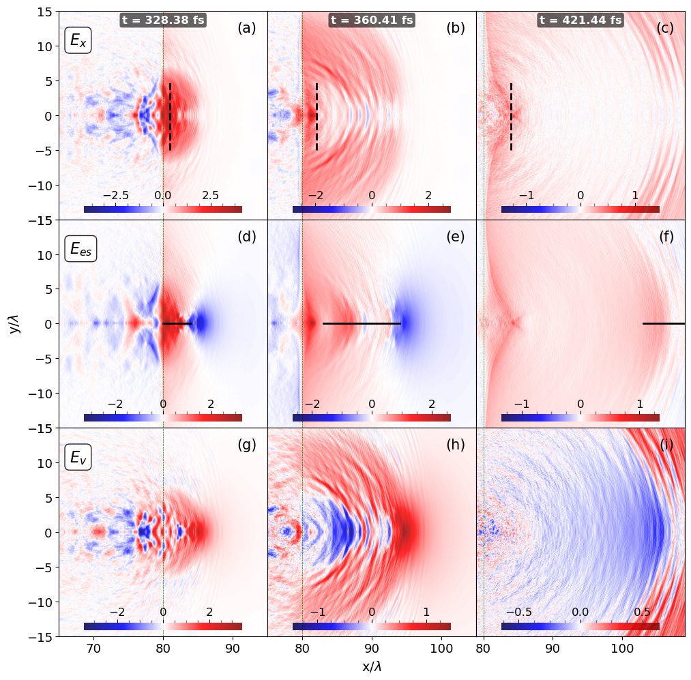

### <a id="jupyter-notebook-cells---interactive-navigation--parameter-inspection">Interactive Navigation & Parameter Inspection</a>
<details>
<summary><b>Tag: navigator1.0</b> – Interactive folder navigator and selector with following inspection of MainVars.py parameters and global saving</summary>

⚠️ **CORE MODULE NOTICE:** This cell manages global pipeline state. **Do not modify the internal code** during routine execution.
🔧 *Only enter this cell if you explicitly need to switch the normalization factor (e.g., change `Norm = fields['Mag']` to `fields['Elec']`). All folder selection and parameter inspection should be handled via the dropdown UI or downstream cells.*

**Description**:  
Provides an interactive dropdown menu to browse predefined simulation directories and dynamically load a `MainVars.py` configuration file upon selection. Automatically extracts key simulation parameters (`a`, `tau`, `D_o`) and computes a global normalization factor (`Norm`) based on physical constants defined in the target module. Designed for rapid parameter comparison across multiple simulation setups without manual file navigation.

**Key Features**:
- 🔍 Dynamic module loading via `importlib.util` (avoids namespace pollution)
- 📂 Real-time parameter extraction and validation
- 🔄 Global state tracking (`selected_folder`, `Norm`) for downstream cells
- 🛡️ Graceful error handling for missing files or undefined attributes

**Dependencies**:  
`ipywidgets`, `IPython.display`, `importlib.util`, `os`

**Usage Notes**:
- Ensure `MainVars.py` exists in each directory and exposes: `a`, `tau`, `D_o`, `ELECMASS`, `Omega`, `ELEMCHARGE`.
- `Norm` is updated globally and can be safely referenced in subsequent notebook cells.
- Unused imports and placeholder paths have been cleaned; `InOtherInstitute` is preserved as a commented template.

**Expected Output**:
</details>


```python
import os
import importlib.util
from IPython.display import display
import ipywidgets as widgets

# 🔧 CONFIGURATION: Change this value to switch normalization type
# Options: "Mag" (Magnetic) or "Elec" (Electric)
NORM_MODE = "Elec"  

# Predefined simulation directories to scan
FOLDER_LIST = [
    '   ',
    '/home/big4/castillo/conversion_a=74_tau_6_ne=0.40_2Jb_stop_window',
    '/home/big4/castillo/conversion_a=74_tau_6_ne=0.40_2Jb_stop_window/best_dumps',
    '/home/big4/castillo/conversion_a=74_tau_6_ne=0.40_2Jb_stop_window/tracking',
    '/home/big4/castillo/conversion_a=27_tau=20_ne=0.50_stop_window',
    '/home/big4/castillo/conversion_a=22_tau=30_ne=0.9_stop_window_ramp',
    '/home/big4/castillo/conversion_a=27_tau=20_ne=0.9_LowResolution'
]

# Global state variables (accessible by downstream cells)
selected_folder = None
Norm = 0.0

# Initialize interactive dropdown
folder_dropdown = widgets.Dropdown(
    options=FOLDER_LIST,
    description='Folder:',
    style={'description_width': 'initial'}  # Prevents label truncation
)

# Output container for dynamic prints
result_output = widgets.Output()

# Render widgets
display(folder_dropdown, result_output)

def on_folder_change(change):
    """Callback executed when the dropdown selection changes."""
    global selected_folder, Norm
    
    target_folder = change['new']
    main_vars_path = os.path.join(target_folder, 'MainVars.py')
    
    with result_output:
        result_output.clear_output()
        
        # Verify configuration file exists
        if not os.path.isfile(main_vars_path):
            print(f"⚠️ MainVars.py not found in: {target_folder}")
            return
        
        # Dynamically import the module without polluting the global namespace
        try:
            spec = importlib.util.spec_from_file_location("MainVars", main_vars_path)
            if spec is None or spec.loader is None:
                raise ImportError("Failed to resolve module specification.")
                
            module = importlib.util.module_from_spec(spec)
            spec.loader.exec_module(module)
            
            # Extract core simulation parameters
            a = module.a
            tau = module.tau
            D_o = module.D_o
            
            # Compute both normalization factors
            norm_elec = (module.ELECMASS * module.LIGHTSPEED * module.Omega) / module.ELEMCHARGE
            norm_mag  = (module.ELECMASS * module.Omega) / module.ELEMCHARGE
            
            # Apply selected normalization mode
            if NORM_MODE.upper() == "ELEC":
                Norm = norm_elec
            else:
                Norm = norm_mag  # Default fallback to Magnetic
            
            # Update global references for downstream cells
            selected_folder = target_folder
            
            # Display validated parameters
            print(f"a     = {a}")
            print(f"tau   = {tau}")
            print(f"D_o   = {D_o}")
            print(f"Norm  ({NORM_MODE.upper()}) = {Norm:.4e}")
            print(f"\n📁 Selected Folder: {selected_folder}")
            
        except AttributeError as e:
            print(f"❌ Missing expected variable in MainVars.py: {e}")
        except Exception as e:
            print(f"❌ Unexpected error loading MainVars.py: {e}")

# Bind callback to dropdown value changes
folder_dropdown.observe(on_folder_change, names='value')
```


    Dropdown(description='Folder:', options=('   ', '/home/big4/castillo/conversion_a=74_tau_6_ne=0.40_2Jb_stop_wi…


    Output()


### <a id="jupyter-notebook-cells---execution-context-validation">Execution Context Validation</a>
<details>
<summary><b>Tag: validator1.0</b> – Optional sanity check for selected folder and normalization factor</summary>

**Description**:  
A lightweight validation snippet that confirms whether a simulation directory has been properly selected via the interactive navigator. Displays the active folder path and the computed normalization factor (`Norm`), or prompts the user to make a selection if the global state remains uninitialized. Recommended as a quick checkpoint before executing downstream analysis, data loading, or plotting cells.

**Key Features**:
- ✅ Verifies global state (`selected_folder`, `Norm`) after widget interaction
- 🔔 Provides explicit console feedback to prevent silent failures
- 🛑 Safe-to-skip guard clause that improves notebook reproducibility

**Dependencies**:  
None (inherits `selected_folder` and `Norm` from `navigator1.0`)

**Usage Notes**:
- Run immediately after selecting a folder from the dropdown.
- If the warning appears, ensure the chosen directory contains a valid `MainVars.py` and that the callback executed without errors.
- Does not alter state; purely diagnostic.

**Expected Output**:
</details>


```python
# Optional sanity check: verify that the interactive selector has initialized global state
if selected_folder:
    print(f"✅ Working on folder: {selected_folder}/")
    print(f"   Normalization factor (Norm): {Norm:.4e}")
else:
    print("⚠️ No valid folder selected. Please choose a directory from the dropdown above.")
```

    ✅ Working on folder: /home/big4/castillo/conversion_a=74_tau_6_ne=0.40_2Jb_stop_window/tracking/
       Normalization factor (Norm): 3.2107e+12


### <a id="jupyter-notebook-cells---helmholtz-decomposition-3x3-time-evolution">Helmholtz Decomposition 3x3 Time Evolution</a>
<details>
<summary><b>Tag: helmholtz_plotter1.0</b> – 3x3 matrix plot with row-wise component labels & selective axis notation</summary>

⚠️ **USER WARNING:** Axis labels and Helmholtz notation are hardcoded to specific subplots to minimize clutter. Ensure your data ranges align with the requested plot layout.

**Description**:  
Generates a publication-ready 3x3 visualization comparing the Helmholtz decomposition of a field across three time steps. Optimized for publication with minimal axis clutter and explicit row/column identification.

**Layout & Labeling**:
- 🔹 **Row Labels**: `$E_{x}$`, `$E_{es}$`, `$E_{v}$` automatically placed in the top-left of the first column for each row.
- 🔹 **Axis Labels**: `ylabel` shown only in `axes[1, 0]`; `xlabel` shown only in `axes[2, 1]`.
- 🔹 **Subplot IDs**: `(a)` through `(i)` positioned in the top-right corner of each panel.
- 🔹 **Time Stamps**: Centered at the top of the first row.

**Key Parameters**:
- `fontsize_labels`: Controls size of axis and component labels (default `14`).
- `show_analysis_lines`: Toggles vertical/horizontal tracking lines.
- `row1_x_positions` / `row2_x_ranges`: Configurable per-dump marker positions.

**Dependencies**:  
`h5py`, `numpy`, `matplotlib`, `os`.
</details>


```python
import os
import h5py
import numpy as np
import matplotlib.pyplot as plt
from matplotlib.ticker import AutoMinorLocator, MultipleLocator

def plot_9_subplots_helmholtz_time_comparison_limits_ticks_line_averaging(
    field="Elec",
    plane="xy",
    density="RhoEL",
    dumps=[5, 7, 12],
    component="x",
    helmholtz_types=["Total", "Gradient", "Solenoidal"],
    cmap_density="Greys",
    cmap_fourier="gist_rainbow_r",
    alpha_density=1.00,
    alpha_fourier=0.85,
    vrange_density=(0.0, 3.0),
    vrange_fourier=(-0.99, 0.99),
    figsize=(10.45, 10.5),
    show_colorbars=True,
    save_fig=False,
    plot_density=True,
    # Limits logic
    xmin_limit=[60, 60, 60],
    xmax_limit=[90, 90, 90],
    ymin_limit=-15,
    ymax_limit=15,
    tick_fontsize=13,
    fontsize_labels=14,  # Added for axis & component labels
    cbar_tick_fontsize=12,
    # Colorbar styling
    cbar_left_pad=0.03,
    cbar_right_pad=0.03,
    cbar_left_anchor=(0.0, 0.5),
    cbar_right_anchor=(2.3, 0.5),
    cbar_panchor_left=(0, 0.5),
    cbar_panchor_right=(1, 0.5),
    cbar_shrink=0.85,
    # Shading/Border
    shade_density=True,
    azdeg=315,
    altdeg=45,
    vert_exag=0.5,
    blend_mode='overlay',
    line_border=True,
    line_position=80,
    line_color='green',
    line_width=0.5,
    # ►►► Analysis Lines Configuration ◄◄◄
    show_analysis_lines=True,
    row1_x_positions=[80, 81, 84],
    row1_y_range=(-5.0, 5.0),
    row2_x_ranges=[(80, 85), (83, 94), (94, 110)],
    row2_y_position=0.0
):
    """
    Generates a 3x3 matrix of subplots comparing Helmholtz decomposition components across 3 dumps.
    Restored: Green vertical line, Ticks on left/bottom, Axis labels only on specific subplots.
    """
    
    # Paths
    folder_density = f"{selected_folder}/DataSlices/"
    folder_fourier = f"{selected_folder}/FourierFieldsOptimized/"

    helmholtz_notation = {
        "Total": r"$E_{x}$",
        "Gradient": r"$E_{es}$",
        "Solenoidal": r"$E_{v}$"
    }
    
    fig, axes = plt.subplots(3, 3, figsize=figsize, sharex=False, sharey=True, squeeze=False)

    # --- File Validation ---
    all_files_exist = True
    for dump in dumps:
        fourier_file = os.path.join(folder_fourier, f"sliceTotalGradSolen_Dump_{str(dump).zfill(3)}.h5")
        try:
            with h5py.File(fourier_file, 'r') as f:
                _ = f[field + "MultiField_Total_x_xy"]
        except Exception as e:
            print(f"⚠️ Fourier file missing for dump={dump}: {e}")
            all_files_exist = False
            
        if plot_density:
            density_file = os.path.join(folder_density, f"slice_Dump_{str(dump).zfill(3)}.h5")
            try:
                with h5py.File(density_file, 'r') as f:
                    _ = f[density + "_" + plane][()]
            except Exception as e:
                print(f"⚠️ Density file missing for dump={dump}: {e}")
                all_files_exist = False
    
    if not all_files_exist:
        raise FileNotFoundError("Required HDF5 files missing.")

    subplot_labels = ['(a)', '(b)', '(c)', '(d)', '(e)', '(f)', '(g)', '(h)', '(i)']
    last_im2 = None

    # --- Plotting Loop ---
    for i, helmholtz in enumerate(helmholtz_types):
        for j, dump in enumerate(dumps):
            ax = axes[i, j]
            
            # 1. Load Density Data
            filename_density = os.path.join(folder_density, f"slice_Dump_{str(dump).zfill(3)}.h5")
            with h5py.File(filename_density, 'r') as f:
                if plot_density:
                    dataDensity = f[density + "_" + plane][()]
                bounds = f['globalGridGlobal'].attrs.get('vsLowerBounds') * 1.0e+6
                upper_bounds = f['globalGridGlobal'].attrs.get('vsUpperBounds') * 1.0e+6
                timeDump = f['time'].attrs.get('vsTime') * 1.0e+15

            xmin_file, ymin_file, _ = bounds
            xmax_file, ymax_file, _ = upper_bounds

            xmin_plot = xmin_limit[j] if isinstance(xmin_limit, (list, tuple)) else xmin_limit
            xmax_plot = xmax_limit[j] if isinstance(xmax_limit, (list, tuple)) else xmax_limit
            xmin_plot = xmin_plot if xmin_plot is not None else xmin_file
            xmax_plot = xmax_plot if xmax_plot is not None else xmax_file
            ymin_plot = ymin_limit if ymin_limit is not None else ymin_file
            ymax_plot = ymax_limit if ymax_limit is not None else ymax_file

            # 2. Plot Density
            if plot_density:
                ax.imshow(dataDensity.T, extent=[xmin_file, xmax_file, ymin_file, ymax_file],
                          aspect='equal', cmap=cmap_density, alpha=alpha_density,
                          vmin=vrange_density[0], vmax=vrange_density[1], zorder=1)

            # 3. Load & Plot Fourier Overlay
            filename_fourier = os.path.join(folder_fourier, f"sliceTotalGradSolen_Dump_{str(dump).zfill(3)}.h5")
            dset_name = f"{field}MultiField_{helmholtz}_{component}_{plane}"
            s_fourier = None
            
            try:
                with h5py.File(filename_fourier, 'r') as f_fourier:
                    s_fourier = f_fourier[dset_name][()]
            except Exception:
                pass

            if s_fourier is not None and s_fourier.size > 0:
                Efabs = max(abs(s_fourier.min()), abs(s_fourier.max()))
                vmin_f, vmax_f = (vrange_fourier[0] * Efabs, vrange_fourier[1] * Efabs) if Efabs != 0 else (-1e-10, 1e-10)
                
                im2 = ax.imshow(s_fourier.T, extent=[xmin_file, xmax_file, ymin_file, ymax_file],
                                aspect='equal', cmap=cmap_fourier, vmin=vmin_f, vmax=vmax_f,
                                alpha=alpha_fourier, zorder=2)
                last_im2 = im2

                # Internal Colorbar
                if show_colorbars:
                    cax = ax.inset_axes([0.12, 0.03, 0.76, 0.035])
                    cbar = fig.colorbar(im2, cax=cax, orientation='horizontal')
                    cbar.ax.xaxis.set_ticks_position('top')
                    cbar.ax.xaxis.set_label_position('top')
                    cbar.ax.tick_params(axis='x', labelsize=cbar_tick_fontsize, 
                                        top=True, bottom=False, labeltop=True, labelbottom=False, pad=2)
                    cbar.ax.xaxis.set_minor_locator(AutoMinorLocator(4))
                    cbar.ax.tick_params(axis='x', which='minor', top=True, bottom=False, 
                                        length=3, width=1, color=(0, 0, 0, 0.5))
                    cbar.ax.spines[:].set_visible(False)
                    cax.set_frame_on(False)
                    cax.patch.set_facecolor('white')
                    cax.patch.set_alpha(0.75)

            # 4. Legacy Vertical Border Line (RESTORED)
            if line_border:
                ax.axvline(x=line_position, color=line_color, linestyle='--', linewidth=line_width, zorder=3)

            # 5. Analysis Lines (New)
            if show_analysis_lines:
                if i == 0 and isinstance(row1_x_positions, (list, tuple)) and j < len(row1_x_positions):
                    x_pos = row1_x_positions[j]
                    y_min, y_max = row1_y_range
                    ax.plot([x_pos, x_pos], [y_min, y_max], color='black', linestyle='--', linewidth=2, zorder=10)
                elif i == 1 and isinstance(row2_x_ranges, (list, tuple)) and j < len(row2_x_ranges):
                    x_start, x_end = row2_x_ranges[j]
                    y_pos = row2_y_position
                    ax.plot([x_start, x_end], [y_pos, y_pos], color='black', linestyle='-', linewidth=2, zorder=10)

            # 6. Axes Limits & Ticks (CORRECTED)
            ax.set_xlim(xmin_plot, xmax_plot)
            ax.set_ylim(ymin_plot, ymax_plot)

            # Ticks & Labels Visibility: Show numbers on Left Col (j=0) and Bottom Row (i=2)
            ax.tick_params(
                left=(j == 0),       # Ticks visible
                bottom=(i == 2),     # Ticks visible
                labelleft=(j == 0),  # Numbers visible
                labelbottom=(i == 2),# Numbers visible
                labelsize=tick_fontsize,
                colors='black'
            )
            for spine in ax.spines.values():
                spine.set_visible(True)

            # 7. TEXT LABELS
            
            # ►►► AXIS LABELS (Text) - ONLY in specific positions
            # Clear existing labels first to ensure they only appear where requested
            ax.set_ylabel("") 
            ax.set_xlabel("")

            if i == 1 and j == 0:  # Second row, first column
                ax.set_ylabel(f"{plane[1]}/$\\lambda$", fontsize=fontsize_labels)

            if i == 2 and j == 1:  # Third row, center column
                ax.set_xlabel(f"{plane[0]}/$\\lambda$", fontsize=fontsize_labels)

            # Helmholtz component notation (Left column only)
            if j == 0:
                ax.text(0.05, 0.90, helmholtz_notation[helmholtz],
                        transform=ax.transAxes, fontsize=fontsize_labels+2, fontweight='bold',
                        color='black', ha='left', va='top',
                        bbox=dict(boxstyle='round,pad=0.3', facecolor='white', alpha=0.85))

            # Subplot index (a)-(i) in top-right
            ax.text(0.95, 0.95, subplot_labels[i * 3 + j], transform=ax.transAxes,
                    fontsize=15, fontweight='normal', fontstyle='normal', color='black',
                    ha='right', va='top',
                    bbox=dict(boxstyle='round,pad=0.25', facecolor='none', edgecolor='none'))

            # Time label (top row only)
            if i == 0:
                ax.text(0.5, 0.98, f"t = {timeDump:.2f} fs",
                        transform=ax.transAxes, fontsize=12, fontweight='semibold',
                        color='white', ha='center', va='top',
                        bbox=dict(boxstyle='round,pad=0.2', facecolor='black', alpha=0.6, edgecolor='none'))

    # Final Layout
    plt.tight_layout(rect=[0.00, 0.00, 0.98, 0.96])
    plt.subplots_adjust(wspace=0.00, hspace=0.00)
    plt.show()

    if save_fig:
        fig_name = f"helmholtz_3x3_{dumps}_E{component}_{density}_{cmap_fourier}.png"
        fig.savefig(fig_name, dpi=150, bbox_inches='tight', facecolor='white')
        print(f"✅ Figure saved: {fig_name}")
```

### <a id="jupyter-notebook-cells---helmholtz-execution-example">Helmholtz Plot Execution Example</a>
<details>
<summary><b>Tag: helmholtz_runner1.0</b> – 3-dump evolution with field-only view and tracked feature lines</summary>

⚠️ **USER WARNING:** Check that the **Analysis Line ranges** (e.g., `row2_x_ranges`) are within the bounds of `xmin_limit` and `xmax_limit`. If a line is outside the plot limits, it will not be displayed.

**Description**:  
Renders the 3x3 Helmholtz grid for dumps `[16, 20, 29]` with independent zoom windows. Includes specific analysis lines to mark the evolution of a feature (e.g., a cavity or front) across the first two rows of subplots.

**Customization**:
- **Row 1 Markers**: Adjust `row1_x_positions` to move vertical dashed lines.
- **Row 2 Markers**: Adjust `row2_x_ranges` to extend or shrink horizontal solid lines.
- **Limits**: Ensure `xmax_limit` is large enough (e.g., `110` for the third dump) to show the full extent of the horizontal line in that column.

**Expected Output**:
- 🖼️ Grid with black dashed lines in row 1 and solid black lines in row 2.
- 💾 Saved as `helmholtz_3x3_...png`.
</details>


```python
# ▶▶▶ Execution block: Helmholtz decomposition with custom analysis lines
plot_9_subplots_helmholtz_time_comparison_limits_ticks_line_averaging(
    # Temporal snapshots
    dumps=[16, 20, 29],
    
    # Visual style
    cmap_fourier="seismic",
    plot_density=False,  # Field only
    
    # Column-specific zoom limits
    xmin_limit=[65, 75, 79],
    xmax_limit=[95, 105, 109],
    
    # Output
    save_fig=True,
    
    # ►►► NEW: Analysis Lines Configuration ◄◄◄
    show_analysis_lines=True,
    # Vertical lines in Row 1 (Top) at specific X positions
    row1_x_positions=[81, 82, 84],
    # Horizontal lines in Row 2 (Middle) spanning specific X ranges
    row2_x_ranges=[(80, 84), (83, 94), (103, 110)]
)
```


    

    


    ✅ Figure saved: helmholtz_3x3_[16, 20, 29]_Ex_RhoEL_seismic.png


```python

```
