## 📓 Jupyter Notebook Cells

### <a id="jupyter-notebook-cells---interactive-navigation--parameter-inspection">Interactive Navigation & Parameter Inspection</a>
<details>
<summary><b>Tag: navigator1.0</b> – Interactive folder navigator and selector with following inspection of MainVars.py parameters and global saving</summary>

**Description**: Provides a dropdown menu to browse predefined simulation folders and dynamically load/display key parameters (`a`, `tau`, `D_o`) and calculate the global parameter `Norm`  from a `MainVars.py` configuration file. Ideal for comparing simulation setups without manual file navigation.  


```python
import os
import shutil
import sys
import importlib.util
from IPython.display import display
import ipywidgets as widgets

# Lista de carpetas donde buscar MainVars.py
folder_list = ['   ',
               '/home/big4/castillo/conversion_a=74_tau_6_ne=0.40_2Jb_stop_window/best_dumps','/home/big4/castillo/conversion_a=74_tau_6_ne=0.40_2Jb_stop_window/best_dumps/additionaldumps',
               '/home/big4/castillo/conversion_a=27_tau=20_ne=0.9_LowResolution'
              ]
InOtherInstitute = ['/home/big4/castillo/conversion_a=34_tau=15_ne=1.2_stop_window/tracking',
                    '/home/big4/castillo/conversion_a=27_tau=20_ne=0.9_stop_window/tracking'
                   ]
selected_folder = None

dropdown = widgets.Dropdown(
    options=folder_list,
    description='Folder:'
)

output = widgets.Output()

display(dropdown, output)

# Aqui se pueden almacenar las variables de MainVars que vayamos a usar
Norm = 0

def on_folder_change(change):
    global selected_folder
    global Norm
    
    folder = change['new']
    main_vars_path = os.path.join(folder, 'MainVars.py')
    
    with output:
        output.clear_output()
        
        if not os.path.isfile(main_vars_path):
            print(f"Archivo MainVars.py no encontrado en {folder}")
            return
        
        # Cargar dinámicamente el módulo
        module_name = "MainVars"
        spec = importlib.util.spec_from_file_location(module_name, main_vars_path)
        module = importlib.util.module_from_spec(spec)
        spec.loader.exec_module(module)
        
        # Importar las variables necesarias
        try:
            a = module.a
            tau = module.tau
            D_o = module.D_o

            fields = {'Elec' : (module.ELECMASS*module.LIGHTSPEED*module.Omega)/module.ELEMCHARGE,
                      'Mag': (module.ELECMASS*module.Omega)/module.ELEMCHARGE}

            Norm = fields['Elec']
            print(f"a = {a}")
            print(f"tau = {tau}")
            print(f"D_o = {D_o}")
            print(f"Norm = {Norm}")
            
            selected_folder = folder
            print(f"\n Selected Folder: {selected_folder}")
        except AttributeError as e:
            print(f"There is not variable {e} in MainVars.py")
    return folder

# Observador del dropdown
dropdown.observe(on_folder_change, names='value')
```


    Dropdown(description='Folder:', options=('   ', '/home/big4/castillo/conversion_a=74_tau_6_ne=0.40_2Jb_stop_wi…


    Output()


```python
try:
    if selected_folder:
        print(f"Working on folder: {selected_folder}/")
    else:
        print("No valid folder selected.")
except NameError:
    print("Variable 'selected_folder' not defined. Run the folder selection cell first.")
```

    Working on folder: /home/big4/castillo/conversion_a=74_tau_6_ne=0.40_2Jb_stop_window/best_dumps/additionaldumps/


<details>
<summary><b>Tag: subplot_four_dumps_v1</b> – 2×2 comparative plot of density and normalized field with dual circular annotations</summary>

**Description**: Generates a 2×2 subplot grid comparing four simulation dumps. Each panel overlays normalized electromagnetic field (e.g., `E_z`) on top of charge density (`RhoEL`). Features two user-defined circular annotations (on first and second subplots only) to highlight regions of interest (e.g., laser-induced cavities). Includes per-panel axis limits, top-aligned horizontal colorbars, time stamps, and high-DPI export. Requires external definition of `selected_folder` and global field normalization constant `Norm`.  
**Version**: v1.0


```python
import h5py
import numpy as np
import matplotlib.pyplot as plt
from mpl_toolkits.axes_grid1.inset_locator import inset_axes
from matplotlib.patches import Circle

folder = selected_folder + '/DataSlices1/'  # Asegúrate de que `selected_folder` esté definido
# ⚠️ Add: Norm = ... (global field normalization)

def plot_four_dumps(
    dumps,
    alpha, cmap, vrange, xrange_list, yrange_list,
    alpha2, cmap2, vrange2, show_second,
    field, density, component, plane,
    fontsize_labels=14, fontsize_ticks=12, fontsize_colorbar=12,
    cbar_width="4%", cbar_height="70%", cbar_pad=0.4,
    wspace=0.05,
    hspace=0.05,
    # ►►► FIRST CIRCLE (first dump) ◄◄◄
    circle_center=None,
    circle_radius=5,
    circle_color='yellow',
    circle_linestyle='--',
    circle_linewidth=2,
    # ►►► SECOND CIRCLE (second dump) ◄◄◄
    circle_center2=None,      # НОВОЕ: (75, 0)
    circle_radius2=5,
    circle_color2='yellow',
    circle_linestyle2='--',
    circle_linewidth2=2,
    save_my_fig=False,
    save_name=None
):
    dumps_organized = dumps  
    vmin1, vmax1 = vrange
    vmin2, vmax2 = vrange2

    fig, axes = plt.subplots(2, 2, figsize=(8.85, 10))
    axes = axes.flatten()
    
    plt.subplots_adjust(
        wspace=wspace, 
        hspace=hspace, 
        top=0.85, 
        bottom=0.08, 
        left=0.08, 
        right=0.95
    )

    ims1 = []
    ims2 = []

    for i, dump in enumerate(dumps_organized):
        ax = axes[i]
        filename = folder + f"slice_Dump_{str(dump).zfill(3)}.h5"

        try:
            with h5py.File(filename, 'r') as f:
                dataDensity = f[density + "_" + plane][()]
                dataField = f[field + "MultiField_" + component + "_" + plane][()]
                dataField = dataField / Norm  # Нормировка поля
                
                bounds = f['globalGridGlobal'].attrs.get('vsLowerBounds') * 1.0e+6
                xmax, ymax, zmax = f['globalGridGlobal'].attrs.get('vsUpperBounds') * 1.0e+6
                xmin, ymin, zmin = bounds
                timeDump = f['time'].attrs.get('vsTime') * 1.0e+15

        except Exception as e:
            ax.text(0.5, 0.5, f"Error loading\nDump {dump}\n{str(e)}", 
                    ha='center', va='center', transform=ax.transAxes, 
                    fontsize=12, color='red', bbox=dict(facecolor='white', alpha=0.8))
            continue

        print(f'--- Dump {dump} (t={timeDump:.2f} fs) ---')
        print(f'Densidad: min={dataDensity.min():.2e}, max={dataDensity.max():.2e}')
        print(f'Campo: min={dataField.min():.2e}, max={dataField.max():.2e}')

        # layer 2: field
        if show_second:
            im2 = ax.imshow(
                dataField.T, extent=[xmin, xmax, ymin, ymax], aspect='equal',
                alpha=alpha2, cmap=cmap2, vmin=vmin2, vmax=vmax2, origin='lower'
            )
            ims2.append(im2)

        # layer 1: density
        if density == "Rho":     
            im1 = ax.imshow(
                dataDensity.T, extent=[xmin, xmax, ymin, ymax], aspect='equal',
                alpha=alpha, cmap=cmap, vmin=-vmax1, vmax=vmax1, origin='lower'
            )
        else:
            im1 = ax.imshow(
                dataDensity.T, extent=[xmin, xmax, ymin, ymax], aspect='equal',
                alpha=alpha, cmap=cmap, vmin=vmin1, vmax=vmax1, origin='lower'
            )
        ims1.append(im1)

        # ►►► CIRCLE ◄◄◄
        # CIRCLE 1: first dump  (i=0, subplot 1)
        if i == 0 and circle_center is not None:
            circle1 = Circle(
                circle_center, circle_radius, fill=False,
                color=circle_color, linestyle=circle_linestyle,
                linewidth=circle_linewidth, zorder=10,
                transform=ax.transData  # ✅ CRITICAL: relatave to axis
            )
            ax.add_patch(circle1)
            print(f"Circle 1 in Dump {dump}: centre={circle_center}")

        # ►►► CIRCLE 2: second dump (i=1, subplot 2) ◄◄◄
        if i == 1 and circle_center2 is not None:
            circle2 = Circle(
                circle_center2, circle_radius2, fill=False,
                color=circle_color2, linestyle=circle_linestyle2,
                linewidth=circle_linewidth2, zorder=10,
                transform=ax.transData
            )
            ax.add_patch(circle2)
            print(f"Circle 2 in Dump {dump}: centre={circle_center2}")

        # Axis limits
        if i < len(xrange_list) and i < len(yrange_list):
            ax.set_xlim(xrange_list[i])
            ax.set_ylim(yrange_list[i])

        # Time
        ax.text(0.03, 0.97, f"t = {timeDump:.2f} fs",
                transform=ax.transAxes, fontsize=fontsize_labels - 2,
                fontweight='semibold', color='white',
                bbox=dict(boxstyle='round,pad=0.3', facecolor='black', alpha=0.7),
                ha='left', va='top')

        # Axis labels
        row, col = divmod(i, 2)
        if col == 0:
            ax.set_ylabel(f"{plane[1]}/$\\lambda$", fontsize=fontsize_labels)
            ax.tick_params(axis='y', labelsize=fontsize_ticks, left=True, labelleft=True)
        else:
            ax.set_ylabel("")
            ax.tick_params(axis='y', left=False, labelleft=False)
        
        if row == 1:
            ax.set_xlabel(f"{plane[0]}/$\\lambda$", fontsize=fontsize_labels)
            ax.tick_params(axis='x', labelsize=fontsize_ticks, bottom=True, labelbottom=True)
        else:
            ax.set_xlabel("")
            ax.tick_params(axis='x', bottom=False, labelbottom=False,
                          top=True, labeltop=True, labelsize=fontsize_ticks)

    # Colorbars
    if ims1:
        cax1 = fig.add_axes([0.53, 0.90, 0.40, 0.03])
        cbar1 = fig.colorbar(ims1[0], cax=cax1, orientation='horizontal')
        cbar1.set_label("$\\rho_e/en_{e}$", fontsize=fontsize_colorbar, labelpad=8)
        cbar1.ax.tick_params(labelsize=fontsize_ticks)
        cbar1.ax.xaxis.set_ticks_position('top')
        cbar1.ax.xaxis.set_label_position('top')

    if show_second and ims2:
        cax2 = fig.add_axes([0.10, 0.90, 0.40, 0.03])
        cbar2 = fig.colorbar(ims2[0], cax=cax2, orientation='horizontal')
        cbar2.set_label("$eE_x / m_ec\\omega$", fontsize=fontsize_colorbar, labelpad=8)
        cbar2.ax.tick_params(labelsize=fontsize_ticks)
        cbar2.ax.xaxis.set_ticks_position('top')
        cbar2.ax.xaxis.set_label_position('top')

    # Saving
    if save_my_fig and save_name is not None:
        import os
        save_path = f"{save_name}_{density}_{field}_{component}_r1_{circle_radius}_r2_{circle_radius2}.png"
        save_dir = os.path.dirname(save_path)
        if save_dir and not os.path.exists(save_dir):
            os.makedirs(save_dir)
        fig.savefig(save_path, dpi=300, bbox_inches='tight', pad_inches=0.1,
                   facecolor='white', transparent=False)
        print(f"✅ Saved as: {save_path}")

    plt.show()

# ✅ Call function
plot_four_dumps(
    dumps=[8, 15, 20, 26],
    alpha=0.5, cmap='Greys', vrange=(0, 2),
    xrange_list=[(45, 75), (60, 90), (75, 105), (75, 105)],
    yrange_list=[(-15, 15), (-15, 15), (-15, 15), (-15, 15)],
    alpha2=1.0, cmap2='seismic', vrange2=(-4.0, 4.0), show_second=True,
    field="Elec", density="RhoEL", component="z", plane="xy",
    fontsize_labels=16, fontsize_ticks=14, fontsize_colorbar=15,
    wspace=0.00, hspace=0.00,
    # ►►► CIRCLE 1: ◄◄◄
    circle_center=(60.1, 0), circle_radius=3.7,
    circle_color='yellow', circle_linestyle='--', circle_linewidth=2,
    # ►►► CIRCLE 2:  ◄◄◄
    circle_center2=(73.5, 0), circle_radius2=4.3,
    circle_color2='yellow', circle_linestyle2='--', circle_linewidth2=2,
    save_my_fig=False,
    save_name='density_field_2_circles'
)
```


    
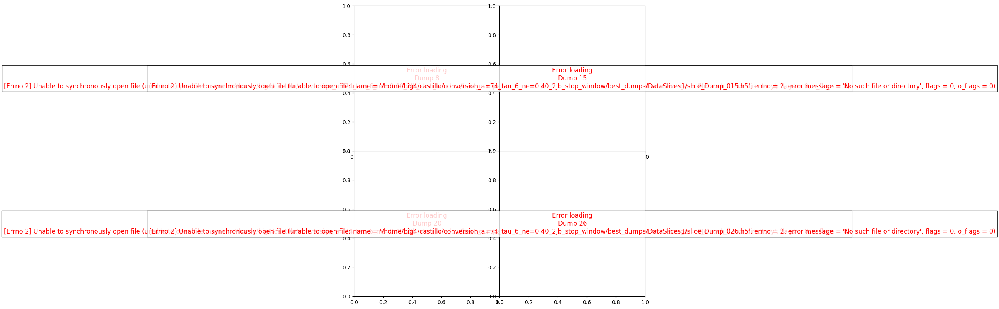
    


```python
import h5py
import numpy as np
import matplotlib.pyplot as plt
import ipywidgets as widgets
import os
import json
from ipywidgets import VBox, HBox, Accordion, Tab
from IPython.display import display, FileLink

folder = selected_folder + '/DataSlices/'

# Variable to store annotated "caverns"
caverns_data = []

# ---- Save cavern ROI ----
def save_cavern(b):
    global caverns_data
    new_entry = {
        "dump": int(w_dump.value),
        "x": str(w_center_x.value),
        "y": str(w_center_y.value),
        "z": str(w_center_z.value),
        "radius": str(w_radius.value)
    }
    caverns_data.append(new_entry)
    print("Caverna guardada:", new_entry)

# ---- Export annotations to JSON ----
def export_json(b):
    global caverns_data
    filename = 'data_cavern.json'
    with open(filename, 'w') as f:
        json.dump(caverns_data, f, indent=2)
    print(f"File '{filename}' exported.")
    display(FileLink(filename))
    
# ---- Update plot based on widget values ----
def update_plot(
    alpha, cmap, vrange, xrange, yrange,
    alpha2, cmap2, vrange2, show_second,
    dump, field, density, component, plane,
    draw_circle, center_x, center_y, center_z, radius
):
    vmin1, vmax1 = vrange
    vmin2, vmax2 = vrange2
    xminscale, xmaxscale = xrange
    yminscale, ymaxscale = yrange

    filename = folder + f"slice_Dump_{str(dump).zfill(3)}.h5"
    
    with h5py.File(filename, 'r') as f:
        dataDensity = f[density + "_" + plane][()]
        dataField = f[field + "MultiField_" + component + "_" + plane][()]

        xmin, ymin, zmin = f['globalGridGlobal'].attrs.get('vsLowerBounds') * 1.0e+6
        xmax, ymax, zmax = f['globalGridGlobal'].attrs.get('vsUpperBounds') * 1.0e+6
        timeDump =  f['time'].attrs.get('vsTime') * 1.0e+15
        steptime =  f['time'].attrs.get('vsStep') * 1.0e+15
    
    fig, ax = plt.subplots(figsize=(18,10.08))
    print('maxDensity', dataDensity.max())
    print('minDensity', dataDensity.min())
    print('time', timeDump)
    
    # Plot density
    if density == "Rho":    
        im1 = ax.imshow(
            dataDensity.T,
            extent=[xmin, xmax, ymin, ymax],
            aspect='equal',
            alpha=alpha,
            cmap=cmap,
            vmin=-vmax1,
            vmax=vmax1
        )
    else:
        im1 = ax.imshow(
            dataDensity.T,
            extent=[xmin, xmax, ymin, ymax],
            aspect='equal',
            alpha=alpha,
            cmap=cmap,
            vmin=vmin1,
            vmax=vmax1
        )
    
    # Optionally overlay field
    Emax = dataField.max()
    Emin = dataField.min()
    print('maxField', "{:e}".format(Emax))
    print('minField', "{:e}".format(Emin))
    if show_second:
        im2 = ax.imshow(
            dataField.T,
            extent=[xmin, xmax, ymin, ymax],
            aspect='equal',
            alpha=alpha2,
            cmap=cmap2,
            vmin=vmin2*Emax,
            vmax=vmax2*Emax
        )
        plt.colorbar(im2, ax=ax, label="Field")

    # Draw circle if enabled
    if draw_circle:
        if plane == 'xy':
            center = (center_x, center_y)
        elif plane == 'xz':
            center = (center_x, center_z)
        else:
            center = (center_x, center_y)

        circle = plt.Circle(center, radius=radius, color='g', alpha=0.3, zorder=100)
        ax.add_patch(circle)

    middle_x = (xmax-xmin)/200
    ax.set_title(f"{density} + {field}{component} ({plane})")
    ax.set_xlabel(plane[0]+r'$/ \lambda$', fontsize = 30, labelpad = 0)
    ax.set_ylabel(plane[1]+r'$/ \lambda$', fontsize = 30, labelpad = 0)
    ax.set_xlim(xmin+(100+xminscale)*middle_x, xmax-(100-xmaxscale)*middle_x)
    ax.set_ylim(ymin-(100+yminscale)*ymin/100, ymax-(100-ymaxscale)*ymax/100)
    plt.colorbar(im1, ax=ax, label=density)
    plt.tight_layout()
    plt.show()

# ---- Widget definitions and UI layout ----
# (Full widget setup as provided...)
# [Note: Full code preserved below for completeness]

# Data source controls
w_dump = widgets.IntSlider(value=1, min=1, max=49, step=1, description='Dump:')
w_field = widgets.Dropdown(options=["Elec", "Mag"], value="Elec", description='Field:')
w_density = widgets.Dropdown(options=["RhoEL", "RhoIL", "Rho"], value="RhoEL", description='Density:')
w_component = widgets.Dropdown(options=["x", "y", "z"], value="x", description='Component:')
w_plane = widgets.Dropdown(options=["xy", "xz"], value="xy", description='Plane:')

data_source_controls = VBox([
    w_dump,
    w_field,
    w_density,
    w_component,
    w_plane
])
accordion_data_source = Accordion(children=[data_source_controls], titles=("Data Source",))
accordion_data_source.selected_index = 0

# Density visualization controls
w_alpha = widgets.FloatSlider(value=0.5, min=0, max=1, step=0.01, description='Alpha:')
w_cmap = widgets.Dropdown(options=plt.colormaps(), value='Greys_r', description='Cmap:')
w_vrange = widgets.FloatRangeSlider(
    value=[0, 2],
    min=0,
    max=30,
    step=1,
    description='Values:',
    continuous_update=False
)

color_controls_density = VBox([w_alpha, w_cmap])
accordion_color_density = Accordion(children=[color_controls_density], titles=("Adjust color",))
accordion_color_density.selected_index = None

v_controls_density = VBox([w_vrange])
accordion_values_density = Accordion(children=[v_controls_density], titles=("Range of values",))
accordion_values_density.selected_index = None

spatial_controls = VBox([
    widgets.FloatRangeSlider(value=[-100,100], min=-100, max=100, step=1, description='X range:'),
    widgets.FloatRangeSlider(value=[-100,100], min=-100, max=100, step=1, description='Y range:')
])
accordion_spatial = Accordion(children=[spatial_controls], titles=("Spatial Range",))
accordion_spatial.selected_index = None

density_tab = VBox([accordion_color_density, accordion_values_density, accordion_spatial])

# Field overlay controls
w_alpha2 = widgets.FloatSlider(value=0.5, min=0, max=1, step=0.01, description='Alpha (Field):')
w_cmap2 = widgets.Dropdown(options=plt.colormaps(), value='seismic', description='Cmap (Field):')
w_vrange2 = widgets.FloatRangeSlider(
    value=[-0.2, 0.2],
    min=-1,
    max=1,
    step=0.01,
    description='Values (Field):',
    continuous_update=False
)
show_second_checkbox = widgets.Checkbox(value=False, description='Show field')

color_controls_fields = VBox([show_second_checkbox, w_alpha2, w_cmap2])
accordion_color_fields = Accordion(children=[color_controls_fields], titles=("Adjust color",))
accordion_color_fields.selected_index = None

v_controls_fields = VBox([w_vrange2])
accordion_values_fields = Accordion(children=[v_controls_fields], titles=("Range of values",))
accordion_values_fields.selected_index = None

fields_tab = VBox([accordion_color_fields, accordion_values_fields])

# Circle annotation controls
draw_circle_checkbox = widgets.Checkbox(value=False, description='Draw Circle')
w_center_x = widgets.FloatText(value=0.0, description='Centr X:')
w_center_y = widgets.FloatText(value=0.0, description='Centr Y:')
w_center_z = widgets.FloatText(value=0.0, description='Centr Z:')
w_radius = widgets.FloatText(value=5.0, description='Radius:')

btn_save = widgets.Button(description="Save caverna", icon='save')
btn_export = widgets.Button(description="Export JSON", icon='download')

btn_save.on_click(save_cavern)
btn_export.on_click(export_json)

circle_controls = VBox([
    HBox([w_dump, w_plane]),
    draw_circle_checkbox,
    w_center_x,
    w_center_y,
    w_center_z,
    w_radius,
    btn_save,
    btn_export
])
accordion_circle = widgets.Accordion(children=[circle_controls], titles=("Configure Circle",))
accordion_circle.selected_index = None

# Assemble tabs
tab = Tab()
tab.children = [accordion_data_source, density_tab, fields_tab, accordion_circle]
tab.titles = ('Data source', 'Density', 'Fields', 'Circle')

# Link widgets to plot function
out = widgets.interactive_output(update_plot, {
    'alpha': w_alpha,
    'cmap': w_cmap,
    'vrange': w_vrange,
    'xrange': spatial_controls.children[0],
    'yrange': spatial_controls.children[1],
    'alpha2': w_alpha2,
    'cmap2': w_cmap2,
    'vrange2': w_vrange2,
    'show_second': show_second_checkbox,
    'dump': w_dump,
    'field': w_field,
    'density': w_density,
    'component': w_component,
    'plane': w_plane,
    'draw_circle': draw_circle_checkbox,
    'center_x': w_center_x,
    'center_y': w_center_y,
    'center_z': w_center_z,
    'radius': w_radius
})

# Display UI
ui = VBox([tab])
display(ui, out)
```


    VBox(children=(Tab(children=(Accordion(children=(VBox(children=(IntSlider(value=1, description='Dump:', max=49…


    Output()


<details>
<summary><b>Tag: subplot_helmholtz_3x3_v1_1</b> – 3×3 Helmholtz comparison with vertical reference line and optimized Fourier path</summary>

**Description**: Extends `subplot_helmholtz_3x3_v1` by adding a **configurable vertical reference line** (e.g., to mark a laser front or boundary) and explicitly uses `/FourierFieldsOptimized/` for Helmholtz data. Compares Total, Gradient, and Solenoidal field components across three time dumps (for example [5, 7, 12]). Includes improved auto-generated filenames for saved figures and retains all publication-ready features: LaTeX labels, consistent scaling, time stamps, and dual-layer overlay (density + Fourier field).  
**Version**: v1.1


```python
import numpy as np
import h5py
import matplotlib.pyplot as plt


folder = selected_folder + "/DataSlices/"
folder2 = selected_folder + "/FourierFieldsOptimized/"
def plot_9_subplots_helmholtz_time_comparison(
    field="Elec",
    plane="xy",
    density="RhoEL",
    dumps=[5, 7, 14],
    component="x",
    helmholtz_types=["Total", "Gradient", "Solenoidal"],
    cmap_density="Greys",
    cmap_fourier= "gist_rainbow_r",
    alpha_density=1.00,
    alpha_fourier=0.75,
    vrange_density=(0.0, 3.0),
    vrange_fourier=(-0.99, 0.99),
    figsize=(10.35, 10.5),
    show_colorbars=True,
    save_fig=False,
    xmin_limit=60,
    xmax_limit=90,
    ymin_limit=-15,
    ymax_limit=15,
    tick_fontsize=13,
    cbar_tick_fontsize=12,
    cbar_left_pad=0.03,
    cbar_right_pad=0.03,
    cbar_left_anchor=(0.0, 0.5),
    cbar_right_anchor=(2.3, 0.5),
    cbar_panchor_left=(0, 0.5),
    cbar_panchor_right=(1, 0.5),
    cbar_shrink=0.85,
    shade_density=True,
    azdeg=315,
    altdeg=45,
    vert_exag=0.5,
    blend_mode='overlay',
    line_border=True, line_position=80,
    line_color='green',line_width=0.5
):
    """
    Genera una matriz 3x3 de subplots:
      - Filas: tipos de Helmholtz (Total, Gradient, Solenoidal)
      - Columnas: dumps 14, 15 y 16 (misma componente "x")
    Superpone densidad (Greys) + componente Ex de Fourier (gist_rainbow_r) con alpha constante.
    """
    
    # ✅ DICCIONARIO DE NOTACIONES MATEMÁTICAS PARA TIPOS DE HELMHOLTZ
    helmholtz_notation = {
        "Total": r"$E_{x}$",
        "Gradient": r"$E_{es}$",      # electrostatic
        "Solenoidal": r"$E_{v}$"
    }
    
    # --- Preparar figura 3x3 ---
    fig, axes = plt.subplots(3, 3, figsize=figsize, sharex=True, sharey=True, squeeze=False)
    fig.suptitle(f"{field}$_{{{component}}}$ ({plane}) - Density {density} + Helmholtz Decomposition", 
                 fontsize=16, y=0.985)

    # Validación de archivos
    all_files_exist = True
    for dump in dumps:
        density_file = folder + f"slice_Dump_{str(dump).zfill(3)}.h5"
        fourier_file = folder2 + f"sliceTotalGradSolen_Dump_{str(dump).zfill(3)}.h5"
        try:
            with h5py.File(density_file, 'r') as f:
                _ = f[density + "_" + plane][()]
            with h5py.File(fourier_file, 'r') as f:
                _ = f[field + "MultiField_Total_x_xy"]
        except Exception as e:
            print(f"[ERROR] Archivo faltante para dump={dump}: {str(e)}")
            all_files_exist = False
    
    if not all_files_exist:
        raise FileNotFoundError("No se pudieron cargar todos los archivos requeridos.")

    last_im1 = None
    last_im2 = None

    # --- Iterar sobre filas y columnas ---
    for i, helmholtz in enumerate(helmholtz_types):
        for j, dump in enumerate(dumps):
            ax = axes[i, j]
            
            # Cargar densidad
            filename_density = folder + f"slice_Dump_{str(dump).zfill(3)}.h5"
            with h5py.File(filename_density, 'r') as f:
                dataDensity = f[density + "_" + plane][()]
                bounds = f['globalGridGlobal'].attrs.get('vsLowerBounds') * 1.0e+6
                upper_bounds = f['globalGridGlobal'].attrs.get('vsUpperBounds') * 1.0e+6
                timeDump = f['time'].attrs.get('vsTime') * 1.0e+15

            xmin_file, ymin_file, _ = bounds
            xmax_file, ymax_file, _ = upper_bounds

            # Aplicar límites personalizados
            xmin_plot = xmin_limit if xmin_limit is not None else xmin_file
            xmax_plot = xmax_limit if xmax_limit is not None else xmax_file
            ymin_plot = ymin_limit if ymin_limit is not None else ymin_file
            ymax_plot = ymax_limit if ymax_limit is not None else ymax_file

            # Cargar datos de Fourier
            try:
                filename_fourier = folder2 + f"sliceTotalGradSolen_Dump_{str(dump).zfill(3)}.h5"
                dset_name = f"{field}MultiField_{helmholtz}_{component}_{plane}"
                with h5py.File(filename_fourier, 'r') as f_fourier:
                    s_fourier = f_fourier[dset_name][()]
            except Exception as e:
                print(f"[WARNING] Fourier no disponible para dump={dump}, {helmholtz}: {str(e)}")
                s_fourier = None

            # Plot densidad (siempre presente)
            im1 = ax.imshow(
                dataDensity.T,
                extent=[xmin_file, xmax_file, ymin_file, ymax_file],
                aspect='equal',
                cmap=cmap_density,
                alpha=alpha_density,
                vmin=vrange_density[0],
                vmax=vrange_density[1]
            )
            last_im1 = im1

            # Plot componente Fourier si está disponible - ALPHA CONSTANTE
            if s_fourier is not None and s_fourier.size > 0:
                Efabs = max(abs(s_fourier.min()), abs(s_fourier.max()))
                vmin_f, vmax_f = (vrange_fourier[0] * Efabs, vrange_fourier[1] * Efabs) if Efabs != 0 else (-1e-10, 1e-10)
                
                # ALPHA CONSTANTE - Sin dependencia del valor de Fourier
                im2 = ax.imshow(
                    s_fourier.T,
                    extent=[xmin_file, xmax_file, ymin_file, ymax_file],
                    aspect='equal',
                    cmap=cmap_fourier,
                    vmin=vmin_f,
                    vmax=vmax_f,
                    alpha=alpha_fourier,
                )
                last_im2 = im2

            # --- Línea vertical en x = 90 ---
            if line_border:
                ax.axvline(x=line_position, color=line_color, linestyle='--', linewidth=line_width, zorder=1)

            # Configuración de ejes
            ax.set_xlim(xmin_plot, xmax_plot)
            ax.set_ylim(ymin_plot, ymax_plot)
            
            # Ticks y etiquetas
            ax.tick_params(
                left=(j == 0),
                bottom=(i == 2),
                labelleft=(j == 0),
                labelbottom=(i == 2),
                labelsize=tick_fontsize,
                colors='black'
            )
            for spine in ax.spines.values():
                spine.set_visible(True)
            
            if i == 2:
                ax.set_xlabel(f"${plane[0]}/\\lambda$", fontsize=15, labelpad=5)
            if j == 0:
                ax.set_ylabel(f"${plane[1]}/\\lambda$", fontsize=15, labelpad=5)
            
            # Etiqueta de tiempo (solo en fila superior)
            if i == 0:
                ax.text(0.5, 0.98, f"t = {timeDump:.2f} fs",
                        transform=ax.transAxes, fontsize=12, fontweight='semibold',
                        color='white', ha='center', va='top',
                        bbox=dict(boxstyle='round,pad=0.2', facecolor='black', alpha=0.6, edgecolor='none'))
            
            # ✅ Etiqueta Helmholtz con notación matemática del diccionario
            helmholtz_label = helmholtz_notation.get(helmholtz, helmholtz)
            ax.text(0.82, 0.93, helmholtz_label,
                    transform=ax.transAxes, fontsize=13, fontweight='bold',
                    color='white', ha='center', va='center',
                    bbox=dict(boxstyle='round,pad=0.25', facecolor='black', alpha=0.6, edgecolor='none'))

    # --- Colorbars ---
    if show_colorbars:
        if last_im1 is not None:
            print('ok')
            '''
            cbar1 = fig.colorbar(
                last_im1, ax=axes, location='left', pad=cbar_left_pad,
                shrink=cbar_shrink, anchor=cbar_left_anchor, panchor=cbar_panchor_left
            )
            cbar1.set_label("$n/n_{0}$", fontsize=14)
            cbar1.ax.tick_params(labelsize=cbar_tick_fontsize)
             '''
        if last_im2 is not None:
            # ✅ Etiqueta del colorbar con notación matemática
            cbar2 = fig.colorbar(
                last_im2, ax=axes, location='right', pad=cbar_right_pad,
                shrink=cbar_shrink, anchor=cbar_right_anchor, panchor=cbar_panchor_right
            )

            cbar2.set_label(f"$eE_{{{component}}}/m_{{e}}c \\omega$", fontsize=14)
            cbar2.ax.tick_params(labelsize=cbar_tick_fontsize)

    
    plt.tight_layout(rect=[0.02, 0.02, 0.98, 0.96])
    plt.subplots_adjust(wspace=0.00, hspace=0.00)
    plt.show()

    if save_fig:
        fig_name= f"helmholtz_3x3_{dumps}_E{component}_{density}_{cmap_fourier}.png"
        fig.savefig(fig_name, dpi=150, bbox_inches='tight', facecolor='white')
        print(f"✅ Figure save as '{fig_name}' (dumps {dumps}, component {component})")
```


```python
plot_9_subplots_helmholtz_time_comparison(dumps=[5, 7, 12],
                                          cmap_fourier= "seismic", #"seismic", #"gist_rainbow_r",
                                          save_fig=True)
```

    ok


    /tmp/ipykernel_881559/70843782.py:207: UserWarning: This figure includes Axes that are not compatible with tight_layout, so results might be incorrect.
      plt.tight_layout(rect=[0.02, 0.02, 0.98, 0.96])


    
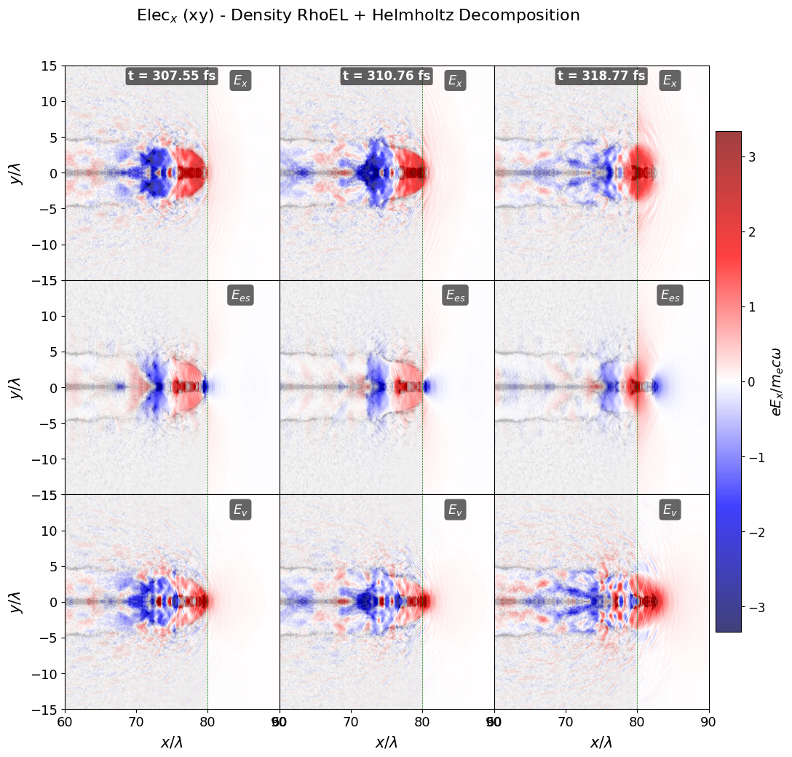
    


    ✅ Figure save as 'helmholtz_3x3_[5, 7, 12]_Ex_RhoEL_seismic.png' (dumps [5, 7, 12], component x)


```python
import numpy as np
import h5py
import matplotlib.pyplot as plt

dump_num = 12
folder = selected_folder + "/DataSlices/"
folder2 = selected_folder + "/FourierFieldsOptimized/"
density = "RhoEL"
plane = "xy"

xmin_limit, xmax_limit = 60, 90
ymin_limit, ymax_limit = -15, 15

fig, axes = plt.subplots(1, 3, figsize=(15, 5))

# Загрузка плотности и координат
with h5py.File(folder + f"slice_Dump_{str(dump_num).zfill(3)}.h5", 'r') as f:
    dataDensity = f[density + "_" + plane][()]
    bounds = f['globalGridGlobal'].attrs.get('vsLowerBounds') * 1.0e+6
    upper_bounds = f['globalGridGlobal'].attrs.get('vsUpperBounds') * 1.0e+6
    timeDump = f['time'].attrs.get('vsTime') * 1.0e+15

xmin_file, ymin_file = bounds[0], bounds[1]
xmax_file, ymax_file = upper_bounds[0], upper_bounds[1]

# Загрузка Fourier полей
filename_fourier = folder2 + f"sliceTotalGradSolen_Dump_{str(dump_num).zfill(3)}.h5"
with h5py.File(filename_fourier, 'r') as f:
    grad_field = f['ElecMultiField_Gradient_x_xy'][()]
    solen_field = f['ElecMultiField_Solenoidal_x_xy'][()]
    total_field = grad_field + solen_field  # ✅ Total = Gradient + Solenoidal

# 1. TOTAL
ax = axes[0]
ax.imshow(dataDensity.T, extent=[xmin_file, xmax_file, ymin_file, ymax_file],
          cmap='Greys', vmin=0, vmax=3, alpha=1)
Efabs = max(abs(total_field.min()), abs(total_field.max()))
ax.imshow(total_field.T, extent=[xmin_file, xmax_file, ymin_file, ymax_file],
          cmap='gist_rainbow_r', vmin=-0.99*Efabs, vmax=0.99*Efabs, alpha=0.75)
ax.set_xlim(xmin_limit, xmax_limit)
ax.set_ylim(ymin_limit, ymax_limit)
ax.set_title('Total $E_x$\nt={:.1f} fs'.format(timeDump))
ax.set_ylabel('y/λ')

# 2. GRADIENT
ax = axes[1]
ax.imshow(dataDensity.T, extent=[xmin_file, xmax_file, ymin_file, ymax_file],
          cmap='Greys', vmin=0, vmax=3, alpha=1)
Efabs = max(abs(grad_field.min()), abs(grad_field.max()))
ax.imshow(grad_field.T, extent=[xmin_file, xmax_file, ymin_file, ymax_file],
          cmap='gist_rainbow_r', vmin=-0.99*Efabs, vmax=0.99*Efabs, alpha=0.75)
ax.set_xlim(xmin_limit, xmax_limit)
ax.set_ylim(ymin_limit, ymax_limit)
ax.set_title('Gradient $E_{{es}}$')

# 3. SOLENOIDAL
ax = axes[2]
ax.imshow(dataDensity.T, extent=[xmin_file, xmax_file, ymin_file, ymax_file],
          cmap='Greys', vmin=0, vmax=3, alpha=1)
Efabs = max(abs(solen_field.min()), abs(solen_field.max()))
ax.imshow(solen_field.T, extent=[xmin_file, xmax_file, ymin_file, ymax_file],
          cmap='gist_rainbow_r', vmin=-0.99*Efabs, vmax=0.99*Efabs, alpha=0.75)
ax.set_xlim(xmin_limit, xmax_limit)
ax.set_ylim(ymin_limit, ymax_limit)
ax.set_title('Solenoidal $E_v$')

for ax in axes:
    ax.set_xlabel('x/λ')

plt.tight_layout()
plt.savefig(f"dump12_3fields_PERFECT.png", dpi=150, bbox_inches='tight')
plt.show()

print(f"✅ dump12_3fields_PERFECT.png — ВСЕ ТРИ ГРАФИКА с данными!")
print(f"t = {timeDump:.1f} fs")
```


    
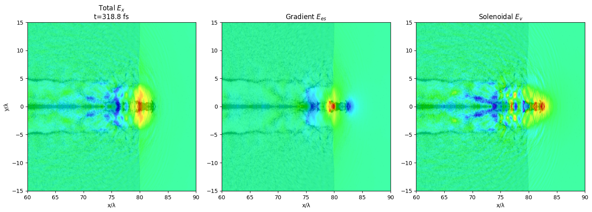
    


    ✅ dump12_3fields_PERFECT.png — ВСЕ ТРИ ГРАФИКА с данными!
    t = 318.8 fs


```python
import numpy as np
import h5py
import matplotlib.pyplot as plt
selected_folder = "/home/big4/castillo/conversion_a=74_tau_6_ne=0.40_2Jb_stop_window/tracking"
dump_num =14
folder = selected_folder + "/DataSlices/"
folder2 = selected_folder + "/FourierFieldsOptimized/"
density = "RhoEL"
plane = "xy"

xmin_limit, xmax_limit = 60, 90

fig, ax = plt.subplots(figsize=(10, 6))

# Загрузка данных
with h5py.File(folder + f"slice_Dump_{str(dump_num).zfill(3)}.h5", 'r') as f:
    dataDensity = f[density + "_" + plane][()]
    bounds = f['globalGridGlobal'].attrs.get('vsLowerBounds') * 1.0e+6
    upper_bounds = f['globalGridGlobal'].attrs.get('vsUpperBounds') * 1.0e+6
    timeDump = f['time'].attrs.get('vsTime') * 1.0e+15

xmin_file, ymin_file = bounds[0], bounds[1]
xmax_file, ymax_file = upper_bounds[0], upper_bounds[1]

# Координаты сетки
nx, ny = dataDensity.shape
dx = (xmax_file - xmin_file) / nx
dy = (ymax_file - ymin_file) / ny

x_centers = xmin_file + (np.arange(nx) + 0.5) * dx
y_centers = ymin_file + (np.arange(ny) + 0.5) * dy

# Центральный срез y=0
idx_y0 = np.argmin(np.abs(y_centers))
print("y=0 найдено на индексе", idx_y0, ", координата y=", y_centers[idx_y0], "λ")

# Загрузка полей
filename_fourier = folder2 + f"sliceTotalGradSolen_Dump_{str(dump_num).zfill(3)}.h5"
with h5py.File(filename_fourier, 'r') as f:
    grad_field = f['ElecMultiField_Gradient_x_xy'][()]
    solen_field = f['ElecMultiField_Solenoidal_x_xy'][()]

total_field = grad_field + solen_field

# 1D профили по y=0
density_1d = dataDensity[:, idx_y0]
total_1d = total_field[:, idx_y0]
grad_1d = grad_field[:, idx_y0] 
solen_1d = solen_field[:, idx_y0]

# Обрезка по X (60-90)
mask = (x_centers >= xmin_limit) & (x_centers <= xmax_limit)
x_plot = x_centers[mask]

# Plot
ax.plot(x_plot, total_1d[mask], 'k-', linewidth=3, label='Total $E_x$')
ax.plot(x_plot, grad_1d[mask], 'b--', linewidth=2.5, label='Gradient $E_{es}$')
ax.plot(x_plot, solen_1d[mask], 'r-.', linewidth=2.5, label='Solenoidal $E_v$')

# Оформление
ax.set_xlabel('x/λ', fontsize=14)
ax.set_ylabel('$E_x$ (норм.)', fontsize=14)
ax.set_title(f'1D профили дамп {dump_num} (t={timeDump:.1f} fs)\ny={y_centers[idx_y0]:.2f} λ', fontsize=14)
ax.grid(True, alpha=0.3)
ax.legend(fontsize=12)
ax.set_xlim(xmin_limit, xmax_limit)

plt.tight_layout()
plt.savefig(f"1D_dump12_y0_Ex.png", dpi=150, bbox_inches='tight')
plt.show()

print("✅ 1D_dump12_y0_Ex.png готов!")
print("y=0:", y_centers[idx_y0], "λ")

```

    y=0 найдено на индексе 365 , координата y= 0.0 λ


    
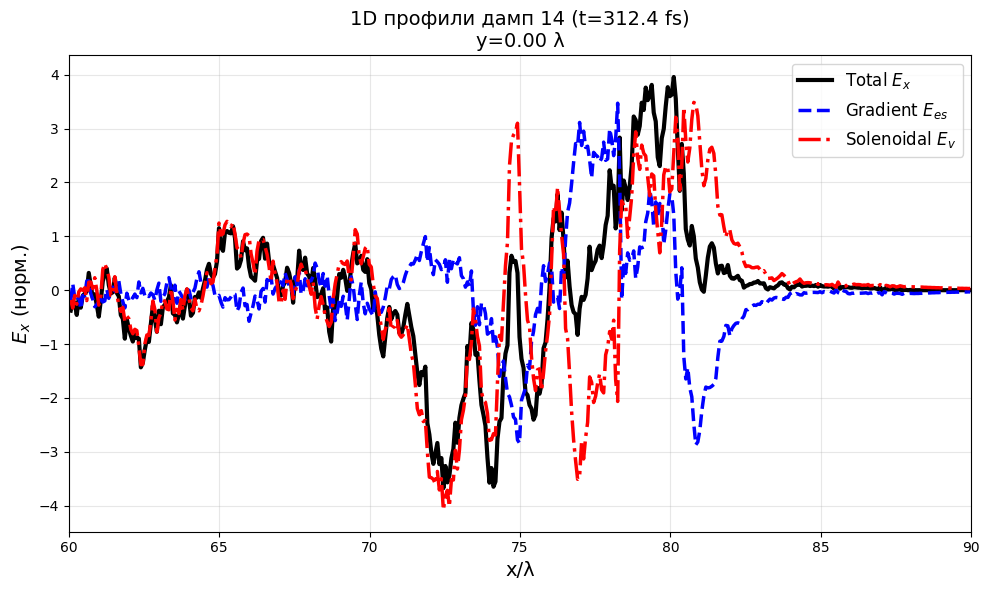
    


    ✅ 1D_dump12_y0_Ex.png готов!
    y=0: 0.0 λ


```python
import numpy as np
import h5py
import matplotlib.pyplot as plt

selected_folder = "/home/big4/castillo/conversion_a=74_tau_6_ne=0.40_2Jb_stop_window/tracking"
dump_num = 29
folder = selected_folder + "/DataSlices/"
folder2 = selected_folder + "/FourierFieldsOptimized/"
density = "RhoEL"
plane = "xy"

xmin_limit, xmax_limit = 60, 90

fig, ax = plt.subplots(figsize=(10, 6))

# Загрузка данных
with h5py.File(folder + f"slice_Dump_{str(dump_num).zfill(3)}.h5", 'r') as f:
    dataDensity = f[density + "_" + plane][()]
    bounds = f['globalGridGlobal'].attrs.get('vsLowerBounds') * 1.0e+6
    upper_bounds = f['globalGridGlobal'].attrs.get('vsUpperBounds') * 1.0e+6
    timeDump = f['time'].attrs.get('vsTime') * 1.0e+15

xmin_file, ymin_file = bounds[0], bounds[1]
xmax_file, ymax_file = upper_bounds[0], upper_bounds[1]

# Координаты сетки
nx, ny = dataDensity.shape
dx = (xmax_file - xmin_file) / nx
dy = (ymax_file - ymin_file) / ny

x_centers = xmin_file + (np.arange(nx) + 0.5) * dx
y_centers = ymin_file + (np.arange(ny) + 0.5) * dy

# Центральный срез y=0
idx_y0 = np.argmin(np.abs(y_centers))
print("y=0 найдено на индексе", idx_y0, ", координата y=", y_centers[idx_y0], "λ")

# Загрузка полей
filename_fourier = folder2 + f"sliceTotalGradSolen_Dump_{str(dump_num).zfill(3)}.h5"
with h5py.File(filename_fourier, 'r') as f:
    grad_field = f['ElecMultiField_Gradient_x_xy'][()]
    solen_field = f['ElecMultiField_Solenoidal_x_xy'][()]

total_field = grad_field + solen_field

# 1D профили по y=0
density_1d = dataDensity[:, idx_y0]
total_1d = total_field[:, idx_y0]
grad_1d = grad_field[:, idx_y0] 
solen_1d = solen_field[:, idx_y0]

# Обрезка по X (60-90)
mask = (x_centers >= xmin_limit) & (x_centers <= xmax_limit)
x_plot = x_centers[mask]

# --- ДОБАВЛЕНО: Печать значений в точке x=85 ---
x_target = 80.0
# Находим индекс ближайшей точки к x=85
idx_target = np.argmin(np.abs(x_centers - x_target))
x_actual = x_centers[idx_target]

print("\n" + "="*50)
print(f"📊 ЗНАЧЕНИЯ ПОЛЕЙ В ТОЧКЕ x = {x_target} λ")
print(f"   (фактическая координата: x = {x_actual:.4f} λ)")
print("="*50)
print(f"Вихревое поле (Solenoidal) E_x: {solen_1d[idx_target]:.6e}")
print(f"Полное поле (Total) E_x:       {total_1d[idx_target]:.6e}")
print(f"Электростатическое (Gradient): {grad_1d[idx_target]:.6e}")
print("="*50 + "\n")
# --- КОНЕЦ ДОБАВЛЕННОГО БЛОКА ---

# Plot
ax.plot(x_plot, total_1d[mask], 'k-', linewidth=3, label='Total $E_x$')
ax.plot(x_plot, grad_1d[mask], 'b--', linewidth=2.5, label='Gradient $E_{es}$')
ax.plot(x_plot, solen_1d[mask], 'r-.', linewidth=2.5, label='Solenoidal $E_v$')

# Оформление
ax.set_xlabel('x/λ', fontsize=14)
ax.set_ylabel('$E_x$ (норм.)', fontsize=14)
ax.set_title(f'1D профили дамп {dump_num} (t={timeDump:.1f} fs)\ny={y_centers[idx_y0]:.2f} λ', fontsize=14)
ax.grid(True, alpha=0.3)
ax.legend(fontsize=12)
ax.set_xlim(xmin_limit, xmax_limit)

plt.tight_layout()
plt.savefig(f"1D_dump12_y0_Ex.png", dpi=150, bbox_inches='tight')
plt.show()

print("✅ 1D_dump12_y0_Ex.png готов!")
print("y=0:", y_centers[idx_y0], "λ")

```

    y=0 найдено на индексе 365 , координата y= 0.0 λ
    
    ==================================================
    📊 ЗНАЧЕНИЯ ПОЛЕЙ В ТОЧКЕ x = 80.0 λ
       (фактическая координата: x = 80.0062 λ)
    ==================================================
    Вихревое поле (Solenoidal) E_x: -2.501890e-01
    Полное поле (Total) E_x:       -2.377871e-01
    Электростатическое (Gradient): 1.240191e-02
    ==================================================
    


    
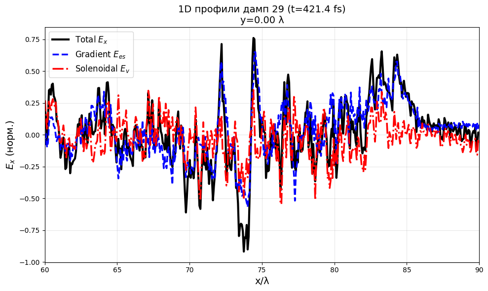
    


    ✅ 1D_dump12_y0_Ex.png готов!
    y=0: 0.0 λ


```python
import numpy as np
import h5py
import matplotlib.pyplot as plt

dump_num = 7
folder = selected_folder + "/DataSlices/"
folder2 = selected_folder + "/FourierFieldsOptimized/"
density = "RhoEL"
plane = "xy"

xmin_limit, xmax_limit = 60, 90

fig, ax = plt.subplots(figsize=(10, 6))

# Загрузка данных
with h5py.File(folder + f"slice_Dump_{str(dump_num).zfill(3)}.h5", 'r') as f:
    dataDensity = f[density + "_" + plane][()]
    bounds = f['globalGridGlobal'].attrs.get('vsLowerBounds') * 1.0e+6
    upper_bounds = f['globalGridGlobal'].attrs.get('vsUpperBounds') * 1.0e+6
    timeDump = f['time'].attrs.get('vsTime') * 1.0e+15

xmin_file, ymin_file = bounds[0], bounds[1]
xmax_file, ymax_file = upper_bounds[0], upper_bounds[1]

# Координаты сетки
nx, ny = dataDensity.shape
dx = (xmax_file - xmin_file) / nx
dy = (ymax_file - ymin_file) / ny

x_centers = xmin_file + (np.arange(nx) + 0.5) * dx
y_centers = ymin_file + (np.arange(ny) + 0.5) * dy

# Центральный срез y=0
idx_y0 = np.argmin(np.abs(y_centers))
print("y=0 найдено на индексе", idx_y0, ", координата y=", y_centers[idx_y0], "λ")

# Загрузка ТОЛЬКО вихревого поля
filename_fourier = folder2 + f"sliceTotalGradSolen_Dump_{str(dump_num).zfill(3)}.h5"
with h5py.File(filename_fourier, 'r') as f:
    solen_field = f['ElecMultiField_Solenoidal_x_xy'][()]

# 1D профиль вихревого поля по y=0
solen_1d = solen_field[:, idx_y0]

# Обрезка по X (60-90)
mask = (x_centers >= xmin_limit) & (x_centers <= xmax_limit)
x_plot = x_centers[mask]

# Plot ТОЛЬКО вихревое поле
ax.plot(x_plot, solen_1d[mask], 'r-', linewidth=3, label='$E_v$')

# ✅ ЧЕРНАЯ ШТРИХОВАЯ ЛИНИЯ x=80
ax.axvline(x=80, color='k', linestyle='--', linewidth=2, alpha=0.8, zorder=5)

# Оформление
ax.tick_params(axis='both', which='major', labelsize=16, size=8, width=1.5)
ax.set_xlabel('x/λ', fontsize=15)
ax.set_ylabel('$E_x$', fontsize=15)
ax.set_title('', fontsize=14)
ax.grid(True, alpha=0.3)
ax.legend(fontsize=16)
ax.set_xlim(xmin_limit, xmax_limit)

plt.tight_layout()
plt.savefig(f"1D_dump{dump_num}_y0_Evortex.png", dpi=150, bbox_inches='tight')
plt.show()

print(f"✅ 1D_dump{dump_num}_y0_Evortex.png готов!")
print("y=0:", y_centers[idx_y0], "λ")
```

    y=0 найдено на индексе 365 , координата y= 0.0 λ


    

    


    ✅ 1D_dump7_y0_Evortex.png готов!
    y=0: 0.0 λ


```python
import numpy as np
import h5py
import matplotlib.pyplot as plt

dump_num = 15
folder = selected_folder + "/DataSlices/"
folder2 = selected_folder + "/FourierFieldsOptimized/"
density = "RhoEL"
plane = "xy"

xmin_limit, xmax_limit = 60, 90

fig, ax = plt.subplots(figsize=(10, 6))

# Загрузка данных
with h5py.File(folder + f"slice_Dump_{str(dump_num).zfill(3)}.h5", 'r') as f:
    dataDensity = f[density + "_" + plane][()]
    bounds = f['globalGridGlobal'].attrs.get('vsLowerBounds') * 1.0e+6
    upper_bounds = f['globalGridGlobal'].attrs.get('vsUpperBounds') * 1.0e+6
    timeDump = f['time'].attrs.get('vsTime') * 1.0e+15

xmin_file, ymin_file = bounds[0], bounds[1]
xmax_file, ymax_file = upper_bounds[0], upper_bounds[1]

# Координаты сетки
nx, ny = dataDensity.shape
dx = (xmax_file - xmin_file) / nx
dy = (ymax_file - ymin_file) / ny

x_centers = xmin_file + (np.arange(nx) + 0.5) * dx
y_centers = ymin_file + (np.arange(ny) + 0.5) * dy

# Центральный срез y=0
idx_y0 = np.argmin(np.abs(y_centers))
print("y=0 найдено на индексе", idx_y0, ", координата y=", y_centers[idx_y0], "λ")

# Загрузка ТОЛЬКО вихревого поля
filename_fourier = folder2 + f"sliceTotalGradSolen_Dump_{str(dump_num).zfill(3)}.h5"
with h5py.File(filename_fourier, 'r') as f:
    solen_field = f['ElecMultiField_Solenoidal_x_xy'][()]

# 1D профиль вихревого поля по y=0
solen_1d = solen_field[:, idx_y0]

# Обрезка по X (60-90)
mask = (x_centers >= xmin_limit) & (x_centers <= xmax_limit)
x_plot = x_centers[mask]

# Plot ТОЛЬКО вихревое поле
ax.text(0.5, 0.98, f"t = {timeDump:.2f} fs",
                        transform=ax.transAxes, fontsize=12, fontweight='semibold',
                        color='white', ha='center', va='top',
                        bbox=dict(boxstyle='round,pad=0.2', facecolor='black', alpha=0.6, edgecolor='none'))
ax.plot(x_plot, solen_1d[mask], 'r-', linewidth=3, label='$E_v$')

# ✅ ЧЕРНАЯ ШТРИХОВАЯ ЛИНИЯ x=80
ax.axvline(x=80, color='k', linestyle='--', linewidth=2, alpha=0.8, zorder=5)

# Оформление
ax.tick_params(axis='both', which='major', labelsize=16, size=8, width=1.5)
ax.set_xlabel('x/λ', fontsize=15)
ax.set_ylabel('$E_x$', fontsize=15)
ax.set_title('', fontsize=14)
ax.grid(True, alpha=0.3)
ax.legend(fontsize=16)
ax.set_xlim(xmin_limit, xmax_limit)
ax.text(0.83, 0.95, r'$(g)$',
        transform=ax.transAxes,
        ha='right', va='top',
        fontsize=16, fontstyle='italic')
plt.tight_layout()
plt.savefig(f"1D_dump{dump_num}_y0_Evortex.png", dpi=150, bbox_inches='tight')
plt.show()

print(f"✅ 1D_dump{dump_num}_y0_Evortex.png готов!")
print("y=0:", y_centers[idx_y0], "λ")
```

    y=0 найдено на индексе 365 , координата y= 0.0 λ


    

    


    ✅ 1D_dump15_y0_Evortex.png готов!
    y=0: 0.0 λ


```python
import numpy as np
import h5py
import matplotlib.pyplot as plt
from scipy.ndimage import gaussian_filter1d  # Для усреднения/сглаживания

dump_num = 15
folder = selected_folder + "/DataSlices/"
folder2 = selected_folder + "/FourierFieldsOptimized/"
density = "RhoEL"
plane = "xy"

xmin_limit, xmax_limit = 75, 100

fig, ax = plt.subplots(figsize=(10, 6))

# Загрузка данных
with h5py.File(folder + f"slice_Dump_{str(dump_num).zfill(3)}.h5", 'r') as f:
    dataDensity = f[density + "_" + plane][()]
    bounds = f['globalGridGlobal'].attrs.get('vsLowerBounds') * 1.0e+6
    upper_bounds = f['globalGridGlobal'].attrs.get('vsUpperBounds') * 1.0e+6
    timeDump = f['time'].attrs.get('vsTime') * 1.0e+15

xmin_file, ymin_file = bounds[0], bounds[1]
xmax_file, ymax_file = upper_bounds[0], upper_bounds[1]

# Координаты сетки
nx, ny = dataDensity.shape
dx = (xmax_file - xmin_file) / nx
dy = (ymax_file - ymin_file) / ny

x_centers = xmin_file + (np.arange(nx) + 0.5) * dx
y_centers = ymin_file + (np.arange(ny) + 0.5) * dy

# Центральный срез y=0
idx_y0 = np.argmin(np.abs(y_centers))
print("y=0 найдено на индексе", idx_y0, ", координата y=", y_centers[idx_y0], "λ")

# Загрузка ТОЛЬКО вихревого поля
filename_fourier = folder2 + f"sliceTotalGradSolen_Dump_{str(dump_num).zfill(3)}.h5"
with h5py.File(filename_fourier, 'r') as f:
    solen_field = f['ElecMultiField_Solenoidal_x_xy'][()]

# 1D профиль вихревого поля по y=0
solen_1d = solen_field[:, idx_y0]

# Усреднение/сглаживание с gaussian_filter1d (sigma=1.5, axis=0)
sigma_smooth = 1.5  # Настройте под шум ваших данных
Ex_sol_smooth = gaussian_filter1d(solen_1d, sigma=sigma_smooth, axis=0, mode='reflect')

# Обрезка по X (60-90)
mask = (x_centers >= xmin_limit) & (x_centers <= xmax_limit)
x_plot = x_centers[mask]

ax.text(0.5, 0.98, f"t = {timeDump:.2f} fs",
                        transform=ax.transAxes, fontsize=12, fontweight='semibold',
                        color='white', ha='center', va='top',
                        bbox=dict(boxstyle='round,pad=0.2', facecolor='black', alpha=0.6, edgecolor='none'))


# Plot ТОЛЬКО вихревое поле
ax.plot(x_plot, Ex_sol_smooth[mask], 'r-', linewidth=3, label='$E_v$')

# ✅ ЧЕРНАЯ ШТРИХОВАЯ ЛИНИЯ x=80
ax.axvline(x=80, color='k', linestyle='--', linewidth=2, alpha=0.8, zorder=5)

# Оформление
ax.tick_params(axis='both', which='major', labelsize=16, size=8, width=1.5)
ax.set_xlabel('x/λ', fontsize=15)
ax.set_ylabel('$E_x$', fontsize=15)
ax.set_title('', fontsize=14)
ax.grid(True, alpha=0.3)
ax.legend(fontsize=16)
ax.set_xlim(xmin_limit, xmax_limit)
ax.text(0.83, 0.95, r'$(g)$',
        transform=ax.transAxes,
        ha='right', va='top',
        fontsize=16, fontstyle='italic')
plt.tight_layout()
plt.savefig(f"1D_dump{dump_num}_y0_Evortex.png", dpi=150, bbox_inches='tight')
plt.show()

print(f"✅ 1D_dump{dump_num}_y0_Evortex.png готов!")
print("y=0:", y_centers[idx_y0], "λ")
```

    y=0 найдено на индексе 365 , координата y= 0.0 λ


    
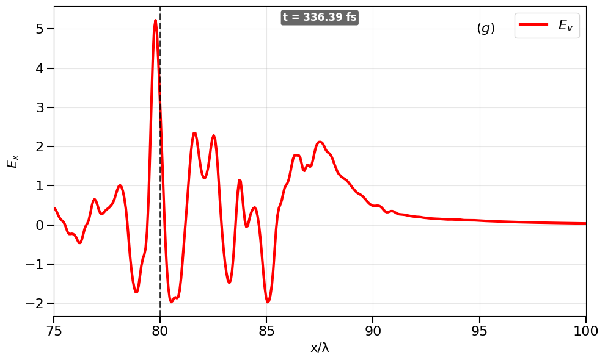
    


    ✅ 1D_dump15_y0_Evortex.png готов!
    y=0: 0.0 λ


```python
selected_folder = "/home/big4/castillo/conversion_a=74_tau_6_ne=0.40_2Jb_stop_window/tracking"

dump_num = 18
folder = selected_folder + "/DataSlices/"
folder2 = selected_folder + "/FourierFieldsOptimized/"
density = "RhoEL"
plane = "xy"

xmin_limit, xmax_limit = 75, 100

fig, ax = plt.subplots(figsize=(10, 6))

# Загрузка данных
with h5py.File(folder + f"slice_Dump_{str(dump_num).zfill(3)}.h5", 'r') as f:
    dataDensity = f[density + "_" + plane][()]
    bounds = f['globalGridGlobal'].attrs.get('vsLowerBounds') * 1.0e+6
    upper_bounds = f['globalGridGlobal'].attrs.get('vsUpperBounds') * 1.0e+6
    timeDump = f['time'].attrs.get('vsTime') * 1.0e+15

xmin_file, ymin_file = bounds[0], bounds[1]
xmax_file, ymax_file = upper_bounds[0], upper_bounds[1]

# Координаты сетки
nx, ny = dataDensity.shape
dx = (xmax_file - xmin_file) / nx
dy = (ymax_file - ymin_file) / ny

x_centers = xmin_file + (np.arange(nx) + 0.5) * dx
y_centers = ymin_file + (np.arange(ny) + 0.5) * dy

# Центральный срез y=0
idx_y0 = np.argmin(np.abs(y_centers))
print("y=0 найдено на индексе", idx_y0, ", координата y=", y_centers[idx_y0], "λ")

# Загрузка ТОЛЬКО вихревого поля
filename_fourier = folder2 + f"sliceTotalGradSolen_Dump_{str(dump_num).zfill(3)}.h5"
with h5py.File(filename_fourier, 'r') as f:
    solen_field = f['ElecMultiField_Solenoidal_x_xy'][()]

# 1D профиль вихревого поля по y=0
solen_1d = solen_field[:, idx_y0]

# Усреднение/сглаживание с gaussian_filter1d (sigma=1.5, axis=0)
sigma_smooth = 1.5  # Настройте под шум ваших данных
Ex_sol_smooth = gaussian_filter1d(solen_1d, sigma=sigma_smooth, axis=0, mode='reflect')

# Обрезка по X (60-90)
mask = (x_centers >= xmin_limit) & (x_centers <= xmax_limit)
x_plot = x_centers[mask]

ax.text(0.5, 0.98, f"t = {timeDump:.2f} fs",
                        transform=ax.transAxes, fontsize=12, fontweight='semibold',
                        color='white', ha='center', va='top',
                        bbox=dict(boxstyle='round,pad=0.2', facecolor='black', alpha=0.6, edgecolor='none'))


# Plot ТОЛЬКО вихревое поле
ax.plot(x_plot, Ex_sol_smooth[mask], 'r-', linewidth=3, label='$E_v$')

# ✅ ЧЕРНАЯ ШТРИХОВАЯ ЛИНИЯ x=80
ax.axvline(x=80, color='k', linestyle='--', linewidth=2, alpha=0.8, zorder=5)

# Оформление
ax.tick_params(axis='both', which='major', labelsize=16, size=8, width=1.5)
ax.set_xlabel('x/λ', fontsize=15)
ax.set_ylabel('$E_x$', fontsize=15)
ax.set_title('', fontsize=14)
ax.grid(True, alpha=0.3)
ax.legend(fontsize=16)
ax.set_xlim(xmin_limit, xmax_limit)
ax.text(0.83, 0.95, r'$(g)$',
        transform=ax.transAxes,
        ha='right', va='top',
        fontsize=16, fontstyle='italic')
plt.tight_layout()
plt.savefig(f"1D_dump{dump_num}_y0_Evortex.png", dpi=150, bbox_inches='tight')
plt.show()

print(f"✅ 1D_dump{dump_num}_y0_Evortex.png готов!")
print("y=0:", y_centers[idx_y0], "λ")

```

    y=0 найдено на индексе 365 , координата y= 0.0 λ


    
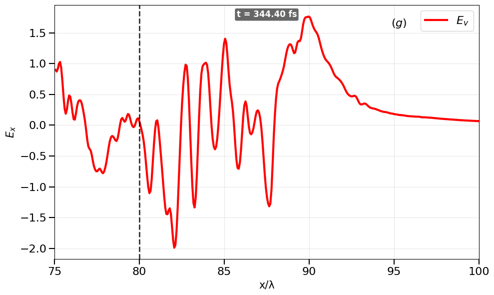
    


    ✅ 1D_dump18_y0_Evortex.png готов!
    y=0: 0.0 λ


```python
import numpy as np
import h5py
import matplotlib.pyplot as plt
from scipy.ndimage import gaussian_filter1d

selected_folder = "/home/big4/castillo/conversion_a=74_tau_6_ne=0.40_2Jb_stop_window/tracking"

dump_nums = [17, 21]  # 🔄 Dumps a comparar
folder = selected_folder + "/DataSlices/"
folder2 = selected_folder + "/FourierFieldsOptimized/"
density = "RhoEL"
plane = "xy"

xmin_limit, xmax_limit = 75, 100

fig, ax = plt.subplots(figsize=(10, 6))

# 🎨 Estilos para cada dump
styles = [
    {'color': 'r-', 'label': f"t = {timeDump:.2f} fs (dump 18)", 'alpha': 0.9},
    {'color': 'b-', 'label': r'$E_v$ (dump 20)', 'alpha': 0.9}
]

for idx, dump_num in enumerate(dump_nums):
    # Загрузка данных de densidad (para obtener la grilla)
    with h5py.File(folder + f"slice_Dump_{str(dump_num).zfill(3)}.h5", 'r') as f:
        dataDensity = f[density + "_" + plane][()]
        bounds = f['globalGridGlobal'].attrs.get('vsLowerBounds') * 1.0e+6
        upper_bounds = f['globalGridGlobal'].attrs.get('vsUpperBounds') * 1.0e+6
        timeDump = f['time'].attrs.get('vsTime') * 1.0e+15

    xmin_file, ymin_file = bounds[0], bounds[1]
    xmax_file, ymax_file = upper_bounds[0], upper_bounds[1]

    # Координаты сетки
    nx, ny = dataDensity.shape
    dx = (xmax_file - xmin_file) / nx
    dy = (ymax_file - ymin_file) / ny

    x_centers = xmin_file + (np.arange(nx) + 0.5) * dx
    y_centers = ymin_file + (np.arange(ny) + 0.5) * dy

    # Центральный срез y=0
    idx_y0 = np.argmin(np.abs(y_centers))
    
    # Загрузка вихревого campo
    filename_fourier = folder2 + f"sliceTotalGradSolen_Dump_{str(dump_num).zfill(3)}.h5"
    with h5py.File(filename_fourier, 'r') as f:
        solen_field = f['ElecMultiField_Solenoidal_x_xy'][()]

    # 1D профиль по y=0
    solen_1d = solen_field[:, idx_y0]

    # Сглаживание
    sigma_smooth = 1.5
    Ex_sol_smooth = gaussian_filter1d(solen_1d, sigma=sigma_smooth, axis=0, mode='reflect')

    # Обрезка por X
    mask = (x_centers >= xmin_limit) & (x_centers <= xmax_limit)
    x_plot = x_centers[mask]
    
    # 📈 Plot del campo vorticial
    ax.plot(x_plot, Ex_sol_smooth[mask], styles[idx]['color'], 
            linewidth=3, label=styles[idx]['label'], alpha=styles[idx]['alpha'])

# ✅ Línea vertical en x=80
ax.axvline(x=80, color='k', linestyle='--', linewidth=2, alpha=0.8, zorder=5)

# 🎨 Formato del plot
ax.tick_params(axis='both', which='major', labelsize=16, size=8, width=1.5)
ax.set_xlabel('x/λ', fontsize=15)
ax.set_ylabel('$E_x$', fontsize=15)
ax.grid(True, alpha=0.3)
ax.legend(fontsize=14, loc='best')
ax.set_xlim(xmin_limit, xmax_limit)

# Etiqueta de subplot
ax.text(0.83, 0.95, r'$(g)$',
        transform=ax.transAxes,
        ha='right', va='top',
        fontsize=16, fontstyle='italic')

plt.tight_layout()
#plt.savefig(f"1D_dump{dump_nums}_y0_Evortex.png", dpi=150, bbox_inches='tight')
plt.show()

print(f"✅ 1D_dump{dump_nums}_y0_Evortex.png generado exitosamente!")
print(f"📊 Dumps comparados: {dump_nums}")
```


    
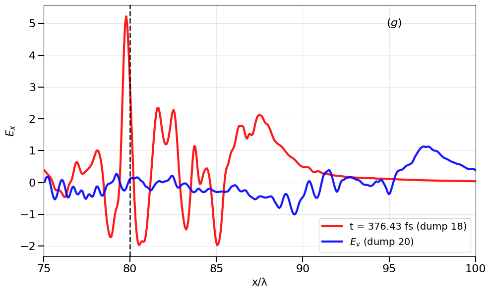
    


    ✅ 1D_dump[17, 21]_y0_Evortex.png generado exitosamente!
    📊 Dumps comparados: [17, 21]


```python
import numpy as np
import h5py
import matplotlib.pyplot as plt
from scipy.ndimage import gaussian_filter1d

selected_folder = "/home/big4/castillo/conversion_a=74_tau_6_ne=0.40_2Jb_stop_window/tracking"

dump_nums = [17, 22]
folder = selected_folder + "/DataSlices/"
folder2 = selected_folder + "/FourierFieldsOptimized/"
density = "RhoEL"
plane = "xy"

xmin_limit, xmax_limit = 78, 100

fig, ax = plt.subplots(figsize=(10, 6))

# Colores para diferenciar cada dump
line_colors = ['r-', 'b-']

for idx, dump_num in enumerate(dump_nums):
    # Cargar grilla y tiempo
    with h5py.File(folder + f"slice_Dump_{str(dump_num).zfill(3)}.h5", 'r') as f:
        dataDensity = f[density + "_" + plane][()]
        bounds = f['globalGridGlobal'].attrs.get('vsLowerBounds') * 1.0e+6
        upper_bounds = f['globalGridGlobal'].attrs.get('vsUpperBounds') * 1.0e+6
        timeDump = f['time'].attrs.get('vsTime') * 1.0e+15  # ⏱️ Tiempo extraído aquí

    xmin_file, ymin_file = bounds[0], bounds[1]
    xmax_file, ymax_file = upper_bounds[0], upper_bounds[1]

    nx, ny = dataDensity.shape
    dx = (xmax_file - xmin_file) / nx
    dy = (ymax_file - ymin_file) / ny

    x_centers = xmin_file + (np.arange(nx) + 0.5) * dx
    y_centers = ymin_file + (np.arange(ny) + 0.5) * dy

    idx_y0 = np.argmin(np.abs(y_centers))
    
    # Cargar campo vorticial
    filename_fourier = folder2 + f"sliceTotalGradSolen_Dump_{str(dump_num).zfill(3)}.h5"
    with h5py.File(filename_fourier, 'r') as f:
        solen_field = f['ElecMultiField_Solenoidal_x_xy'][()]

    solen_1d = solen_field[:, idx_y0]
    sigma_smooth = 1.5
    Ex_sol_smooth = gaussian_filter1d(solen_1d, sigma=sigma_smooth, axis=0, mode='reflect')

    mask = (x_centers >= xmin_limit) & (x_centers <= xmax_limit)
    x_plot = x_centers[mask]
    
    # 📈 Plot con el label dinámico solicitado
    ax.plot(x_plot, Ex_sol_smooth[mask], line_colors[idx], linewidth=3,
            label=f"$E_v$ for t = {timeDump:.2f} fs")

# ✅ Línea vertical en x=80
ax.axvline(x=80, color='k', linestyle='--', linewidth=2, alpha=0.8, zorder=5)

# 🎨 Formato del plot
ax.tick_params(axis='both', which='major', labelsize=16, size=8, width=1.5)
ax.set_xlabel('x/λ', fontsize=15)
ax.set_ylabel('$E_x$', fontsize=15)
ax.grid(True, alpha=0.5)
ax.legend(fontsize=14, loc='best')
ax.set_xlim(xmin_limit, xmax_limit)

# Etiqueta de subplot
ax.text(0.87, 0.95, r'$(j)$',
        transform=ax.transAxes,
        ha='right', va='top',
        fontsize=16, fontstyle='italic')

plt.tight_layout()
plt.savefig(f"1D_dump{dump_nums}_y0_Evortex.png", dpi=150, bbox_inches='tight')
plt.show()

print(f"✅ 1D_dump{dump_nums}_y0_Evortex.png generado exitosamente!")
print(f"📊 Dumps comparados: {dump_nums}")
```


    
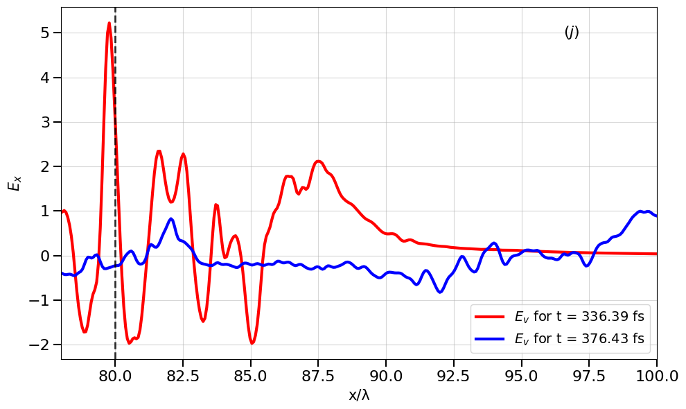
    


    ✅ 1D_dump[17, 22]_y0_Evortex.png generado exitosamente!
    📊 Dumps comparados: [17, 22]


```python
import numpy as np
import h5py
import matplotlib.pyplot as plt
from scipy.ndimage import uniform_filter1d

# Пути к данным
selected_folder = "/home/big4/castillo/conversion_a=74_tau_6_ne=0.40_2Jb_stop_window/tracking"
dump_nums = [17, 21] 
folder = selected_folder + "/DataSlices/"
folder2 = selected_folder + "/FourierFieldsOptimized/"
density = "RhoEL"
plane = "xy"

xmin_limit, xmax_limit = 75, 100

fig, ax = plt.subplots(figsize=(10, 6))

# Стили для дампов
styles = [
    {'color': 'r', 'label': f"Dump {dump_nums[0]}"},
    {'color': 'b', 'label': f"Dump {dump_nums[1]}"}
]

for idx, dump_num in enumerate(dump_nums):
    # Загрузка данных сетки
    with h5py.File(folder + f"slice_Dump_{str(dump_num).zfill(3)}.h5", 'r') as f:
        dataDensity = f[density + "_" + plane][()]
        bounds = f['globalGridGlobal'].attrs.get('vsLowerBounds') * 1.0e+6
        upper_bounds = f['globalGridGlobal'].attrs.get('vsUpperBounds') * 1.0e+6

    xmin_file, ymin_file = bounds[0], bounds[1]
    xmax_file, ymax_file = upper_bounds[0], upper_bounds[1]

    nx, ny = dataDensity.shape
    dx = (xmax_file - xmin_file) / nx
    x_centers = xmin_file + (np.arange(nx) + 0.5) * dx
    y_centers = ymin_file + (np.arange(ny) + 0.5) * (ymax_file - ymin_file) / ny

    # Центральный срез y=0
    idx_y0 = np.argmin(np.abs(y_centers))
    
    # Загрузка поля
    filename_fourier = folder2 + f"sliceTotalGradSolen_Dump_{str(dump_num).zfill(3)}.h5"
    with h5py.File(filename_fourier, 'r') as f:
        solen_field = f['ElecMultiField_Gradient_x_xy'][()]

    solen_1d = solen_field[:, idx_y0]

    # --- СТРОГОЕ УСРЕДНЕНИЕ ПО lambda=1 ---
    window_size = int(round(1.0 / dx))
    if window_size % 2 == 0:
        window_size += 1
    
    Ex_sol_smooth = uniform_filter1d(solen_1d, size=window_size, axis=0, mode='reflect')
    # --------------------------------------

    # Подготовка маски для обрезки
    mask = (x_centers >= xmin_limit) & (x_centers <= xmax_limit)
    x_plot = x_centers[mask]
    
    # Отрисовка сырых данных (пунктир)
    ax.plot(x_plot, solen_1d[mask], color=styles[idx]['color'], linestyle='--', 
            linewidth=1, alpha=0.3)
    
    # Отрисовка усредненных данных (сплошная)
    ax.plot(x_plot, Ex_sol_smooth[mask], color=styles[idx]['color'], linestyle='-', 
            linewidth=3, label=f"{styles[idx]['label']} (avg)", alpha=0.9)

# Линия x=80
ax.axvline(x=80, color='k', linestyle='--', linewidth=2, alpha=0.8, zorder=5)

# Форматирование
ax.tick_params(axis='both', which='major', labelsize=16, size=8, width=1.5)
ax.set_xlabel('x/λ', fontsize=15)
ax.set_ylabel('$E_x$', fontsize=15)
ax.grid(True, alpha=0.3)
ax.legend(fontsize=14, loc='best')
ax.set_xlim(xmin_limit, xmax_limit)

ax.text(0.83, 0.95, r'$(g)$', transform=ax.transAxes, ha='right', va='top', fontsize=16, fontstyle='italic')

plt.tight_layout()
plt.show()

print(f"📊 Dumps comparados: {dump_nums}")
```


```python
import numpy as np
import h5py
import matplotlib.pyplot as plt
from scipy.ndimage import uniform_filter1d
import os

selected_folder = "/home/big4/castillo/conversion_a=74_tau_6_ne=0.40_2Jb_stop_window/tracking"
dump_num = 17  # Один дамп
folder = selected_folder + "/DataSlices/"
folder2 = selected_folder + "/FourierFieldsOptimized/"
density = "RhoEL"
plane = "xy"

xmin_limit, xmax_limit = 75, 100

# Стили для двух полей
styles = [
    {'color': 'r', 'label': 'Вихревое поле (Solenoidal)', 'alpha': 0.9, 'linestyle': '-', 'linewidth': 3},
    {'color': 'b', 'label': 'Электростатическое поле (Electrostatic)', 'alpha': 0.9, 'linestyle': '--', 'linewidth': 3}
]

fig, ax = plt.subplots(figsize=(10, 6))

# --- 1. Загрузка данных для определения сетки (один раз) ---
file_path = folder + f"slice_Dump_{str(dump_num).zfill(3)}.h5"
if not os.path.exists(file_path):
    print(f"Файл не найден: {file_path}")
    exit()

with h5py.File(file_path, 'r') as f:
    dataDensity = f[density + "_" + plane][()]
    bounds = f['globalGridGlobal'].attrs.get('vsLowerBounds')
    upper_bounds = f['globalGridGlobal'].attrs.get('vsUpperBounds')
    
    if bounds is not None:
        bounds = bounds * 1.0e+6
        upper_bounds = upper_bounds * 1.0e+6

# Альтернативное получение координат если атрибутов нет
if bounds is None:
    with h5py.File(file_path, 'r') as f:
        if 'x' in f:
            x_coords = f['x'][()] * 1e6
            bounds = x_coords[0]
            upper_bounds = x_coords[-1]

xmin_file, ymin_file = bounds[0], bounds[1]
xmax_file, ymax_file = upper_bounds[0], upper_bounds[1]

nx, ny = dataDensity.shape
dx = (xmax_file - xmin_file) / nx
dy = (ymax_file - ymin_file) / ny

x_centers = xmin_file + (np.arange(nx) + 0.5) * dx
y_centers = ymin_file + (np.arange(ny) + 0.5) * dy
idx_y0 = np.argmin(np.abs(y_centers))

# --- 2. Загрузка полей и построение ---
fourier_path = folder2 + f"sliceTotalGradSolen_Dump_{str(dump_num).zfill(3)}.h5"

with h5py.File(fourier_path, 'r') as f:
    print("Доступные ключи в файле:", list(f.keys()))
    
    # Загрузка вихревого поля
    if 'ElecMultiField_Solenoidal_x_xy' in f:
        solen_field = f['ElecMultiField_Solenoidal_x_xy'][()]
        print("Вихревое поле загружено")
    else:
        print("Ключ для вихревого поля не найден")
        solen_field = None
    
    # Загрузка электростатического поля
    if 'ElecMultiField_Electrostatic_x_xy' in f:
        elec_field = f['ElecMultiField_Electrostatic_x_xy'][()]
        print("Электростатическое поле загружено")
    elif 'ElecField_Electrostatic_x_xy' in f:
        elec_field = f['ElecField_Electrostatic_x_xy'][()]
        print("Электростатическое поле загружено (альтернативный ключ)")
    else:
        print("Ключ для электростатического поля не найден")
        elec_field = None

# --- 3. Обработка и построение вихревого поля ---
if solen_field is not None:
    if len(solen_field.shape) == 2:
        if solen_field.shape[0] == nx:
            solen_1d = solen_field[:, idx_y0]
        else:
            solen_1d = solen_field[idx_y0, :]
    else:
        solen_1d = solen_field
    
    # Усреднение
    window_size = int(round(1.0 / dx))
    if window_size % 2 == 0:
        window_size += 1
    window_size = max(1, window_size)
    
    Ex_sol_smooth = uniform_filter1d(solen_1d, size=window_size, axis=0, mode='reflect')
    
    mask = (x_centers >= xmin_limit) & (x_centers <= xmax_limit)
    x_plot = x_centers[mask]
    
    ax.plot(x_plot, Ex_sol_smooth[mask], 
            color=styles[0]['color'], 
            linestyle=styles[0]['linestyle'],
            linewidth=styles[0]['linewidth'], 
            label=styles[0]['label'], 
            alpha=styles[0]['alpha'])

# --- 4. Обработка и построение электростатического поля ---
if elec_field is not None:
    if len(elec_field.shape) == 2:
        if elec_field.shape[0] == nx:
            elec_1d = elec_field[:, idx_y0]
        else:
            elec_1d = elec_field[idx_y0, :]
    else:
        elec_1d = elec_field
    
    # Усреднение
    window_size = int(round(1.0 / dx))
    if window_size % 2 == 0:
        window_size += 1
    window_size = max(1, window_size)
    
    Ex_elec_smooth = uniform_filter1d(elec_1d, size=window_size, axis=0, mode='reflect')
    
    mask = (x_centers >= xmin_limit) & (x_centers <= xmax_limit)
    
    ax.plot(x_plot, Ex_elec_smooth[mask], 
            color=styles[1]['color'], 
            linestyle=styles[1]['linestyle'],
            linewidth=styles[1]['linewidth'], 
            label=styles[1]['label'], 
            alpha=styles[1]['alpha'])

# --- 5. Оформление ---
ax.axvline(x=80, color='k', linestyle='--', linewidth=2, alpha=0.8, zorder=5, label='x = 80')

ax.tick_params(axis='both', which='major', labelsize=16, size=8, width=1.5)
ax.set_xlabel('x/λ', fontsize=15)
ax.set_ylabel('$E_x$', fontsize=15)
ax.grid(True, alpha=0.3)
ax.legend(fontsize=14, loc='best')
ax.set_xlim(xmin_limit, xmax_limit)

plt.tight_layout()
plt.show()
```

    Доступные ключи в файле: ['ElecMultiField_Gradient_x_xy', 'ElecMultiField_Gradient_x_xz', 'ElecMultiField_Gradient_y_xy', 'ElecMultiField_Gradient_y_xz', 'ElecMultiField_Gradient_z_xy', 'ElecMultiField_Gradient_z_xz', 'ElecMultiField_Solenoidal_x_xy', 'ElecMultiField_Solenoidal_x_xz', 'ElecMultiField_Solenoidal_y_xy', 'ElecMultiField_Solenoidal_y_xz', 'ElecMultiField_Solenoidal_z_xy', 'ElecMultiField_Solenoidal_z_xz', 'ElecMultiField_Total_x_xy', 'ElecMultiField_Total_x_xz', 'ElecMultiField_Total_y_xy', 'ElecMultiField_Total_y_xz', 'ElecMultiField_Total_z_xy', 'ElecMultiField_Total_z_xz', 'MagMultiField_Gradient_x_xy', 'MagMultiField_Gradient_x_xz', 'MagMultiField_Gradient_y_xy', 'MagMultiField_Gradient_y_xz', 'MagMultiField_Gradient_z_xy', 'MagMultiField_Gradient_z_xz', 'MagMultiField_Solenoidal_x_xy', 'MagMultiField_Solenoidal_x_xz', 'MagMultiField_Solenoidal_y_xy', 'MagMultiField_Solenoidal_y_xz', 'MagMultiField_Solenoidal_z_xy', 'MagMultiField_Solenoidal_z_xz', 'MagMultiField_Total_x_xy', 'MagMultiField_Total_x_xz', 'MagMultiField_Total_y_xy', 'MagMultiField_Total_y_xz', 'MagMultiField_Total_z_xy', 'MagMultiField_Total_z_xz', 'globalGridGlobal', 'time']
    Вихревое поле загружено
    Ключ для электростатического поля не найден


    
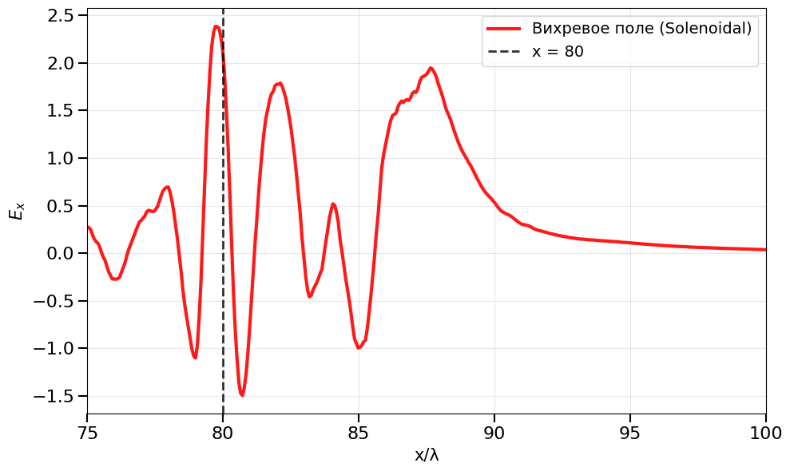
    


```python
import numpy as np
import h5py
import matplotlib.pyplot as plt
from scipy.ndimage import uniform_filter1d

# --- ПАРАМЕТРЫ УСРЕДНЕНИЯ ---
# Вы можете менять это значение (например, 1.0, 2.0, 3.0...)
lambda_avg_scale = 4.0 

# Пути к данным
selected_folder = "/home/big4/castillo/conversion_a=74_tau_6_ne=0.40_2Jb_stop_window/tracking"
dump_nums = [17, 22] 
folder = selected_folder + "/DataSlices/"
folder2 = selected_folder + "/FourierFieldsOptimized/"
density = "RhoEL"
plane = "xy"

xmin_limit, xmax_limit = 78, 100

fig, ax = plt.subplots(figsize=(10, 6))
colors = ['r', 'b']

for idx, dump_num in enumerate(dump_nums):
    with h5py.File(folder + f"slice_Dump_{str(dump_num).zfill(3)}.h5", 'r') as f:
        dataDensity = f[density + "_" + plane][()]
        bounds = f['globalGridGlobal'].attrs.get('vsLowerBounds') * 1.0e+6
        upper_bounds = f['globalGridGlobal'].attrs.get('vsUpperBounds') * 1.0e+6
        timeDump = f['time'].attrs.get('vsTime') * 1.0e+15

    xmin_file, ymin_file = bounds[0], bounds[1]
    xmax_file, ymax_file = upper_bounds[0], upper_bounds[1]

    nx, ny = dataDensity.shape
    dx = (xmax_file - xmin_file) / nx
    x_centers = xmin_file + (np.arange(nx) + 0.5) * dx
    y_centers = ymin_file + (np.arange(ny) + 0.5) * (ymax_file - ymin_file) / ny
    idx_y0 = np.argmin(np.abs(y_centers))
    
    filename_fourier = folder2 + f"sliceTotalGradSolen_Dump_{str(dump_num).zfill(3)}.h5"
    with h5py.File(filename_fourier, 'r') as f:
        solen_field = f['ElecMultiField_Solenoidal_x_xy'][()]

    solen_1d = solen_field[:, idx_y0]

    # --- СТРОГОЕ УСРЕДНЕНИЕ ПО lambda_avg_scale ---
    window_size = int(round(lambda_avg_scale / dx))
    if window_size % 2 == 0:
        window_size += 1
    
    Ex_sol_smooth = uniform_filter1d(solen_1d, size=window_size, axis=0, mode='reflect')

    # Отрисовка
    mask = (x_centers >= xmin_limit) & (x_centers <= xmax_limit)
    x_plot = x_centers[mask]
    
    ax.plot(x_plot, solen_1d[mask], color=colors[idx], linestyle='--', linewidth=1, alpha=0.3)
    
    label_text = f"Dump {dump_num}, t={timeDump:.1f} fs ({lambda_avg_scale}λ avg)"
    ax.plot(x_plot, Ex_sol_smooth[mask], color=colors[idx], linestyle='-', linewidth=3, label=label_text, alpha=0.9)

# Оформление
ax.axvline(x=80, color='k', linestyle='--', linewidth=2, alpha=0.8, zorder=5)
ax.tick_params(axis='both', which='major', labelsize=16, size=8, width=1.5)
ax.set_xlabel('x/λ', fontsize=15)
ax.set_ylabel('$E_x$', fontsize=15)
ax.grid(True, alpha=0.3)
ax.legend(fontsize=12, loc='best')
ax.set_xlim(xmin_limit, xmax_limit)

ax.text(0.87, 0.95, r'$(j)$', transform=ax.transAxes, ha='right', va='top', fontsize=16, fontstyle='italic')

plt.tight_layout()
plt.savefig(f"1D_dump_{dump_nums[0]}_{dump_nums[1]}_{int(lambda_avg_scale)}lambda_avg.png", dpi=150, bbox_inches='tight')
plt.show()
```


    
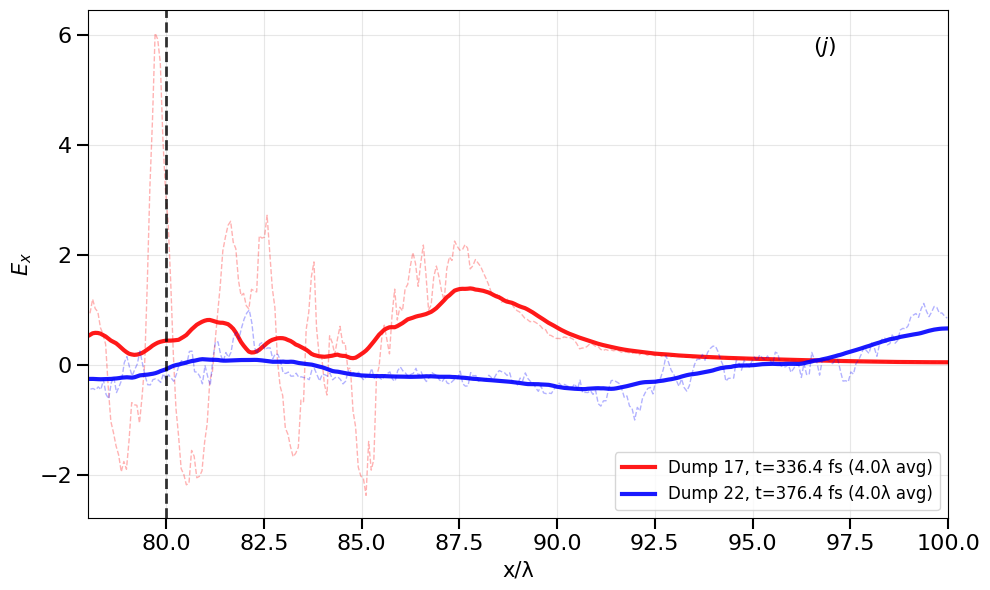
    


```python
import numpy as np
import h5py
import matplotlib.pyplot as plt
from scipy.ndimage import uniform_filter1d
import os


# --- ПАРАМЕТРЫ ---
lambda_avg_scale = 5.0
selected_folder = "/home/big4/castillo/conversion_a=74_tau_6_ne=0.40_2Jb_stop_window/tracking"
dump_nums = [17, 22]
folder = selected_folder + "/DataSlices/"
folder2 = selected_folder + "/FourierFieldsOptimized/"
density = "RhoEL"
plane = "xy"
xmin_limit, xmax_limit = 78, 100


# --- МАССИВЫ ДЛЯ ХРАНЕНИЯ ДАННЫХ (только вихревая часть) ---
Ex_solenoid_raw = {}
Ex_solenoid_smooth = {}
Ex_solenoid_x = {}

time_dump = {}


fig, ax = plt.subplots(figsize=(10, 6))
colors = ['r', 'b']


for idx, dump_num in enumerate(dump_nums):
    # --- Загрузка данных плотности и координат ---
    path_density = folder + f"slice_Dump_{str(dump_num).zfill(3)}.h5"
    if not os.path.exists(path_density):
        print(f"Файл плотности не найден: {path_density}")
        continue

    with h5py.File(path_density, 'r') as f:
        dataDensity = f[density + "_" + plane][()]
        bounds = f['globalGridGlobal'].attrs.get('vsLowerBounds') * 1.0e+6
        upper_bounds = f['globalGridGlobal'].attrs.get('vsUpperBounds') * 1.0e+6
        timeDump = f['time'].attrs.get('vsTime') * 1.0e+15


    dx = (upper_bounds[0] - bounds[0]) / dataDensity.shape[0]
    x_centers = bounds[0] + (np.arange(dataDensity.shape[0]) + 0.5) * dx
    idx_y0 = dataDensity.shape[1] // 2


    # --- ВИХРЕВАЯ (СОЛЕНОИДАЛЬНАЯ) ЧАСТЬ Ex ---
    path_solen = folder2 + f"sliceTotalGradSolen_Dump_{str(dump_num).zfill(3)}.h5"
    if not os.path.exists(path_solen):
        print(f"Файл соленоидальной части не найден: {path_solen}")
        continue

    with h5py.File(path_solen, 'r') as f:
        solen_field = f['ElecMultiField_Solenoidal_x_xy'][()]

    solen_1d = solen_field[:, idx_y0]

    window_size = int(round(lambda_avg_scale / dx))
    if window_size % 2 == 0:
        window_size += 1
    Ex_sol_smooth = uniform_filter1d(solen_1d, size=window_size, axis=0, mode='reflect')

    # Сохраняем вихревую часть
    Ex_solenoid_raw[dump_num] = solen_1d
    Ex_solenoid_smooth[dump_num] = Ex_sol_smooth
    Ex_solenoid_x[dump_num] = x_centers

    time_dump[dump_num] = timeDump


    # --- Отрисовка ---
    mask = (x_centers >= xmin_limit) & (x_centers <= xmax_limit)
    ax.plot(x_centers[mask], solen_1d[mask], color=colors[idx], linestyle='--', linewidth=1, alpha=0.3)
    ax.plot(x_centers[mask], Ex_sol_smooth[mask], color=colors[idx], linestyle='-', linewidth=3,
            label=f"Dump {dump_num}, t={timeDump:.1f} fs ({lambda_avg_scale}λ avg)", alpha=0.9)


# --- Вывод статистики для Dump 17 ---
dump_17 = 17
if dump_17 in Ex_solenoid_raw:
    residual_17 = Ex_solenoid_raw[dump_17] - Ex_solenoid_smooth[dump_17]
    print(f"\n--- Статистика для Dump {dump_17} ---")
    print(f"Средняя невязка (abs): {np.mean(np.abs(residual_17)):.4e}")
    print(f"Максимальная невязка: {np.max(np.abs(residual_17)):.4e}")


# --- Оформление графика ---
ax.axvline(x=80, color='k', linestyle='--', linewidth=2, alpha=0.8, zorder=5)
ax.axhline(y=0, color='k', linestyle='-', linewidth=1, alpha=0.5, zorder=1)
ax.tick_params(axis='both', which='major', labelsize=18, size=10, width=2)
ax.set_xlabel('x/λ', fontsize=20)
ax.set_ylabel('$E_x$', fontsize=20)
ax.grid(True, alpha=0.3)
ax.legend(fontsize=14, loc='best')
ax.set_xlim(xmin_limit, xmax_limit)

ax.text(0.98, 0.95, r'$(j)$', transform=ax.transAxes, ha='right', va='top',
        fontsize=22, fontweight='bold')

plt.tight_layout()
plt.show()


# --- Сохранение в .dat: две колонки (x, Ex) только для вихревой части ---
dump_folder = selected_folder + "/ExFields_dat/"
os.makedirs(dump_folder, exist_ok=True)

for dump_num in dump_nums:
    if dump_num not in Ex_solenoid_raw:
        continue

    x = Ex_solenoid_x[dump_num]
    Ex_solen_raw   = Ex_solenoid_raw[dump_num]
    Ex_solen_smooth = Ex_solenoid_smooth[dump_num]


    # Вихревая часть, сырая
    np.savetxt(
        dump_folder + f"Ex_solen_raw_Dump{dump_num:03d}.dat",
        np.column_stack((x, Ex_solen_raw)),
        header="x [μm]  Ex_solen_raw [V/m]",
        comments="# ",
        fmt="%.12g"
    )

    # Вихревая часть, усреднённая
    np.savetxt(
        dump_folder + f"Ex_solen_smooth_Dump{dump_num:03d}.dat",
        np.column_stack((x, Ex_solen_smooth)),
        header="x [μm]  Ex_solen_smooth [V/m]",
        comments="# ",
        fmt="%.12g"
    )


# --- Сохранение массивов в .npz (только вихревая часть) ---
save_path = selected_folder + "/ProcessedExFields_solenoid.npz"
np.savez(
    save_path,
    Ex_solenoid_raw=Ex_solenoid_raw,
    Ex_solenoid_smooth=Ex_solenoid_smooth,
    Ex_solenoid_x=Ex_solenoid_x,
    time_dump=time_dump
)
print(f"Вихревая часть Ex сохранена в {save_path}")
```

    
    --- Статистика для Dump 17 ---
    Средняя невязка (abs): 2.8876e-01
    Максимальная невязка: 5.5620e+00


    

    


    Вихревая часть Ex сохранена в /home/big4/castillo/conversion_a=74_tau_6_ne=0.40_2Jb_stop_window/tracking/ProcessedExFields_solenoid.npz


```python
import numpy as np
import h5py
import matplotlib.pyplot as plt
from scipy.ndimage import uniform_filter1d
import os

# --- ПАРАМЕТРЫ ---
lambda_avg_scale = 5.0
selected_folder = "/home/big4/castillo/conversion_a=74_tau_6_ne=0.40_2Jb_stop_window/tracking"
dump_nums = list(range(14, 30))  # 14–29 включительно
folder = selected_folder + "/DataSlices/"
folder2 = selected_folder + "/FourierFieldsOptimized/"
density = "RhoEL"
plane = "xy"
xmin_limit, xmax_limit = 78, 100

# --- МАССИВЫ (ТОЛЬКО ВИХРЕВАЯ) ---
Ex_solenoid_raw = {}
Ex_solenoid_smooth = {}
Ex_solenoid_x = {}
time_dump = {}

fig, ax = plt.subplots(figsize=(10, 6))
n_dumps = len(dump_nums)
colors = plt.cm.viridis(np.linspace(0, 1, n_dumps))

processed_count = 0
residual_stats = {}

for idx, dump_num in enumerate(dump_nums):
    dump_str = str(dump_num).zfill(3)
    
    # Координаты + время из density файла
    path_density = folder + f"slice_Dump_{dump_str}.h5"
    if not os.path.exists(path_density):
        print(f"⚠️ Нет density: {path_density}")
        continue
        
    with h5py.File(path_density, 'r') as f:
        dataDensity = f[density + "_" + plane][()]
        bounds = f['globalGridGlobal'].attrs.get('vsLowerBounds') * 1e6
        upper_bounds = f['globalGridGlobal'].attrs.get('vsUpperBounds') * 1e6
        timeDump = f['time'].attrs.get('vsTime') * 1e15
        dx = (upper_bounds[0] - bounds[0]) / dataDensity.shape[0]
        x_centers = bounds[0] + (np.arange(dataDensity.shape[0]) + 0.5) * dx
        idx_y0 = dataDensity.shape[1] // 2

    # ✅ ВИХРЕВАЯ часть (Solenoidal)
    path_solen = folder2 + f"sliceTotalGradSolen_Dump_{dump_str}.h5"
    if not os.path.exists(path_solen):
        print(f"⚠️ Нет вихревого: {path_solen}")
        continue
        
    with h5py.File(path_solen, 'r') as f:
        solen_field = f['ElecMultiField_Solenoidal_x_xy'][()]
        solen_1d = solen_field[:, idx_y0]
        
        # Усреднение
        window_size = int(round(lambda_avg_scale / dx))
        if window_size % 2 == 0: window_size += 1
        Ex_sol_smooth = uniform_filter1d(solen_1d, size=window_size, mode='reflect')

    # Сохранение
    Ex_solenoid_raw[dump_num] = solen_1d
    Ex_solenoid_smooth[dump_num] = Ex_sol_smooth
    Ex_solenoid_x[dump_num] = x_centers
    time_dump[dump_num] = timeDump
    
    # Невязка
    residual = np.abs(solen_1d - Ex_sol_smooth)
    residual_stats[dump_num] = {'mean': np.mean(residual), 'max': np.max(residual)}

    # ✅ ГРАФИК ТОЛЬКО ВИХРЕВОЙ (raw пунктир, smooth сплошной)
    mask = (x_centers >= xmin_limit) & (x_centers <= xmax_limit)
    ax.plot(x_centers[mask], solen_1d[mask], color=colors[idx], ls='--', lw=1, alpha=0.4)
    ax.plot(x_centers[mask], Ex_sol_smooth[mask], color=colors[idx], ls='-', lw=3,
            label=f"D{dump_num} t={timeDump:.0f}fs", alpha=0.9)

    processed_count += 1

print(f"✅ Обработано вихревых полей: {processed_count}/{len(dump_nums)}")

# Статистика невязок
print("\n--- НЕВЯЗКИ вихревой Ex (mean/max) ---")
for dump_num in sorted(residual_stats):
    stats = residual_stats[dump_num]
    print(f"D{dump_num:02d}: {stats['mean']:.3e} / {stats['max']:.3e}")

# График ВИХРЕВОЙ
ax.axvline(80, color='k', ls='--', lw=2, alpha=0.8, zorder=5)
ax.axhline(0, color='k', ls='-', lw=1, alpha=0.5)
ax.tick_params(axis='both', which='major', labelsize=18)
ax.set_xlabel('x [μm]', fontsize=20)
ax.set_ylabel('$E_x^{vortex}$ [V/m]', fontsize=20)
ax.grid(True, alpha=0.3)
if processed_count > 8:
    ax.legend(fontsize=11, loc='best', ncol=2)
ax.set_xlim(xmin_limit, xmax_limit)
ax.text(0.98, 0.95, r'$(j)$ $E_x^{vortex}$', transform=ax.transAxes, ha='right', va='top',
        fontsize=22, fontweight='bold')
plt.tight_layout()
plt.savefig(selected_folder + "/Ex_vortex_14-29.png", dpi=300, bbox_inches='tight')
plt.show()

# === СОХРАНЕНИЕ .dat С ВРЕМЕНЕМ (3 колонки) ===
dump_folder = selected_folder + "/ExFields_dat/"
os.makedirs(dump_folder, exist_ok=True)

for dump_num in sorted(Ex_solenoid_raw.keys()):
    x = Ex_solenoid_x[dump_num]
    Ex_raw = Ex_solenoid_raw[dump_num]
    Ex_smooth = Ex_solenoid_smooth[dump_num]
    t_fs = time_dump[dump_num]
    
    # Raw: x[μm]  t[fs]  Ex_raw
    np.savetxt(dump_folder + f"Ex_vortex_raw_Dump{dump_num:03d}.dat",
               np.column_stack((x, np.full_like(x, t_fs), Ex_raw)),
               header=f"# Dump {dump_num:03d}  t = {t_fs:.1f} fs", 
               comments="# ", fmt="%.12g")
    
    # Smooth: x[μm]  t[fs]  Ex_smooth  
    np.savetxt(dump_folder + f"Ex_vortex_smooth_Dump{dump_num:03d}.dat",
               np.column_stack((x, np.full_like(x, t_fs), Ex_smooth)),
               header=f"# Dump {dump_num:03d}  t = {t_fs:.1f} fs", 
               comments="# ", fmt="%.12g")

print("\n✅ .dat файлы (x t Ex):")
for dump_num in sorted(Ex_solenoid_raw):
    print(f"  Ex_vortex_raw/smooth_Dump{dump_num:03d}.dat")

# .npz архив
save_path = selected_folder + "/ProcessedExFields_vortex_14-29.npz"
np.savez(save_path, Ex_solenoid_raw=Ex_solenoid_raw, Ex_solenoid_smooth=Ex_solenoid_smooth,
         Ex_solenoid_x=Ex_solenoid_x, time_dump=time_dump, residual_stats=residual_stats)
print(f"✅ Архив: {save_path}")
```

    ⚠️ Нет вихревого: /home/big4/castillo/conversion_a=74_tau_6_ne=0.40_2Jb_stop_window/tracking/FourierFieldsOptimized/sliceTotalGradSolen_Dump_027.h5
    ⚠️ Нет вихревого: /home/big4/castillo/conversion_a=74_tau_6_ne=0.40_2Jb_stop_window/tracking/FourierFieldsOptimized/sliceTotalGradSolen_Dump_028.h5
    ✅ Обработано вихревых полей: 14/16
    
    --- НЕВЯЗКИ вихревой Ex (mean/max) ---
    D14: 3.241e-01 / 4.276e+00
    D15: 2.722e-01 / 2.953e+00
    D16: 3.166e-01 / 3.061e+00
    D17: 2.888e-01 / 5.562e+00
    D18: 2.212e-01 / 2.245e+00
    D19: 1.927e-01 / 1.701e+00
    D20: 1.634e-01 / 1.437e+00
    D21: 1.293e-01 / 9.280e-01
    D22: 1.263e-01 / 9.731e-01
    D23: 9.806e-02 / 5.043e-01
    D24: 9.790e-02 / 6.484e-01
    D25: 8.911e-02 / 6.972e-01
    D26: 8.666e-02 / 5.208e-01
    D29: 7.319e-02 / 4.831e-01


    

    


    
    ✅ .dat файлы (x t Ex):
      Ex_vortex_raw/smooth_Dump014.dat
      Ex_vortex_raw/smooth_Dump015.dat
      Ex_vortex_raw/smooth_Dump016.dat
      Ex_vortex_raw/smooth_Dump017.dat
      Ex_vortex_raw/smooth_Dump018.dat
      Ex_vortex_raw/smooth_Dump019.dat
      Ex_vortex_raw/smooth_Dump020.dat
      Ex_vortex_raw/smooth_Dump021.dat
      Ex_vortex_raw/smooth_Dump022.dat
      Ex_vortex_raw/smooth_Dump023.dat
      Ex_vortex_raw/smooth_Dump024.dat
      Ex_vortex_raw/smooth_Dump025.dat
      Ex_vortex_raw/smooth_Dump026.dat
      Ex_vortex_raw/smooth_Dump029.dat
    ✅ Архив: /home/big4/castillo/conversion_a=74_tau_6_ne=0.40_2Jb_stop_window/tracking/ProcessedExFields_vortex_14-29.npz


```python
import numpy as np
import h5py
import matplotlib.pyplot as plt
from scipy.ndimage import uniform_filter1d
import os

# --- ПАРАМЕТРЫ ---
lambda_avg_scale = 5.0
selected_folder = "/home/big4/castillo/conversion_a=74_tau_6_ne=0.40_2Jb_stop_window/tracking"
dump_nums = list(range(14, 30))  # 14–29 включительно
folder = selected_folder + "/DataSlices/"
folder2 = selected_folder + "/FourierFieldsOptimized/"
density = "RhoEL"
plane = "xy"
xmin_limit, xmax_limit = 78, 100

# --- МАССИВЫ (ТОЛЬКО ВИХРЕВАЯ) ---
Ex_solenoid_raw = {}
Ex_solenoid_smooth = {}
Ex_solenoid_x = {}
time_dump = {}

fig, ax = plt.subplots(figsize=(10, 6))
n_dumps = len(dump_nums)
colors = plt.cm.viridis(np.linspace(0, 1, n_dumps))

processed_count = 0
residual_stats = {}

for idx, dump_num in enumerate(dump_nums):
    dump_str = str(dump_num).zfill(3)
    
    # Координаты + время из density файла
    path_density = folder + f"slice_Dump_{dump_str}.h5"
    if not os.path.exists(path_density):
        print(f"⚠️ Нет density: {path_density}")
        continue
        
    with h5py.File(path_density, 'r') as f:
        dataDensity = f[density + "_" + plane][()]
        bounds = f['globalGridGlobal'].attrs.get('vsLowerBounds') * 1e6
        upper_bounds = f['globalGridGlobal'].attrs.get('vsUpperBounds') * 1e6
        timeDump = f['time'].attrs.get('vsTime') * 1e15
        dx = (upper_bounds[0] - bounds[0]) / dataDensity.shape[0]
        x_centers = bounds[0] + (np.arange(dataDensity.shape[0]) + 0.5) * dx
        idx_y0 = dataDensity.shape[1] // 2

    # ✅ ВИХРЕВАЯ часть (Solenoidal)
    path_solen = folder2 + f"sliceTotalGradSolen_Dump_{dump_str}.h5"
    if not os.path.exists(path_solen):
        print(f"⚠️ Нет вихревого: {path_solen}")
        continue
        
    with h5py.File(path_solen, 'r') as f:
        solen_field = f['ElecMultiField_Solenoidal_x_xy'][()]
        solen_1d = solen_field[:, idx_y0]
        
        # Усреднение
        window_size = int(round(lambda_avg_scale / dx))
        if window_size % 2 == 0: 
            window_size += 1
        Ex_sol_smooth = uniform_filter1d(solen_1d, size=window_size, mode='reflect')

    # Сохранение
    Ex_solenoid_raw[dump_num] = solen_1d
    Ex_solenoid_smooth[dump_num] = Ex_sol_smooth
    Ex_solenoid_x[dump_num] = x_centers
    time_dump[dump_num] = timeDump
    
    # Невязка
    residual = np.abs(solen_1d - Ex_sol_smooth)
    residual_stats[dump_num] = {'mean': np.mean(residual), 'max': np.max(residual)}

    # ✅ ГРАФИК ТОЛЬКО ВИХРЕВОЙ (raw пунктир, smooth сплошной)
    mask = (x_centers >= xmin_limit) & (x_centers <= xmax_limit)
    ax.plot(x_centers[mask], solen_1d[mask], color=colors[idx], ls='--', lw=1, alpha=0.4)
    ax.plot(x_centers[mask], Ex_sol_smooth[mask], color=colors[idx], ls='-', lw=3,
            label=f"D{dump_num} t={timeDump:.0f}fs", alpha=0.9)

    processed_count += 1

print(f"✅ Обработано вихревых полей: {processed_count}/{len(dump_nums)}")

# Статистика невязок
print("\n--- НЕВЯЗКИ вихревой Ex (mean/max) ---")
for dump_num in sorted(residual_stats):
    stats = residual_stats[dump_num]
    print(f"D{dump_num:02d}: {stats['mean']:.3e} / {stats['max']:.3e}")

# График ВИХРЕВОЙ
ax.axvline(80, color='k', ls='--', lw=2, alpha=0.8, zorder=5)
ax.axhline(0, color='k', ls='-', lw=1, alpha=0.5)
ax.tick_params(axis='both', which='major', labelsize=18)
ax.set_xlabel('x [μm]', fontsize=20)
ax.set_ylabel('$E_x^{vortex}$ [V/m]', fontsize=20)
ax.grid(True, alpha=0.3)
if processed_count > 8:
    ax.legend(fontsize=11, loc='best', ncol=2)
ax.set_xlim(xmin_limit, xmax_limit)
ax.text(0.98, 0.95, r'$(j)$ $E_x^{vortex}$', transform=ax.transAxes, ha='right', va='top',
        fontsize=22, fontweight='bold')
plt.tight_layout()
plt.savefig(selected_folder + "/Ex_vortex_14-29.png", dpi=300, bbox_inches='tight')
plt.show()

# === СОХРАНЕНИЕ .dat С ВРЕМЕНЕМ В ДАННЫХ (3 колонки: x t Ex) ===
dump_folder = selected_folder + "/ExFields_dat/"
os.makedirs(dump_folder, exist_ok=True)

for dump_num in sorted(Ex_solenoid_raw.keys()):
    x = Ex_solenoid_x[dump_num]
    Ex_raw = Ex_solenoid_raw[dump_num]
    Ex_smooth = Ex_solenoid_smooth[dump_num]
    t_fs = time_dump[dump_num]
    
    # Raw: x[μm]  t[fs]  Ex_raw  ← ВРЕМЯ В ТРЕТЬЕЙ КОЛОНКЕ!
    np.savetxt(dump_folder + f"Ex_vortex_raw_Dump{dump_num:03d}.dat",
               np.column_stack((x, np.full_like(x, t_fs), Ex_raw)),
               header=f"x[μm]  t[fs]  Ex_vortex_raw[V/m]  # Dump {dump_num:03d} t={t_fs:.1f}fs",
               comments='',  # Без # для читаемости
               fmt="%.8g")
    
    # Smooth: x[μm]  t[fs]  Ex_smooth
    np.savetxt(dump_folder + f"Ex_vortex_smooth_Dump{dump_num:03d}.dat",
               np.column_stack((x, np.full_like(x, t_fs), Ex_smooth)),
               header=f"x[μm]  t[fs]  Ex_vortex_smooth[V/m]  # Dump {dump_num:03d} t={t_fs:.1f}fs",
               comments='',
               fmt="%.8g")

print("\n✅ .dat файлы созданы (3 колонки: x[μm] t[fs] Ex[V/m]):")
for dump_num in sorted(Ex_solenoid_raw):
    print(f"  Ex_vortex_raw/smooth_Dump{dump_num:03d}.dat")

# .npz архив
save_path = selected_folder + "/ProcessedExFields_vortex_14-29.npz"
np.savez(save_path, Ex_solenoid_raw=Ex_solenoid_raw, Ex_solenoid_smooth=Ex_solenoid_smooth,
         Ex_solenoid_x=Ex_solenoid_x, time_dump=time_dump, residual_stats=residual_stats)
print(f"✅ Архив: {save_path}")

# ПРОВЕРКА одного файла
if 17 in Ex_solenoid_raw:
    test_file = dump_folder + "Ex_vortex_smooth_Dump017.dat"
    if os.path.exists(test_file):
        data = np.loadtxt(test_file, skiprows=1)
        x_test, t_test, Ex_test = data[:,0], data[:,1], data[:,2]
        print(f"\n✅ ПРОВЕРКА Dump017: t={np.mean(t_test):.1f} fs, N_points={len(x_test)}")
```

    ⚠️ Нет вихревого: /home/big4/castillo/conversion_a=74_tau_6_ne=0.40_2Jb_stop_window/tracking/FourierFieldsOptimized/sliceTotalGradSolen_Dump_025.h5
    ⚠️ Нет вихревого: /home/big4/castillo/conversion_a=74_tau_6_ne=0.40_2Jb_stop_window/tracking/FourierFieldsOptimized/sliceTotalGradSolen_Dump_026.h5
    ⚠️ Нет вихревого: /home/big4/castillo/conversion_a=74_tau_6_ne=0.40_2Jb_stop_window/tracking/FourierFieldsOptimized/sliceTotalGradSolen_Dump_027.h5
    ⚠️ Нет вихревого: /home/big4/castillo/conversion_a=74_tau_6_ne=0.40_2Jb_stop_window/tracking/FourierFieldsOptimized/sliceTotalGradSolen_Dump_028.h5
    ✅ Обработано вихревых полей: 12/16
    
    --- НЕВЯЗКИ вихревой Ex (mean/max) ---
    D14: 3.241e-01 / 4.276e+00
    D15: 2.722e-01 / 2.953e+00
    D16: 3.166e-01 / 3.061e+00
    D17: 2.888e-01 / 5.562e+00
    D18: 2.212e-01 / 2.245e+00
    D19: 1.927e-01 / 1.701e+00
    D20: 1.634e-01 / 1.437e+00
    D21: 1.293e-01 / 9.280e-01
    D22: 1.263e-01 / 9.731e-01
    D23: 9.806e-02 / 5.043e-01
    D24: 9.790e-02 / 6.484e-01
    D29: 7.319e-02 / 4.831e-01


    
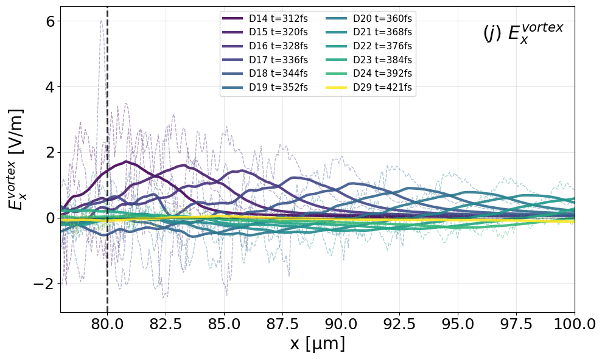
    


    
    ✅ .dat файлы созданы (3 колонки: x[μm] t[fs] Ex[V/m]):
      Ex_vortex_raw/smooth_Dump014.dat
      Ex_vortex_raw/smooth_Dump015.dat
      Ex_vortex_raw/smooth_Dump016.dat
      Ex_vortex_raw/smooth_Dump017.dat
      Ex_vortex_raw/smooth_Dump018.dat
      Ex_vortex_raw/smooth_Dump019.dat
      Ex_vortex_raw/smooth_Dump020.dat
      Ex_vortex_raw/smooth_Dump021.dat
      Ex_vortex_raw/smooth_Dump022.dat
      Ex_vortex_raw/smooth_Dump023.dat
      Ex_vortex_raw/smooth_Dump024.dat
      Ex_vortex_raw/smooth_Dump029.dat
    ✅ Архив: /home/big4/castillo/conversion_a=74_tau_6_ne=0.40_2Jb_stop_window/tracking/ProcessedExFields_vortex_14-29.npz
    
    ✅ ПРОВЕРКА Dump017: t=336.4 fs, N_points=1051


```python
import h5py
import numpy as np
import matplotlib.pyplot as plt
import ipywidgets as widgets
import os
import json
from ipywidgets import VBox, HBox, Accordion, Tab
from IPython.display import display, FileLink

folder =  selected_folder + "/DataSlices/"
folder1 = selected_folder + "/FourierFieldsOptimized/"

# ---- Datos simulados (si no se tienen archivos reales) ----
def load_fourier_data(dump=10, field= "Elec", component="x", plane="xy", Helmholtzs="Total"):
    dump_str = str(dump)
    filename = folder1 + "sliceTotalGradSolen_Dump_" + dump_str.zfill(3) + ".h5"
    dset_name = field+"MultiField_" + Helmholtzs + "_" + component + "_" + plane

    if not os.path.exists(filename):
        print(f"Archivo no encontrado: {filename}")
        return None

    with h5py.File(filename, 'r') as f:
        if dset_name in f:
            s = f[dset_name][()]
            return np.real(s)
        else:
            print(f"Conjunto de datos no encontrado: {dset_name}")
            return None

# Variable para almacenar las "cavernas"
caverns_data = []
# ---- Función para guardar caverna ----
def save_cavern(b):
    global caverns_data
    new_entry = {
        "dump": int(w_dump.value),
        "x": str(w_center_x.value),
        "y": str(w_center_y.value),
        "z": str(w_center_z.value),
        "radius": str(w_radius.value)
    }
    caverns_data.append(new_entry)
    print("Caverna guardada:", new_entry)

# ---- Función para exportar JSON ----
def export_json(b):
    global caverns_data
    filename = 'data_cavern.json'
    with open(filename, 'w') as f:
        json.dump(caverns_data, f, indent=2)
    print(f"File '{filename}' exported.")
    display(FileLink(filename))
    
# ---- Función que actualiza el plot ----
def update_plot(
    alpha, cmap, vrange, xrange, yrange,
    alpha2, cmap2, vrange2, show_second,
    alpha3, cmap3, vrange3, show_fourier,
    dump, field, density, component, plane,
    draw_circle, center_x, center_y, center_z, radius,
    helmholtzs, 
    pos
):
    vmin1, vmax1 = vrange
    vmin2, vmax2 = vrange2
    vmin3, vmax3 = vrange3
    xminscale, xmaxscale = xrange
    yminscale, ymaxscale = yrange

    filename = folder + f"slice_Dump_{str(dump).zfill(3)}.h5"
    
    with h5py.File(filename, 'r') as f:
        dataDensity = f[density + "_" + plane][()]
        dataField = f[field + "MultiField_" + component + "_" + plane][()]

        xmin, ymin, zmin = f['globalGridGlobal'].attrs.get('vsLowerBounds') * 1.0e+6
        xmax, ymax, zmax = f['globalGridGlobal'].attrs.get('vsUpperBounds') * 1.0e+6
        timeDump =  f['time'].attrs.get('vsTime') * 1.0e+15
        steptime =  f['time'].attrs.get('vsStep') * 1.0e+15
    
    fig, ax = plt.subplots(figsize=(18,10.08))
    print('maxDensity', dataDensity.max())
    print('minDensity', dataDensity.min())
    print('timeDump', timeDump)
    # Primera imagen
    if density == "Rho":    
        im1 = ax.imshow(
            dataDensity.T,
            extent=[xmin, xmax, ymin, ymax],
            aspect='equal',
            alpha=alpha,
            cmap=cmap,
            vmin=-vmax1,
            vmax=vmax1
        )
    else:
        im1 = ax.imshow(
            dataDensity.T,
            extent=[xmin, xmax, ymin, ymax],
            aspect='equal',
            alpha=alpha,
            cmap=cmap,
            vmin=vmin1,
            vmax=vmax1
        )
    # Segunda imagen (opcional)
    Emax = dataField.max()
    Emin = dataField.min()
    print('maxField', "{:e}".format(Emax))
    print('minField', "{:e}".format(Emin))
    if show_second:
        im2 = ax.imshow(
            dataField.T,
            extent=[xmin, xmax, ymin, ymax],
            aspect='equal',
            alpha=alpha2,
            cmap=cmap2,
            vmin=vmin2*Emax,
            vmax=vmax2*Emax
        )
        cbar2 = plt.colorbar(im2, ax=ax, label="Field")
        cbar2.ax.tick_params(labelsize=12)

    # Tercera imagen: Fourier
    if show_fourier:
        try:
            s3 = load_fourier_data(dump, field, component, plane, helmholtzs)
            Efmax = s3.max()
            Efmin = s3.min()
            Efabs = max(abs(Efmax),abs(Efmin))
            im3 = ax.imshow(
                s3.T,
                extent=[xmin, xmax, ymin, ymax],
                aspect='equal',
                alpha=alpha3,
                cmap=cmap3,
                vmin=vmin3*Efabs,
                vmax=vmax3*Efabs
            )
            cbar3= plt.colorbar(im3, ax=ax, label="Fourier " + helmholtzs)
            cbar3.ax.tick_params(labelsize=12)
        except Exception as e:
            print("Error al cargar datos de Fourier:", e)

    # Dibujar círculo si está activado
    if draw_circle:
        if plane == 'xy':
            center = (center_x, center_y)
        elif plane == 'xz':
            center = (center_x, center_z)
        else:
            center = (center_x, center_y)

        circle = plt.Circle(center, radius=radius, color='g', alpha=0.3, zorder=100)
        ax.add_patch(circle)      

    ax.axvline(pos, color='k', ls='--', lw=1, alpha=0.8, zorder=5)
    
    middle_x = (xmax-xmin)/200
    ax.set_title(f"{density}  {field}{component} ({plane}) time {int(timeDump)} fs")
    ax.set_xlabel(plane[0]+r'$(\mu m)$', fontsize = 30, labelpad = 0)
    ax.set_ylabel(plane[1]+r'$(\mu m)$', fontsize = 30, labelpad = 0)
    ax.set_xlim(xmin+(100+xminscale)*middle_x, xmax-(100-xmaxscale)*middle_x)
    ax.set_ylim(ymin-(100+yminscale)*ymin/100, ymax-(100-ymaxscale)*ymax/100)
    ax.tick_params(axis='both', labelsize=14)
    cbar = plt.colorbar(im1, ax=ax, label=density)
    cbar.ax.tick_params(labelsize=12)
    plt.tight_layout()
    plt.grid(visible=True, color='gray', linestyle='--', linewidth=0.5, alpha=0.7)
    plt.show()

# ---- Pestaña "Data source" ----
w_dump = widgets.IntSlider(value=1, min=1, max=32, step=1, description='Dump:')
w_field = widgets.Dropdown(options=["Elec", "Mag"], value="Elec", description='Field:')
w_density = widgets.Dropdown(options=["RhoEL", "RhoIL", "Rho"], value="RhoEL", description='Density:')
w_component = widgets.Dropdown(options=["x", "y", "z"], value="x", description='Component:')
w_plane = widgets.Dropdown(options=["xy", "xz"], value="xy", description='Plane:')
w_pos = widgets.IntSlider(value=80, min=80, max=125, step=0.5, description='Position_line')

data_source_controls = VBox([
    w_dump,
    w_field,
    w_density,
    w_component,
    w_plane,
    w_pos
])
accordion_data_source = Accordion(children=[data_source_controls], titles=("Data Source",))
accordion_data_source.selected_index = 0  # Abierto por defecto

# ---- Pestaña "Density" ----
w_alpha = widgets.FloatSlider(value=0.5, min=0, max=1, step=0.01, description='Alpha:')
w_cmap = widgets.Dropdown(options=plt.colormaps(), value='Greys', description='Cmap:')
w_vrange = widgets.FloatRangeSlider(
    value=[0, 2],
    min=0,
    max=10,
    step=1,
    description='Values:',
    continuous_update=False
)

color_controls_density = VBox([w_alpha, w_cmap])
accordion_color_density = Accordion(children=[color_controls_density], titles=("Adjust color",))
accordion_color_density.selected_index = None

v_controls_density = VBox([w_vrange])
accordion_values_density = Accordion(children=[v_controls_density], titles=("Range of values",))
accordion_values_density.selected_index = None

spatial_controls = VBox([
    widgets.FloatRangeSlider(value=[-100,100], min=-100, max=100, step=1, description='X range:'),
    widgets.FloatRangeSlider(value=[-100,100], min=-100, max=100, step=1, description='Y range:')
])
accordion_spatial = Accordion(children=[spatial_controls], titles=("Spatial Range",))
accordion_spatial.selected_index = None

density_tab = VBox([accordion_color_density, accordion_values_density, accordion_spatial])

# ---- Pestaña "Fields" ----
w_alpha2 = widgets.FloatSlider(value=0.5, min=0, max=1, step=0.01, description='Alpha (Field):')
w_cmap2 = widgets.Dropdown(options=plt.colormaps(), value='seismic', description='Cmap (Field):')
w_vrange2 = widgets.FloatRangeSlider(
    value=[-0.2, 0.2],
    min=-1,
    max=1,
    step=0.,
    description='Values (Field):',
    continuous_update=False
)
show_second_checkbox = widgets.Checkbox(value=False, description='Show field')

color_controls_fields = VBox([show_second_checkbox, w_alpha2, w_cmap2])
accordion_color_fields = Accordion(children=[color_controls_fields], titles=("Adjust color",))
accordion_color_fields.selected_index = None

v_controls_fields = VBox([w_vrange2])
accordion_values_fields = Accordion(children=[v_controls_fields], titles=("Range of values",))
accordion_values_fields.selected_index = None

fields_tab = VBox([accordion_color_fields, accordion_values_fields])

# ---- Pestaña "Circle" con botones ----
draw_circle_checkbox = widgets.Checkbox(value=False, description='Draw Circle')
w_center_x = widgets.FloatText(value=0.0, description='Centr X:')
w_center_y = widgets.FloatText(value=0.0, description='Centr Y:')
w_center_z = widgets.FloatText(value=0.0, description='Centr Z:')
w_radius = widgets.FloatText(value=5.0, description='Radius:')

btn_save = widgets.Button(description="Save caverna", icon='save')
btn_export = widgets.Button(description="Export JSON", icon='download')

btn_save.on_click(save_cavern)
btn_export.on_click(export_json)

circle_controls = VBox([
    HBox([w_dump, w_plane]),
    draw_circle_checkbox,
    w_center_x,
    w_center_y,
    w_center_z,
    w_radius,
    btn_save,
    btn_export
])
accordion_circle = widgets.Accordion(children=[circle_controls], titles=("Configure Circle",))
accordion_circle.selected_index = None

# ---- Pestaña "Fourier Fields" ----
w_alpha3 = widgets.FloatSlider(value=0.5, min=0, max=1, step=0.01, description='Alpha (Fourier):')
w_cmap3 = widgets.Dropdown(options=plt.colormaps(), value='seismic', description='Cmap (Fourier):')
w_vrange3 = widgets.FloatRangeSlider(
    value=[-1, 1],
    min=-1,
    max=1,
    step=0.1,
    description='Valores (Fourier):',
    continuous_update=False
)
show_fourier_checkbox = widgets.Checkbox(value=False, description='Mostrar Fourier')
w_helmholtzs = widgets.Dropdown(options=["Total", "Gradient", "Solenoidal"], value="Total", description='Helmholtzs:')

fourier_tab = VBox([
    widgets.Accordion(children=[VBox([show_fourier_checkbox, w_alpha3, w_cmap3])], titles=("Ajustes de color",)),
    widgets.Accordion(children=[VBox([w_vrange3])], titles=("Rango de valores",)),
    widgets.Accordion(children=[VBox([w_helmholtzs])], titles=("Tipo de campo",))
])

# ---- Combinar pestañas ----
tab = Tab()
tab.children = [accordion_data_source, density_tab, fields_tab, accordion_circle, fourier_tab]
tab.titles = ('Data source', 'Density', 'Fields', 'Circle', 'Fourier Fields')

# ---- Salida dinámica del gráfico ----
out = widgets.interactive_output(update_plot, {
    'alpha': w_alpha,
    'cmap': w_cmap,
    'vrange': w_vrange,
    'xrange': spatial_controls.children[0],
    'yrange': spatial_controls.children[1],
    'alpha2': w_alpha2,
    'cmap2': w_cmap2,
    'vrange2': w_vrange2,
    'show_second': show_second_checkbox,
    'alpha3': w_alpha3,
    'cmap3': w_cmap3,
    'vrange3': w_vrange3,
    'show_fourier': show_fourier_checkbox,
    'dump': w_dump,
    'field': w_field,
    'density': w_density,
    'component': w_component,
    'plane': w_plane,
    'draw_circle': draw_circle_checkbox,
    'center_x': w_center_x,
    'center_y': w_center_y,
    'center_z': w_center_z,
    'radius': w_radius,
    'helmholtzs': w_helmholtzs,
    'pos': w_pos 
})

# ---- Organización final ----
ui = VBox([
    tab
])

display(ui, out)
```


    VBox(children=(Tab(children=(Accordion(children=(VBox(children=(IntSlider(value=1, description='Dump:', max=32…


    Output()


```python
# Diccionario: dump_num → {Le, Li}
dump_params = {
    14: {"Le": 1, "Li": 0.1},
    15: {"Le": 3, "Li": 0.1},
    16: {"Le": 5, "Li": 0.3},
    17: {"Le": 7, "Li": 0.5},
    18: {"Le": 9, "Li": 0.9},
    19: {"Le": 12, "Li": 1.1},
    20: {"Le": 14, "Li": 1.5},
    21: {"Le": 17, "Li": 2.0},
    22: {"Le": 18, "Li": 2.3},
    23: {"Le": 21, "Li": 2.6},
    24: {"Le": 24, "Li": 3.0},
    25: {"Le": 25, "Li": 3.5},
    26: {"Le": 27, "Li": 3.8},
    27: {"Le": 29, "Li": 4.0},
    28: {"Le": 32, "Li": 5.0},
    29: {"Le": 33, "Li": 5.3},
}
```


```python
import numpy as np
import h5py
import matplotlib.pyplot as plt
import os

# =============================================================================
# --- CONFIGURACIÓN PRINCIPAL ---
# =============================================================================

# Tipos de campo Helmholtz disponibles
helmholtz_types = ["Total", "Gradient", "Solenoidal"]
selected_helmholtz = "Solenoidal"  # ← Cambiar según necesidad

# Parámetros de procesamiento
selected_folder = "/home/big4/castillo/conversion_a=74_tau_6_ne=0.40_2Jb_stop_window/tracking"
dump_nums = list(range(14, 30))  # 14–29 inclusive
folder = selected_folder + "/DataSlices/"
folder2 = selected_folder + "/FourierFieldsOptimized/"
density = "RhoEL"
plane = "xy"

# Rango para visualización
xmin_limit, xmax_limit = 78, 100

# Parámetros para la integral: ∫ E(x) dx / L
x_integral_start = 80.0  # Límite inferior de integración [μm]
use_L_type = "Le"        # ← Elegir: "Le" o "Li" para el límite superior

# =============================================================================
# --- DICCIONARIO DE PARÁMETROS POR DUMP ---
# =============================================================================
dump_params = {
    14: {"Le": 1, "Li": 0.1},
    15: {"Le": 3, "Li": 0.1},
    16: {"Le": 5, "Li": 0.3},
    17: {"Le": 7, "Li": 0.5},
    18: {"Le": 9, "Li": 0.9},
    19: {"Le": 12, "Li": 1.1},
    20: {"Le": 14, "Li": 1.5},
    21: {"Le": 17, "Li": 2.0},
    22: {"Le": 18, "Li": 2.3},
    23: {"Le": 21, "Li": 2.6},
    24: {"Le": 24, "Li": 3.0},
    25: {"Le": 25, "Li": 3.5},
    26: {"Le": 27, "Li": 3.8},
    27: {"Le": 29, "Li": 4.0},
    28: {"Le": 32, "Li": 5.0},
    29: {"Le": 33, "Li": 5.3},
}

# =============================================================================
# --- INICIALIZACIÓN DE ESTRUCTURAS ---
# =============================================================================
Ex_field_raw = {}        # Campo sin procesar (por dump)
Ex_field_x = {}          # Coordenadas x
time_dump = {}           # Tiempo de cada dump
integral_results = {}    # Resultado de ∫E/L por dump

fig, ax = plt.subplots(figsize=(10, 6))
n_dumps = len(dump_nums)
colors = plt.cm.viridis(np.linspace(0, 1, n_dumps))

processed_count = 0
integral_stats = {}

# =============================================================================
# --- BUCLE PRINCIPAL: PROCESAMIENTO POR DUMP ---
# =============================================================================
for idx, dump_num in enumerate(dump_nums):
    dump_str = str(dump_num).zfill(3)
    
    # -------------------------------------------------------------------------
    # 1️⃣ Cargar coordenadas y tiempo (archivo de densidad)
    # -------------------------------------------------------------------------
    path_density = folder + f"slice_Dump_{dump_str}.h5"
    if not os.path.exists(path_density):
        print(f"⚠️ No hay density: {path_density}")
        continue
        
    with h5py.File(path_density, 'r') as f:
        dataDensity = f[density + "_" + plane][()]
        bounds = f['globalGridGlobal'].attrs.get('vsLowerBounds') * 1e6      # [μm]
        upper_bounds = f['globalGridGlobal'].attrs.get('vsUpperBounds') * 1e6  # [μm]
        timeDump = f['time'].attrs.get('vsTime') * 1e15                       # [fs]
        
        dx = (upper_bounds[0] - bounds[0]) / dataDensity.shape[0]            # Paso de malla
        x_centers = bounds[0] + (np.arange(dataDensity.shape[0]) + 0.5) * dx # Centros de celda
        idx_y0 = dataDensity.shape[1] // 2                                   # Línea central en y

    # -------------------------------------------------------------------------
    # 2️⃣ Cargar campo según tipo Helmholtz seleccionado
    # -------------------------------------------------------------------------
    path_field = folder2 + f"sliceTotalGradSolen_Dump_{dump_str}.h5"
    if not os.path.exists(path_field):
        print(f"⚠️ No hay campo: {path_field}")
        continue
        
    with h5py.File(path_field, 'r') as f:
        # 🔄 Nombre dinámico del dataset según helmholtz_type
        dataset_name = f'ElecMultiField_{selected_helmholtz}_x_{plane}'
        
        if dataset_name not in f:
            print(f"⚠️ Dataset '{dataset_name}' no encontrado en {path_field}")
            print(f"   Disponibles: {list(f.keys())}")
            continue
            
        field_data = f[dataset_name][()]          # Campo 2D: [x, y]
        field_1d = field_data[:, idx_y0]          # Perfil 1D: línea central en y

    # -------------------------------------------------------------------------
    # 3️⃣ Obtener L para integración (Le o Li)
    # -------------------------------------------------------------------------
    params = dump_params.get(dump_num, {})
    L_value = params.get(use_L_type, None)
    
    if L_value is None:
        print(f"⚠️ No hay valor '{use_L_type}' para dump {dump_num}")
        continue

    # -------------------------------------------------------------------------
    # 4️⃣ 🧮 CALCULAR INTEGRAL: ∫(x=80 → L) E(x) dx / L
    # -------------------------------------------------------------------------
    # ⚠️ NOTA: Si L_value < x_integral_start, la máscara estará vacía.
    # Esto puede ser intencional (ej: L en unidades normalizadas) o requerir ajuste.
    
    mask_integral = (x_centers >= x_integral_start) & (x_centers <= (x_integral_start+L_value))
    n_points = np.sum(mask_integral)
    
    if n_points < 2:
        # Caso: rango de integración inválido o vacío
        print(f"⚠️ Dump {dump_num}: L={L_value} < {x_integral_start} → sin puntos para integrar")
        integral_value = np.nan
    else:
        # Integración numérica con regla del trapecio
        integral_value = np.trapezoid(field_1d[mask_integral], x_centers[mask_integral]) / L_value

    # -------------------------------------------------------------------------
    # 5️⃣ Guardar resultados
    # -------------------------------------------------------------------------
    Ex_field_raw[dump_num] = field_1d
    Ex_field_x[dump_num] = x_centers
    time_dump[dump_num] = timeDump
    integral_results[dump_num] = integral_value
    
    integral_stats[dump_num] = {
        'integral': integral_value,
        'L_value': L_value,
        'L_type': use_L_type,
        'n_points': n_points,
        'x_range': [x_integral_start, L_value]
    }

    # -------------------------------------------------------------------------
    # 6️⃣ 📈 Graficar campo (solo raw, sin suavizado)
    # -------------------------------------------------------------------------
    mask_plot = (x_centers >= xmin_limit) & (x_centers <= xmax_limit)
    
    # Etiquetar con valor de integral si es válido
    int_label = f"{integral_value:.1e}" if not np.isnan(integral_value) else "N/A"
    
    ax.plot(x_centers[mask_plot], field_1d[mask_plot], color=colors[idx], ls='-', lw=2,
            label=f"D{dump_num} t={timeDump:.0f}fs | ∫E/{use_L_type}={int_label}", 
            alpha=0.85)

    processed_count += 1

# =============================================================================
# --- REPORTES Y ESTADÍSTICAS ---
# =============================================================================
print(f"\n✅ Procesados {processed_count}/{len(dump_nums)} campos ({selected_helmholtz})")

print(f"\n--- 📊 INTEGRALES: ∫ E·dx / {use_L_type} ---")
print(f"{'Dump':<6} {'L':<6} {'∫E/L [V]':<14} {'Pts':<5} {'Estado'}")
print("-" * 45)
for dump_num in sorted(integral_stats):
    s = integral_stats[dump_num]
    status = "OK" if not np.isnan(s['integral']) else "SIN DATOS"
    val_str = f"{s['integral']:.3e}" if not np.isnan(s['integral']) else "— "
    print(f"D{dump_num:02d}   {s['L_value']:<6.1f} {val_str:<14} {s['n_points']:<5} {status}")

# =============================================================================
# --- CONFIGURACIÓN Y GUARDADO DEL GRÁFICO ---
# =============================================================================
ax.axvline(80, color='k', ls='--', lw=2, alpha=0.8, zorder=5, label='x=80 μm')
ax.axhline(0, color='k', ls='-', lw=1, alpha=0.5)

ax.tick_params(axis='both', which='major', labelsize=18)
ax.set_xlabel('x [μm]', fontsize=20)
ax.set_ylabel(f'$E_x^{{{selected_helmholtz}}}/E_{0}$ ', fontsize=20)
ax.grid(True, alpha=0.3)

if processed_count > 0:
    ax.legend(fontsize=8, loc='best', ncol=1, framealpha=0.9)
    
ax.set_xlim(xmin_limit, xmax_limit)
ax.text(0.98, 0.95, f'$(j)$ $E_x^{{{selected_helmholtz}}}$', transform=ax.transAxes, 
        ha='right', va='top', fontsize=22, fontweight='bold',
        bbox=dict(boxstyle='round', facecolor='wheat', alpha=0.3))

plt.tight_layout()
plot_filename = selected_folder + f"/Ex_{selected_helmholtz}_int_{use_L_type}_14-29.png"
#plt.savefig(plot_filename, dpi=300, bbox_inches='tight')
print(f"\n📁 Gráfico guardado: {plot_filename}")
plt.show()

# =============================================================================
# --- EXPORTAR DATOS A ARCHIVOS .dat ---
# =============================================================================
dump_folder = selected_folder + f"/ExFields_{selected_helmholtz}_dat/"
os.makedirs(dump_folder, exist_ok=True)

for dump_num in sorted(Ex_field_raw.keys()):
    x = Ex_field_x[dump_num]
    Ex_raw = Ex_field_raw[dump_num]
    t_fs = time_dump[dump_num]
    int_val = integral_results[dump_num]
    L_val = dump_params[dump_num][use_L_type]
    
    # Archivo: x[μm] | t[fs] | Ex[V/m]
    #np.savetxt(dump_folder + f"Ex_{selected_helmholtz}_raw_Dump{dump_num:03d}.dat",
    #           np.column_stack((x, np.full_like(x, t_fs), Ex_raw)),
    #           header=f"x[um]  t[fs]  Ex_{selected_helmholtz}[V/m]  # D{dump_num:03d} t={t_fs:.1f}fs  L{use_L_type}={L_val}  int={int_val:.3e}",
    #           comments='', fmt="%.8g")

print(f"\n✅ Archivos .dat guardados en: {dump_folder}")

# =============================================================================
# --- ARCHIVO .npz CON TODOS LOS RESULTADOS ---
# =============================================================================
save_path = selected_folder + f"/ProcessedExFields_{selected_helmholtz}_{use_L_type}_14-29.npz"
#np.savez(save_path, 
#         Ex_field_raw=Ex_field_raw,
#         Ex_field_x=Ex_field_x, 
#         time_dump=time_dump, 
#         integral_results=integral_results,
#         integral_stats=integral_stats,
#         dump_params=dump_params,
#         config={
#             'helmholtz_type': selected_helmholtz,
#             'L_type': use_L_type,
#             'x_integral_start': x_integral_start,
#             'dump_nums': dump_nums
#         })
print(f"✅ Archivo NPZ: {save_path}")

# =============================================================================
# --- VERIFICACIÓN RÁPIDA ---
# =============================================================================
#if 17 in Ex_field_raw:
#    test_file = dump_folder + f"Ex_{selected_helmholtz}_raw_Dump017.dat"
#    if os.path.exists(test_file):
#        data = np.loadtxt(test_file, skiprows=1)
#        x_test, t_test, Ex_test = data[:,0], data[:,1], data[:,2]
#        print(f"\n🔍 VERIFICACIÓN Dump017:")
#        print(f"   • t = {np.mean(t_test):.1f} fs")
#        print(f"   • N_points = {len(x_test)}")
#        print(f"   • ∫E/{use_L_type} = {integral_results[17]:.3e}")
```

    ⚠️ No hay campo: /home/big4/castillo/conversion_a=74_tau_6_ne=0.40_2Jb_stop_window/tracking/FourierFieldsOptimized/sliceTotalGradSolen_Dump_025.h5
    ⚠️ No hay campo: /home/big4/castillo/conversion_a=74_tau_6_ne=0.40_2Jb_stop_window/tracking/FourierFieldsOptimized/sliceTotalGradSolen_Dump_026.h5
    ⚠️ No hay campo: /home/big4/castillo/conversion_a=74_tau_6_ne=0.40_2Jb_stop_window/tracking/FourierFieldsOptimized/sliceTotalGradSolen_Dump_027.h5
    ⚠️ No hay campo: /home/big4/castillo/conversion_a=74_tau_6_ne=0.40_2Jb_stop_window/tracking/FourierFieldsOptimized/sliceTotalGradSolen_Dump_028.h5
    
    ✅ Procesados 12/16 campos (Solenoidal)
    
    --- 📊 INTEGRALES: ∫ E·dx / Le ---
    Dump   L      ∫E/L [V]       Pts   Estado
    ---------------------------------------------
    D14   1.0    2.638e+00      15    OK
    D15   3.0    1.394e+00      45    OK
    D16   5.0    5.848e-01      75    OK
    D17   7.0    3.029e-01      105   OK
    D18   9.0    -9.074e-02     135   OK
    D19   12.0   -3.223e-02     180   OK
    D20   14.0   -1.526e-01     210   OK
    D21   17.0   -1.088e-01     255   OK
    D22   18.0   -1.385e-01     270   OK
    D23   21.0   -1.054e-01     315   OK
    D24   24.0   -8.953e-02     361   OK
    D29   33.0   -5.208e-02     496   OK
    
    📁 Gráfico guardado: /home/big4/castillo/conversion_a=74_tau_6_ne=0.40_2Jb_stop_window/tracking/Ex_Solenoidal_int_Le_14-29.png


    
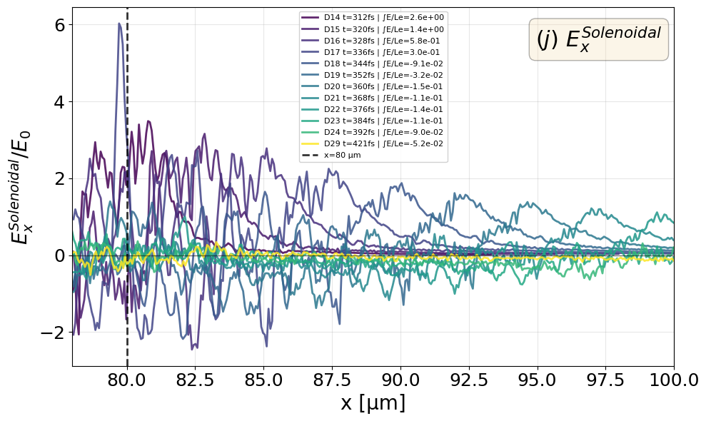
    


    
    ✅ Archivos .dat guardados en: /home/big4/castillo/conversion_a=74_tau_6_ne=0.40_2Jb_stop_window/tracking/ExFields_Solenoidal_dat/
    ✅ Archivo NPZ: /home/big4/castillo/conversion_a=74_tau_6_ne=0.40_2Jb_stop_window/tracking/ProcessedExFields_Solenoidal_Le_14-29.npz


```python
# =============================================================================
# 📊 GRÁFICA: integral_results vs time_dump
# =============================================================================

# Crear nueva figura
fig_int, ax_int = plt.subplots(figsize=(10, 6))

# Extraer datos válidos (excluir NaN)
times = []
integrals = []
dump_labels = []

for dump_num in sorted(integral_results.keys()):
    t = time_dump.get(dump_num)
    val = integral_results.get(dump_num)
    
    if t is not None and val is not None and not np.isnan(val):
        times.append(t)
        integrals.append(val)
        dump_labels.append(f"D{dump_num}")

# Convertir a arrays numpy para facilitar el manejo
times = np.array(times)
integrals = np.array(integrals)

if len(times) > 0:
    # 🎨 Gráfica principal: puntos + línea conectada
    ax_int.plot(times, integrals, 'o-', color='#2E86AB', lw=2, ms=8, 
                label=f'∫E/{use_L_type}', zorder=3)
    
    # 🏷️ Etiquetas en cada punto (opcional: comentar si hay muchos dumps)
    for i, (t, val, label) in enumerate(zip(times, integrals, dump_labels)):
        ax_int.annotate(label, (t, val), textcoords="offset points", 
                       xytext=(8, 5), ha='left', fontsize=9, alpha=0.8)
    
    # 📏 Línea de referencia en y=0
    ax_int.axhline(0, color='k', ls='--', lw=1, alpha=0.4)
    
    # 🎨 Estilizado
    ax_int.set_xlabel('Time [fs]', fontsize=16, fontweight='bold')
    ax_int.set_ylabel(f'$\\int E_x^{{{selected_helmholtz}}} dx / {use_L_type}$ [V]', 
                      fontsize=16, fontweight='bold')
    ax_int.set_title(f'temporal Evolution  of ∫E/{use_L_type}', 
                     fontsize=14, pad=20)
    ax_int.grid(True, alpha=0.3, linestyle='--')
    ax_int.tick_params(axis='both', labelsize=12)
    
    # 📦 Leyenda
    ax_int.legend(fontsize=11, loc='best', framealpha=0.9)
    
    # 💾 Guardar y mostrar
    plot_int_filename = selected_folder + f"/Integral_{selected_helmholtz}_{use_L_type}_vs_time.png"
    plt.tight_layout()
    plt.savefig(plot_int_filename, dpi=300, bbox_inches='tight')
    print(f"📁 Gráfica de integral guardada: {plot_int_filename}")
    plt.show()
    
else:
    print("⚠️ No hay datos válidos para graficar (todos los valores son NaN)")
    print("   → Verifica que L_value >= x_integral_start para al menos un dump")
```

    📁 Gráfica de integral guardada: /home/big4/castillo/conversion_a=74_tau_6_ne=0.40_2Jb_stop_window/tracking/Integral_Solenoidal_Le_vs_time.png


    
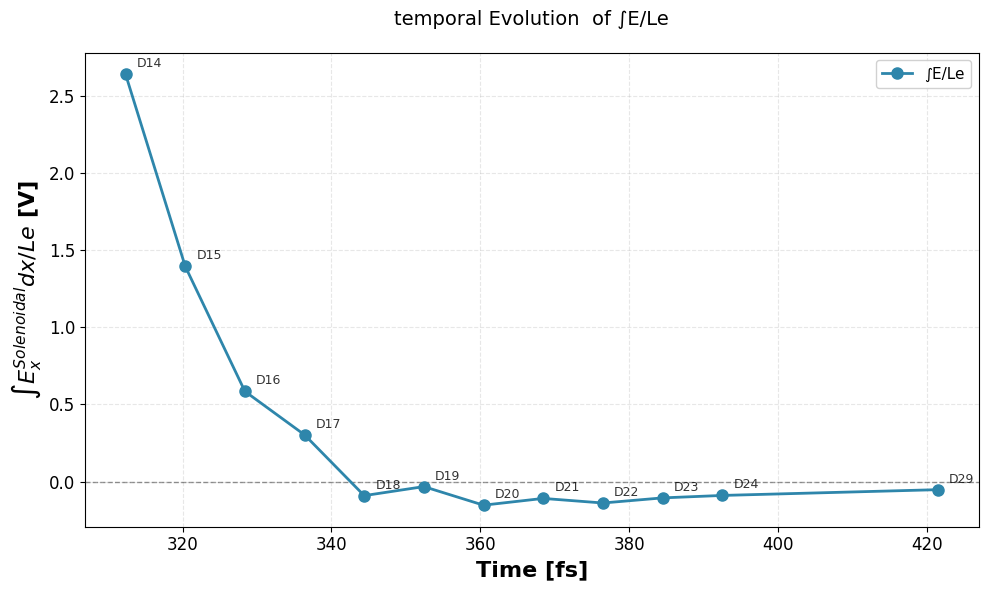
    


```python
import numpy as np
import h5py
import matplotlib.pyplot as plt
from scipy.ndimage import gaussian_filter1d  # Для усреднения/сглаживания
import os

dump_num = 24
folder = selected_folder + "/DataSlices/"
folder2 = selected_folder + "/FourierFieldsOptimized/"
density = "RhoEL"
plane = "xy"

xmin_limit, xmax_limit = 75, 100

# ИЗМЕНЕНО: увеличен размер графика с (10,6) до (12, 7)
fig, ax = plt.subplots(figsize=(11, 7))

# Загрузка данных
with h5py.File(folder + f"slice_Dump_{str(dump_num).zfill(3)}.h5", 'r') as f:
    dataDensity = f[density + "_" + plane][()]
    bounds = f['globalGridGlobal'].attrs.get('vsLowerBounds') * 1.0e+6
    upper_bounds = f['globalGridGlobal'].attrs.get('vsUpperBounds') * 1.0e+6
    timeDump = f['time'].attrs.get('vsTime') * 1.0e+15

xmin_file, ymin_file = bounds[0], bounds[1]
xmax_file, ymax_file = upper_bounds[0], upper_bounds[1]

# Координаты сетки
nx, ny = dataDensity.shape
dx = (xmax_file - xmin_file) / nx
dy = (ymax_file - ymin_file) / ny

x_centers = xmin_file + (np.arange(nx) + 0.5) * dx
y_centers = ymin_file + (np.arange(ny) + 0.5) * dy

# Центральный срез y=0
idx_y0 = np.argmin(np.abs(y_centers))
print("y=0 найдено на индексе", idx_y0, ", координата y=", y_centers[idx_y0], "λ")

# Загрузка полей из Fourier файла
filename_fourier = folder2 + f"sliceTotalGradSolen_Dump_{str(dump_num).zfill(3)}.h5"
with h5py.File(filename_fourier, 'r') as f:
    # Вихревая компонента (Solenoidal)
    solen_field = f['ElecMultiField_Solenoidal_x_xy'][()]
    # Электростатическая компонента (Gradient)
    grad_field = f['ElecMultiField_Gradient_x_xy'][()]

# 1D профили по y=0
solen_1d = solen_field[:, idx_y0]
grad_1d = grad_field[:, idx_y0]

# Сглаживание
sigma_smooth = 1.5
Ex_sol_smooth = gaussian_filter1d(solen_1d, sigma=sigma_smooth, axis=0, mode='reflect')
Ex_grad_smooth = gaussian_filter1d(grad_1d, sigma=sigma_smooth, axis=0, mode='reflect')

# ============================================
# СОХРАНЕНИЕ ПОЛЕЙ В ТЕКСТОВЫЕ ФАЙЛЫ (dump 24)
# ============================================
# Создаём массив для сохранения: [координата x, поле]
data_to_save_Ev = np.column_stack((x_centers, Ex_sol_smooth))
data_to_save_Ees = np.column_stack((x_centers, Ex_grad_smooth))

# Имя файлов
filename_Ev = folder2 + f"Ev_{dump_num}.dat"
filename_Ees = folder2 + f"E_es_{dump_num}.dat"

# Сохраняем вихревое поле
np.savetxt(filename_Ev, data_to_save_Ev, 
           header=f"Coordinates x [um] and Solenoidal (vortex) field E_v for dump {dump_num}\nColumns: x [um]  E_v [E0]",
           comments='# ', fmt='%.8e')

# Сохраняем электростатическое поле
np.savetxt(filename_Ees, data_to_save_Ees,
           header=f"Coordinates x [um] and Gradient (electrostatic) field E_es for dump {dump_num}\nColumns: x [um]  E_es [E0]",
           comments='# ', fmt='%.8e')

print(f"✅ Сохранено: {filename_Ev}")
print(f"✅ Сохранено: {filename_Ees}")

# Обрезка по X для графика
mask = (x_centers >= xmin_limit) & (x_centers <= xmax_limit)
x_plot = x_centers[mask]

# Текст с временем
ax.text(0.3, 0.98, f"t = {timeDump:.2f} fs",
        transform=ax.transAxes, fontsize=12, fontweight='semibold',
        color='white', ha='center', va='top',
        bbox=dict(boxstyle='round,pad=0.2', facecolor='black', alpha=0.6, edgecolor='none'))

# Plot: вихревое поле (синий) и электростатическое поле (красный)
ax.plot(x_plot, Ex_sol_smooth[mask], 'b-', linewidth=3, label='$E_v$ ')
ax.plot(x_plot, Ex_grad_smooth[mask], 'r-', linewidth=3, label='$E_{es}$ ')

# Оформление
ax.tick_params(axis='both', which='major', labelsize=18, size=8, width=1.5)
ax.grid(True, alpha=0.3)
ax.legend(fontsize=20)
ax.set_xlim(80, 86)
ax.set_ylim(-0.5, 0.9)
ax.text(0.83, 0.95, r'$(b)$',
        transform=ax.transAxes,
        ha='right', va='top',
        fontsize=18, fontstyle='italic')
plt.tight_layout()
plt.savefig(f"1D_dump{dump_num}_y0_Ecomparison.png", dpi=150, bbox_inches='tight')
plt.show()

print(f"✅ 1D_dump{dump_num}_y0_Ecomparison.png готов!")
print("y=0:", y_centers[idx_y0], "λ")
```

    y=0 найдено на индексе 365 , координата y= 0.0 λ
    ✅ Сохранено: /home/big4/castillo/conversion_a=74_tau_6_ne=0.40_2Jb_stop_window/tracking/FourierFieldsOptimized/Ev_24.dat
    ✅ Сохранено: /home/big4/castillo/conversion_a=74_tau_6_ne=0.40_2Jb_stop_window/tracking/FourierFieldsOptimized/E_es_24.dat


    
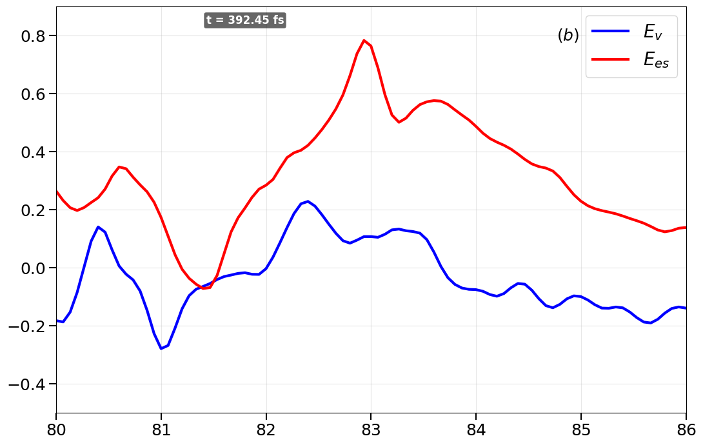
    


    ✅ 1D_dump24_y0_Ecomparison.png готов!
    y=0: 0.0 λ


```python

```
